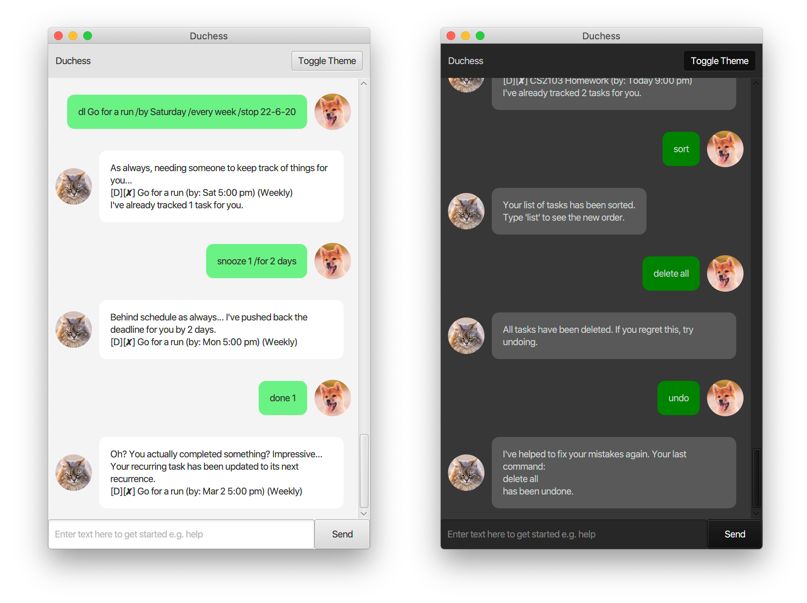
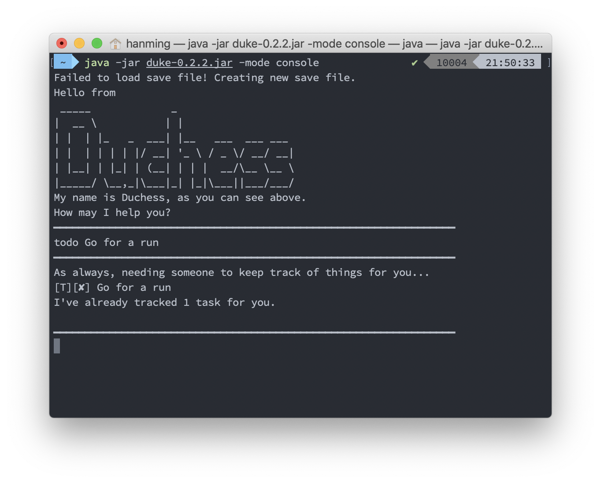

<h1 align="center">Duchess</h1>
<h3 align="center">A JavaFX-Powered Task Management App</h3>

<em>Zhu Hanming&nbsp;&nbsp;</em>|<em>&nbsp;&nbsp;A0196737L</em>

&nbsp;&nbsp;

## About Duchess

This application was written for CS2103 - Software Engineering, as part of its Individual Project. Through this project, students are expected to learn more about managing a medium-sized project and get used to SE practices.

## Highlights and Features of Duchess

1. <b>Extensive Testing Using JUnit and Mockito</b>

Close to 90 JUnit tests were written to test each individual part of the program, ensuring that everything operates as expected. Due to time constraints, there are still parts that are missing tests.  

It was a good learning experience for me, as I had never worked with JUnit and Mockito prior to this project.

2. <b>Data Storage using Gson and JSON</b>

All data exchanged in the application are properly stored in JSON format using the Gson library by Google. This data is persisted between sessions, and allow users to keep a copy of their tasks with them at all times.

This was also my first time in working with the Gson library and with JSON files in Java, and was a good experience too.

3. <b>Responsive JavaFX UI with Dark and Light Mode</b>

It was also my first time using JavaFX to design user interfaces for Java. Having prior experience with UI/UX design, I sought to bring about the best design I could with my limited knowledge of JavaFX. As such, I extended on the default UI to arrive at the above app, and built a **Dark Mode** as well for the sake of my eyes.

The app is also fully reponsive, and supports full-screen usage.

4. <b>Command Line Interface for the Command Line Lovers</b>

For those of you who love command lines and terminals, fret not - Duchess fully supports CLI usage as well! Simply run the program via CLI with the flag `-mode console` and you will be able to utilise the CLI version of the app!

5. <b>And PLENTY of features built to enhance your experience!</b>

There are lots of features built to support your task management, which includes:
* **Undo** - We all make mistakes!
* **Archive** - Clean up your list of tasks without deleting these tasks completely!
* **Set Recurring Deadlines** - Don't worry about ever missing your weekly lessons again!
* **Find specific tasks** - Simply search for keywords to instantly find your task!
* **Statistics** - Get data about how you're performing instantly!

And MORE! Get started with Duchess now to explore all of its options!

## Download Link

You can download a working, cross-platform JAR file containing the application right here at the [Releases page](https://github.com/zhuhanming/duke/releases). You can launch the app by either double clicking it, or running it in the command line with the command: `java -jar duke-0.2.2.jar -mode console`.

## Setting up

**Prerequisites**

* JDK 11
* Recommended: IntelliJ IDE
* Fork this repo to your GitHub account and clone the fork to your computer

**Importing the project into IntelliJ**

1. Open IntelliJ (if you are not in the welcome screen, click `File` > `Close Project` to close the existing project dialog first).
1. Set up the correct JDK version.
   * Click `Configure` > `Structure for new Projects` (in older versions of Intellij:`Configure` > `Project Defaults` > `Project Structure`).
   * If JDK 11 is listed in the drop down, select it. If it is not, click `New...` and select the directory where you installed JDK 11.
   * Click `OK`.
1. Click `Import Project`.
1. Locate the project directory and click `OK`.
1. Select `Create project from existing sources` and click `Next`.
1. Rename the project if you want. Click `Next`.
1. Ensure that your src folder is checked. Keep clicking `Next`.
1. Click `Finish`.

## Tutorials 

Duke Increment | Tutorial
---------------|---------------
`A-Gradle` | [Gradle Tutorial](tutorials/gradleTutorial.md)
`A-TextUiTesting` | [Text UI Testing Tutorial](tutorials/textUiTestingTutorial.md)
`Level-10` | JavaFX tutorials: → [Part 1: Introduction to JavaFX][fx1] → [Part 2: Creating a GUI for Duke][fx2] → [Part 3: Interacting with the user][fx3] → [Part 4: Introduction to FXML][fx4]

[fx1]: <tutorials/javaFxTutorialPart1.md>
[fx2]: <tutorials/javaFxTutorialPart2.md>
[fx3]: <tutorials/javaFxTutorialPart3.md>
[fx4]: <tutorials/javaFxTutorialPart4.md>

## Feedback, Bug Reports

* If you have feedback or bug reports, please post in [se-edu/duke issue tracker](https://github.com/se-edu/duke/issues).
* We welcome pull requests too.

## Acknowledgements

### External Packages Used
* [Gson by Google](https://github.com/google/gson) - For saving tasks into a JSON file.
* [JUnit by JUnit Team](https://github.com/junit-team/junit5/) - For testing classes and components in Duchess.
* [Mockito by Mockito](https://github.com/mockito/mockito) - For creating mocks in JUnit tests.
* [JavaFX by OpenJDK](https://github.com/openjdk/jfx) - For creating user interfaces.

### Other Licenses
All images used in this project have been properly licensed for use. The photos are namely:
* [Grumpy cat by fotyma](https://elements.envato.com/grumpy-cat-BVUARH4)
* [Beautiful Young Red Shiba Inu Puppy Dog Sitting Outdoor In Sandy by Grigory_bruev](https://elements.envato.com/beautiful-young-red-shiba-inu-puppy-dog-sitting-XMSN35D)

The photos have all been licensed under the Envato Elements License for CS2103 usage.
