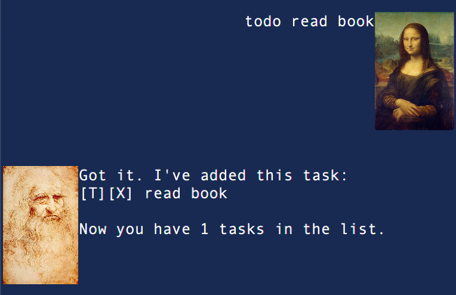
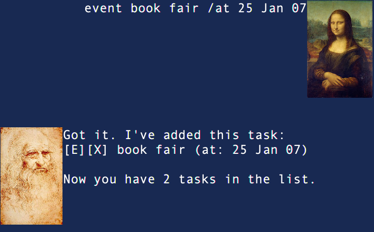
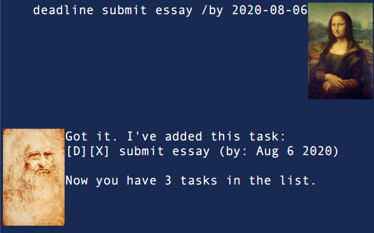
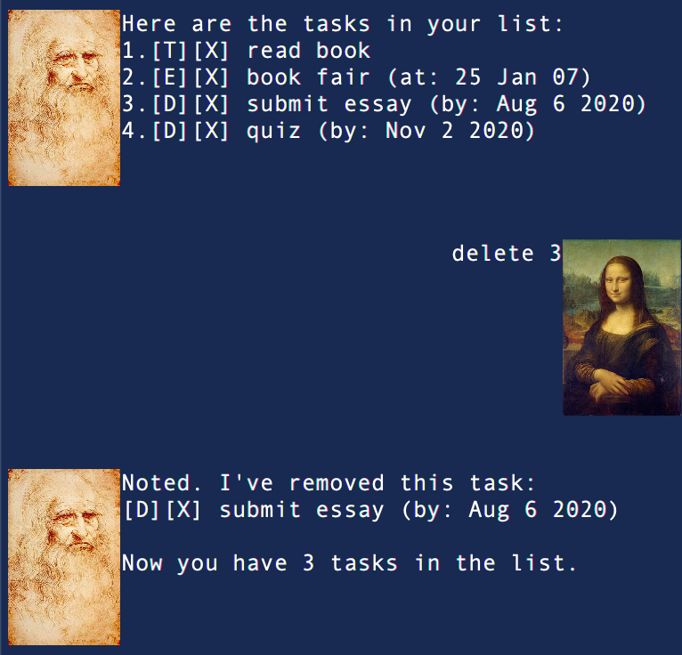
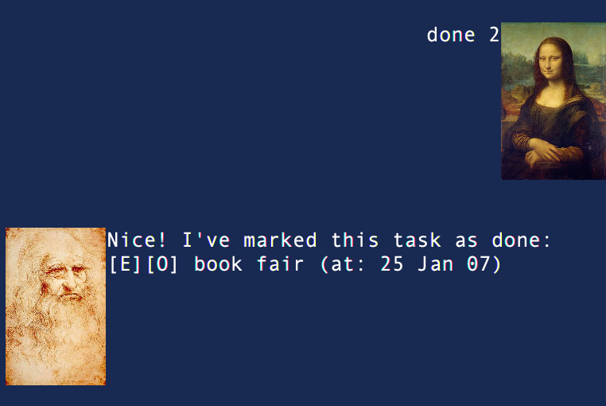
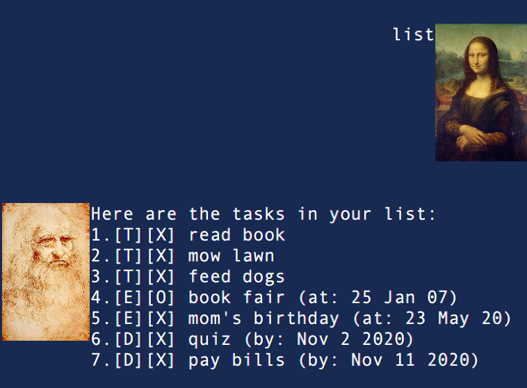
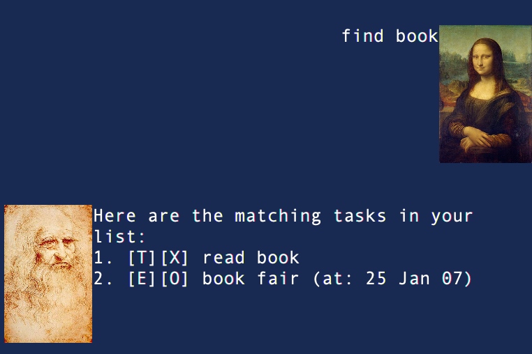

# User Guide

## Introduction 

Duke is a Chatbot Personal Assistant to help keep track of various types of **tasks**.

The types of tasks are:
1. **Todo**
    - Tasks with no attached attached date/time.
2. **Event**
    - Tasks that have a start and end date/time
3. **Deadline**
    - Tasks to be completed by a certain date.

Duke can:
1. Add task
2. Delete task
3. Complete task
4. List all tasks
5. Find tasks based on keyword
6. Sort tasks
7. Exit
# Features:

## 1. Add task
The type of task that can be added are:
1. todo
2. event
3. deadline

### Usage

`todo` - Add new todo

Format: `todo [name]`

Provide a name for Duke to associate the todo to.

Example of usage: `todo read book`

Expected outcome:

`event` - Add new event

Format: `event [name] /at [date in ANY format]`

Provide a name for Duke to associate the event to.

Example of usage: `event book fair /at 25 Jan 07`

Expected outcome:

`deadline` - Add new deadline

Format: `deadline [name] /by [date in yyyy-mm-dd]`

Provide a name for Duke to associate the deadline to.

Example of usage: 

`deadline submit essay /by 2020-08-06`

Expected outcome:

## 2. Delete task
Delete an existing task.

### Usage
`delete` - Delete task

Delete a task based on its index in the list. To find out a task's index,
check using the `list` command.

Format:
`delete [index]`

Example of usage: `delete 3`

Expected outcome: 

## 3. Complete task
Complete an existing task.

### Usage
`done` - Complete a task

Complete a task and mark it as done based on its index in the list.
To find out a task's index, check using the `list` command.

Format:
`done [index]`

Example of usage: `done 2`

Expected outcome: 

## 4. List all tasks

Shows all tasks.

### Usage
`list` - List tasks

Display list of all tasks.

Example of usage: `list`

Expected outcome: 

## 5. Find tasks based on keyword

Finds tasks with names containing the keyword.

### Usage
`find` - Find task that contains a given keyword

Returns a list of tasks with names that contain the given keyword.

Format:
`find [keyword]`

Example of usage: `find book`

Expected outcome: 

## 6. Sort Tasks

Tasks will be sorted by type and date/time.

When `find` or `list` commands are run, the list generated and displayed
will be sorted by type in the order Todo, Event and Deadline. Deadlines
are sorted chronologically by their date/time.

## 7. Exit

Close application

### Usage
`bye` - Close application

Returns a list of tasks with names that contain the given keyword.

Example of usage: `bye`

## Acknowledgements

GUI done with
[JavaFX Tutorial](https://github.com/nus-cs2103-AY1920S2/duke/blob/master/tutorials/javaFxTutorialPart4.md)
by [Jeffry Lum](https://github.com/j-lum)

Da Vinci from https://upload.wikimedia.org/wikipedia/commons/b/ba/Leonardo_self.jpg

Mona Lisa from
https://upload.wikimedia.org/wikipedia/commons/e/ec/Mona_Lisa%2C_by_Leonardo_da_Vinci%2C_from_C2RMF_retouched.jpg