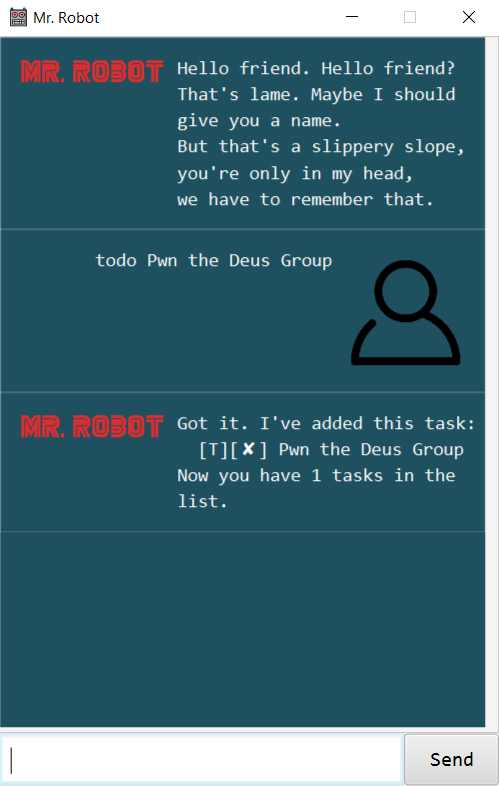
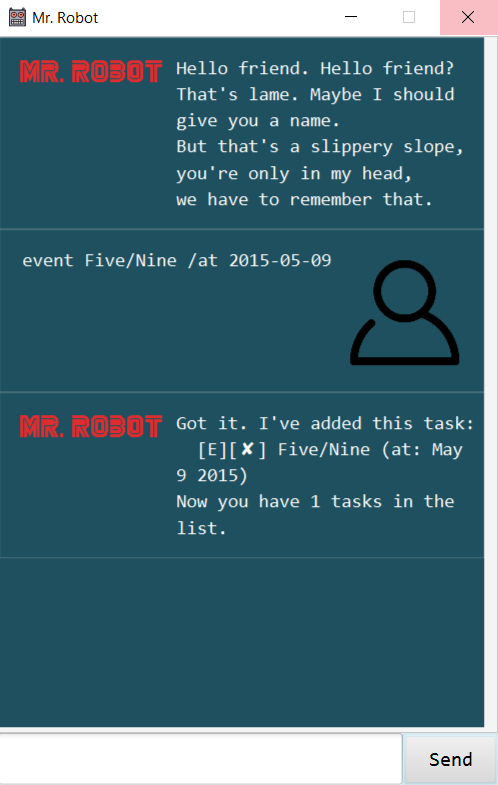
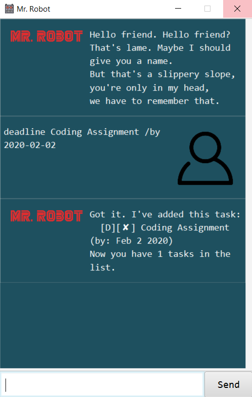
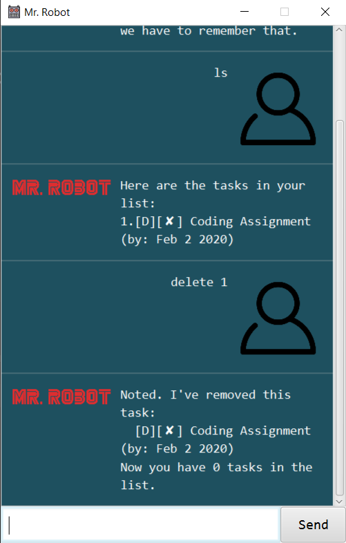
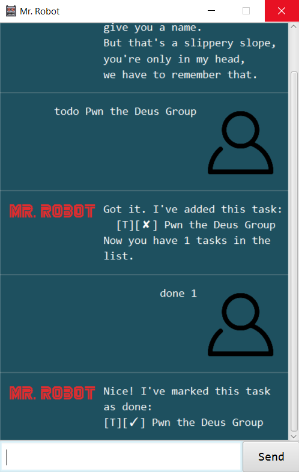
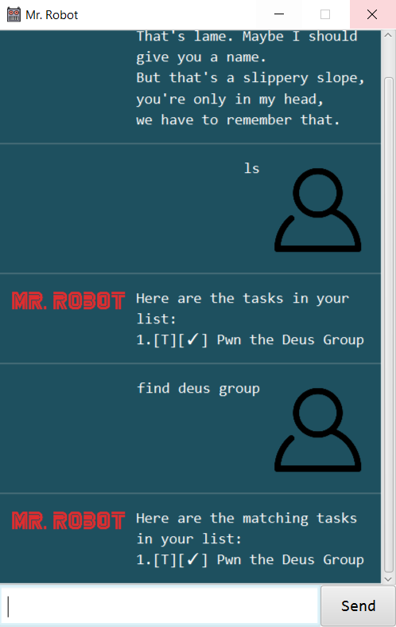
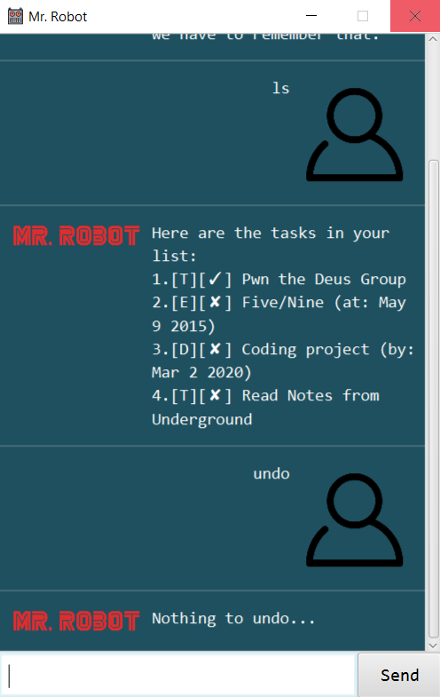
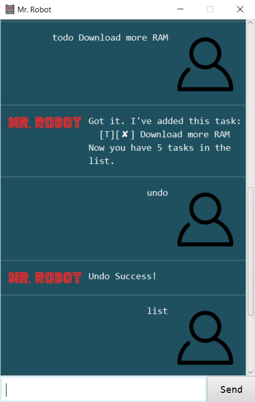
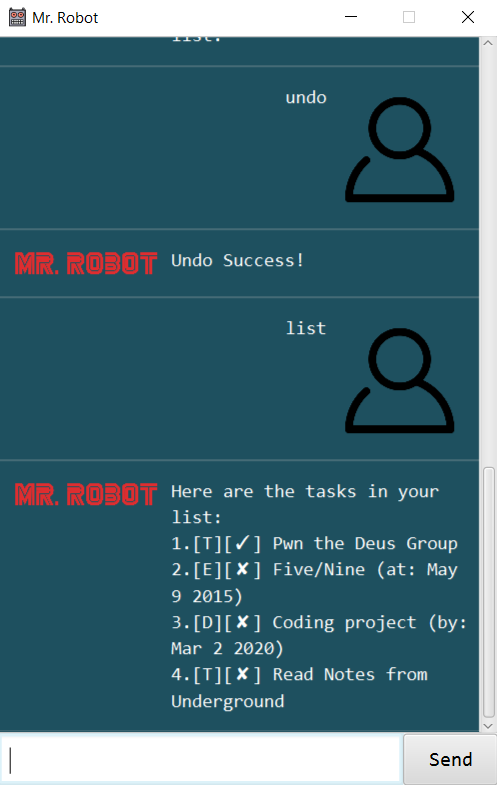
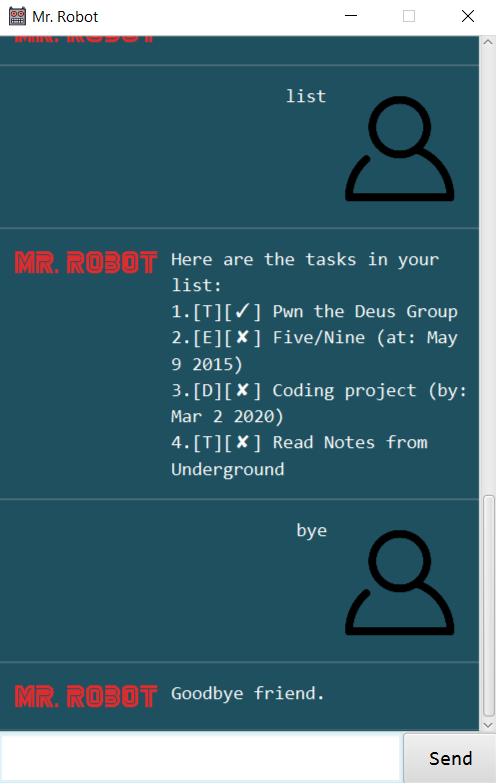

# Mr Robot

# User Guide

## Introduction

Duke is a Personal Assistant Chatbot that helps
a person keep track of various things in the form of
**tasks**.
> There are 3 types of **Tasks**: 
> 1. **todo**
>   * Tasks without any date attached to it.  
> 2. **event**
>   * Tasks that need to be done before a specific date.
> 3. **deadline**
>   * Tasks that start at a specific time and ends at a specific time.

Duke can perform the following:
1. **Add** a task
2. **Delete** a task
3. **Mark** a task as completed
4. **Find** a specific task using a given keyword
5. **List** out all tasks
6. **Undo** a command
7. **Exit**

## Running Duke on Windows
1. Locate the jar file in the File Explorer 
2. Type 'cmd' on the search bar and press 'Enter' to launch Command Prompt 
3. Execute the following command, assuming the jar file 
is named "duke-0.2.jar"
   * > java -jar -Dfile.encoding="UTF-8" duke-0.2.jar

## Features 

### 1. Add a task 
The specific steps used to add a task depends on the task type.

You can add a task to your list by using one of the following
**keywords**:
1. todo
2. event
3. deadline

## Usage

### `todo` - Add a new todo task

Adding a new todo task requires the following format:

`todo [description]`

A description is required for adding a new todo task.

Example of usage: 

`todo Pwn the Deus Group`

Expected outcome:

### `event` - Add a new Event task

Adding a new event task requires the following format:

`event [description] /at [event time in yyyy-mm-dd]`

Example of usage: 

`event Five/Nine /at 2015-05-09`

Expected outcome:

### `deadline` - Add a new deadline task

Adding a new deadline task requires the following format:

`deadline [description] /by [due date in yyyy-mm-dd]`

Example of usage: 

`deadline Coding Assignment /by 2020-02-02`

Expected outcome:

### 2. Delete a task
Allows you to remove a task.

## Usage

### `delete` or `rm` - Remove a task

Removes a task by providing a task number.

The task number starts from 1 and has a maximum value
based on the number of tasks in your list.

> **Unsure of the task number?**
>
> You can check using the `list` command!

Removing a task requires one of the following format:

1. `delete [task number]`
2. `rm [task number]`

Example of usage: 

1. `delete 1`
2. `rm 1`

Expected outcome:

### 3. Mark a task as completed
Allows you to mark a task as done.

## Usage

### `done` - Mark task as done

Mark a task as done by providing a task number.

The task number starts from 1 and has a maximum value
based on the number of tasks in your list.

> **Unsure of the task number?**
>
> You can check using the `list` command!

Marking a task as done requires the following format:

`done [task number]`

Example of usage: 

`done 1`

Expected outcome:

### 4. Find a specific task using a given keyword
Allows you to find all tasks with descriptions matching
a given **keyword**.

## Usage

### `find` - Find tasks with descriptions containing given keyword

Returns a list of tasks that have descriptions matching the given keyword.

Finding a task requires the following format:

`find [keyword to search]`

Example of usage: 

`find deus group`

Expected outcome:

### 5. List out all tasks
Allows you to view all tasks.

## Usage

### `list` or `ls` - List all tasks

Displays a list of tasks.

Example of usage: 

1. `list`
2. `ls`

Expected outcome:

### 6. Undo a command
Allows you to revert actions done on your list.

> You can undo commands up to the initial starting state of your list
> (When you first launch the application)

## Usage

### `undo` - Revert state of list to previous state, if applicable

No action will be performed if the list has returned to the state when the application
was first launched.

Example of usage: 

`undo`

Expected outcome:

> Undo is not possible

`Nothing to undo...`

> Undo is possible

 

### 7. Exit 
Command to terminate application.

## Usage

### `bye` - Terminate application

Example of usage: 

`bye`

Expected outcome:

## Acknowledgements
GUI was done using the
[JavaFX Tutorial](https://github.com/nus-cs2103-AY1920S2/duke/blob/master/tutorials/javaFxTutorialPart4.md)
done by [Jeffry Lum](https://github.com/j-lum)

User icon image obtained from
https://www.hiclipart.com/free-transparent-background-png-clipart-dlzoi/

Mr Robot icon: By USA Network - USA Network, Public Domain,
https://commons.wikimedia.org/w/index.php?curid=49685837
