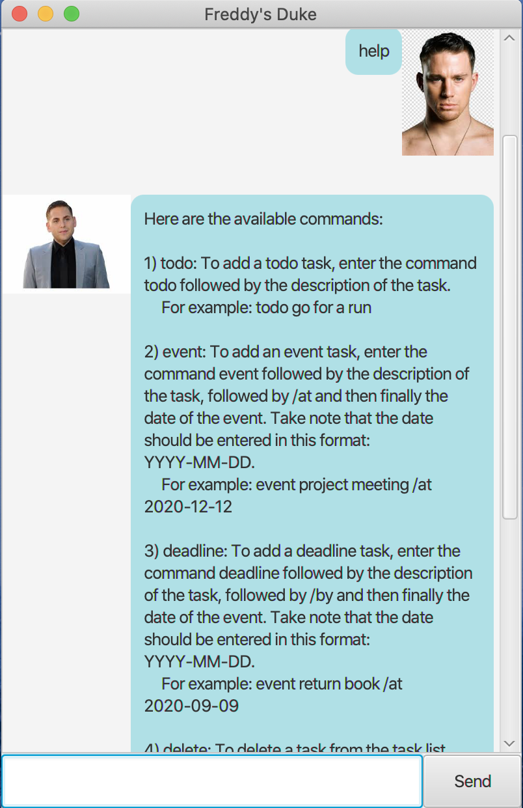

# User Guide

Duke is a **smart** bot which assist you to manage tasks. 

## Features 

### Add tasks

### Delete tasks

### List tasks

### Mark tasks as done 

### Find tasks by keywords

### Say good bye and save data

## Usage

Example of usage: 

`help`

Expected outcome:

````
1. help - lists out available commands
2. list - lists out all the tasks
3. todo <task name> - adds a ToDo task
4. event <task name> /by <event date: YYYY-MM-DD> - adds an Event task
5. deadline <task name> /by <event date: YYYY-MM-DD> - adds a Deadline task
6. done <task number> - marks indicated task as complete
7. delete <task number> - deletes the indicated task
8. find <keyword> - searches for tasks with <keyword>
9. bye - saves and closes the program
````

Example:


___

### `todo` : add a task of type TODO with description. 

`todo [description]` add a task of type TODO with description. 

Example of usage:

`todo find a love`

Expected outcome:
````
I have added this task:
  [T][X] find a love
You now have 1 tasks in the list!
````
___

### `event` : add a task of type EVENT with description and dates or venue

`event [description] /at June` add a task of type EVENT

Example of usage:

`event IOI 2020 /at July`

Expected outcome:
````
I have added this task:
  [E][X] IOI 2020 (at July)
You now have 2 tasks in the list!
````

___

### `deadline` : add a task of type DEADLINE with description and dates

`deadline [description] /by [yyyy-mm-dd]` add a task of type DEADLINE

Example of usage:

`deadline finish IP /by 2020-03-01`

Expected outcome:
````
I have added this task:
  [D][X] finish IP (by 01 March 2020)
You now have 2 tasks in the list!
````

___

### `list` : show all the tasks added 

`list` show all the tasks

Example of usage:

`list`

Expected outcome:
````
List of items:
1. [T][X] find a love
2. [E][X] IOI 2020 (at July)
3. [D][X] finish IP (by 01 March 2020)
````

___

### `done` : mark tasks as done. 

`done [index_1] [index_2] ... ` mark tasks in a certain list as done.

Example of usage:

`done 1 2`

Expected outcome:
````
Nice! I've marked this task as done:
	[T][V] find a love
	[E][X] IOI 2020 (at July)
````
___

### `delete` : delete tasks from the list.
`delete [index_1] [index_2]` removes the task at index from the list

Example of usage:

`delete 1`

Expected outcome:
````
I have deleted 1.[T][  complete  ] buy bottle
You now have 2 tasks remaining!
````

___

### `find` : search for tasks which contain keyword

`find [keyword]` show all the tasks

Example of usage:

`find IOI`

Expected outcome:
````
Here are the tasks matching in your list. 
````

___

### `bye` : quit and save data

`bye` saves and exits the program

Example of usage:

`bye`

`

### Acknowledgements
Code adapted from: https://github.com/se-edu/duke

JavaFX and Gradle tutorials: https://github.com/nus-cs2103-AY1920S2/duke/tree/master/tutorials


