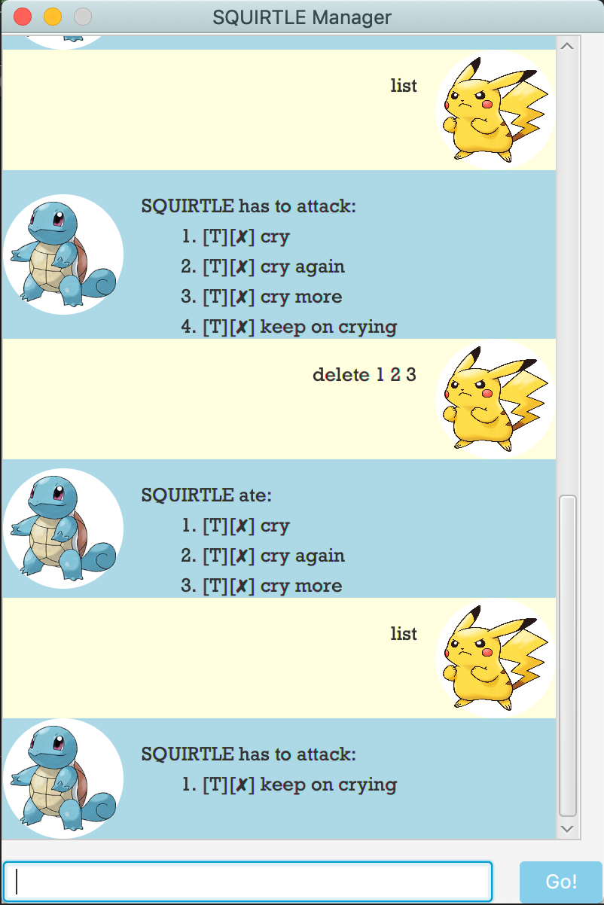

### Table of Contents
- [Welcome to Squirtle Manager!](#welcome-to-squirtle-manager-)
  * [What Squirtle Can Do](#what-squirtle-can-do)
  * [Setting up](#setting-up)
  * [Command List](#command-list)
  * [Sample Use](#sample-use)
- [Credits](#credits)
- [Feedback, Bug Reports](#feedback--bug-reports)

# Welcome to Squirtle Manager!
Squirtle Manager is a lightweight command line interface application built with Java and JavaFX, with a focus on object-oriented programming (OOP). Squirtle Manager makes use of local storage to remember your agenda, and is an _easy_, _quick_ and _fun_ way to stay on top of your tasks.
 


## What Squirtle Can Do

**1. Task tracking**

Squirtle Manager can track 3 types of tasks:

1. Events: These come with a _description_ and _date_

2. Deadlines: These come with a _description_ and _date_

3. Todos: These are tasks with a _description_ only

**2. Task deletion**

**3. Task updating**
* Modify task descriptions and dates easily

**4. Mark finished tasks as done**

**5. Task listing**
* Get a list of all your ongoing tasks, and their done status

**6. Find tasks using given keyword**  

## Setting up
* Download the jar file
* Run it using the command line command java -jar <name of jar file>
* Alternatively, double-click on the jar application to launch  

## Command List

_Notes on how commands are formatted:_
1. Words in brackets are PLACEHOLDERS

   * Replace with your own item
   * eg. ```(description)```
   
2. Words in square brackets are FIXED

   * You have to use either option within the brackets exactly
   * Options are separated with a slash /
   * eg. ```[des/date]``` means you have to pick either ```des``` or ```date```

Function | Command | Notes
---------|---------|-------
**Create new task**|```todo (description)```<br><br>```deadline /by (description) (deadline)```<br><br>```event /at (description) (date)```|Leave a space between each item. Refer to example below.<br><br>**date format: ```d/M/YYYY```** or **```today```** or **```tomorrow```**<br><br>Note the difference in construction between creating an event and deadline. (typing '```/at```' _vs_ '```/by```')
**List Tasks**|```list```|Gives a numbered list of all your current tasks.
**Delete Tasks**|```delete (item number)```|Item number corresponds to the sequence of the task in the list.<br>You can delete multiple tasks by adding a space between task numbers.<br>eg. ```delete 1 2 3```
**Update Task** Stage 1|```update (item number)```|Upon entering this command, Squirtle Manager will ask you to indicate which items to update, and what to update to.<br>See: Update Task Stage 2
**Update Task** Stage 2|```[des/date] (update)```|_Eg. to change the date of task to 9 February 2020: <br>```date 9/2/2020```
**Find Task**|```find (keyword)```|Squirtle Manager currently only accepts one keyword. Plans are being made to accept more keywords at one go to improve application versatility.
**Mark Task as Done**|```done (item number)```|Item number corresponds to the sequence of the task on the list.  

Example|
-------|
eg. to create a new deadline, called "download Squirtle Manager", due by 19 February 2020|
```deadline download Squirtle Manager /by 19/2/2020```|

## Sample Use
**Creating different tasks:**<br>


**Deleting a task:**<br>


**Deleting multiple tasks at once:**<br>


**Updating a selected task:**<br>


**Finding a task:**<br>


# Credits
Squirtle Manager is based on the popular [Duke][a2] software engineering tutorial, while this repository is forked from [this repo][a1], which contains modified code for instruction in module CS2103T taught by National University of Singapore.  

Table of contents generated with [markdown-toc][a3].

[a1]:https://github.com/nus-cs2103-AY1920S2/duke
[a2]:https://github.com/se-edu/duke
[a3]:http://ecotrust-canada.github.io/markdown-toc

# Feedback, Bug Reports

* If you have feedback or bug reports, please post in [airshhlay/duke issue tracker](https://github.com/airshhlay/duke/issues).
* I welcome pull requests too.

