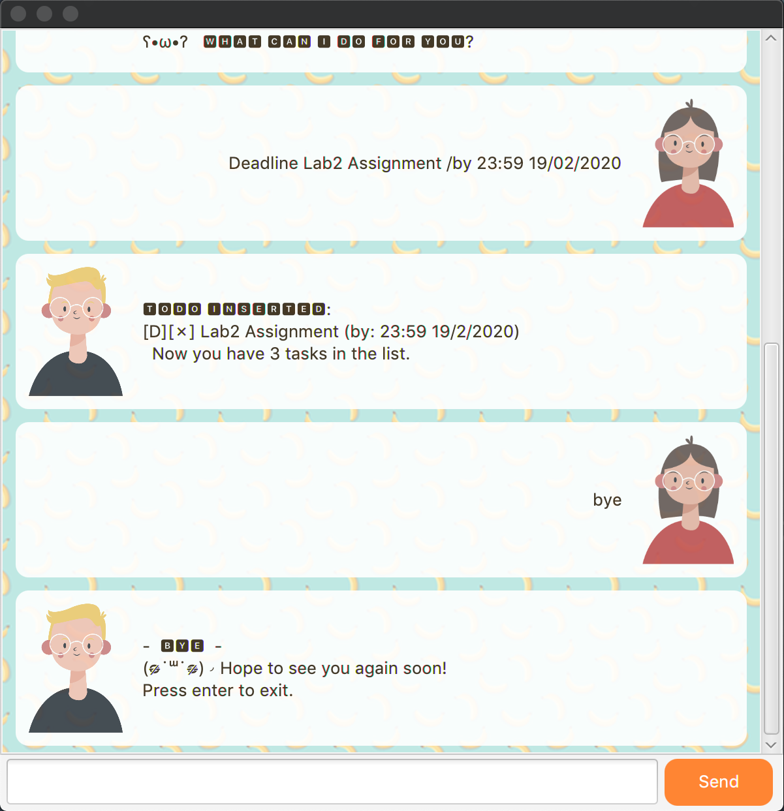

# User Guide: Cat Bot


Missing a Todo list? 

Or sometimes requiring a Todo list while offline?

Cat bot saves a list of things you want to do!

## Features 

### Easy to use GUI

Has an easy-to-use user interface with intuitive commands, along with theme toggling and exit button functionality.

### Holds 3 different task types

1. Todo - a task that you want to do

2. Deadline - a task that requires you to finish by a certain date

3. Event - a task that happens on a certain date

### Saves your task list

Saves your tasks when you exit from the program and keeps your tasks until the next
time you open the program.

<br>


## Usage

### `todo` - Adds a todo task

Adds a todo task to your list!

Example of usage: 

```todo homework```

Expected outcome:

```
Got it. I have added this task:
1. [T][N] homework
Now you have a total of 1 Tasks in your list
```

### Acceptable input formats:
* todo 'task'
<br>


### `deadline` - Adds a deadline task

Has the ability to record date and time of the deadline.

Example of usage:

```deadline tutorial 2 /by 7/3/2020 2200```

Expected outcome:
```
Got it. I have added this task:
2. [D][N] tutorial 2  (by: 7/3/2020 2200)
Now you have a total of 2 Tasks in your list
```

Works as well for other deadlines without specific date and times.

Example of usage:

```deadline tutorial submission /by tonight```

Expected outcome:
```
Follow the format dd/MM/YYYY HHMM if you want the timing to be recorded!

Got it. I have added this task:
3. [D][N] tutorial submission  (by: tonight)
Now you have a total of 3 Tasks in your list
```

#### Acceptable input formats:
* deadline 'task' /by dd/MM/YYYY HHMM
* deadline 'task' /by dd/MM/YYYY
* deadline 'task' /by 'non-specified time'
<br>


### `event` - Adds an event task

Adds an event task to your list!

Example of usage: 

```event eat with friends /at tonight```

Expected outcome:

```
Follow the format dd/MM/YYYY HHMM if you want the timing to be recorded!

Got it. I have added this task:
4. [E][N] eat with friends  (at: tonight)
Now you have a total of 4 Tasks in your list
```

#### Acceptable input formats:
* event 'task' /by dd/MM/YYYY HHMM
* event 'task' /by dd/MM/YYYY
* event 'task' /by 'non-specified time'
<br>


### `list` - Shows the tasklist

Shows the tasks currently in your list.

Example of usage: 

```
list 
```

Expected outcome:

```
Here are the tasks in your list:
1. [T][N] homework
2. [D][N] tutorial 2  (by: 7/3/2020 2200)
3. [D][N] tutorial submission  (by: tonight)
4. [E][N] eat with friends  (at: tonight)
```
<br>


### `done` - Finishes a task

Finishes a task from your list, marking it as 'Y' instead or 'N'.

Example of usage: 

```done 1```

Expected outcome:

```
Nice! You have done this:
1. [T][Y] homework
```

If you enter the list command to see all the tasks, you will notice that task 1 is 
marked with 'Y' instead of 'N'.

Command entered:

```
list 
```

Reply from bot:

```
Here are the tasks in your list:
1. [T][Y] homework
2. [D][N] tutorial 2  (by: 7/3/2020 2200)
3. [D][N] tutorial submission  (by: tonight)
4. [E][N] eat with friends  (at: tonight)
```

If ```done 1``` is entered again, the bot will reply the following:

```
You have already done
1. [T][Y] homework
No need to do it again!
```

#### Acceptable input formats:
* done 'task number'
<br>


### `find` - Finds tasks

Finds tasks which contains descriptions associted to the input from the user.

Example of usage: 

```find tut```

Expected outcome:

```
Here are the matching tasks in your list:
2. [D][N] tutorial 2  (by: 7/3/2020 2200)
3. [D][N] tutorial submission  (by: tonight)
```

#### Acceptable input formats:
* find 'task number'
<br>


### `details` - Return details about tasks

Returns the full details of tasks such as when they were started and when are they due.
<br>Works for individual tasks as well as all tasks.

#### Individual task usage
Example of usage: 

```details 2```

Expected outcome:

```
Your Task Details are as follows:

2. [D][N] tutorial 2 
(started on: 2020-02-22) 
(by: 7/3/2020 2200)
```

Note that the deadline task has already been previously entered.

Command used:
```deadline tutorial 2 /by 7/3/2020 2200```

#### All tasks usage

Example of usage: 

```details all```

Expected outcome:

```
Your Task Details are as follows:

1. [T][Y] homework
2. [D][N] tutorial 2 
(started on: 2020-02-22) 
(by: 7/3/2020 2200)
3. [D][N] tutorial submission 
(started on: 2020-02-22) 
(by: tonight)
4. [E][N] eat with friends  (at: tonight)
```

##### Acceptable input formats:
* details 'task number'
* details all
<br>


### `delete` - Deletes tasks from your list

Has the function to delete a singular task or all tasks from your list.

Example of usage assuming you have 4 tasks in your list: 

```delete 1```

Expected outcome:

```
I have removed a finished task:
1. [T][Y] homework

Now you have a total of 3 Tasks in your list
```

Also contains delete all function to delete all tasks:

Example of usage: 

```delete all```

Expected outcome:

```
Your whole list has been cleared!
```

#### Acceptable input formats:
* delete 'task number'
* delete all
<br>


### `bye` - Saves list before termination

Saves the list into a text file and guides the user to exit the application.

Example of usage:

```bye```

Expected outcome:

```
Your List has been saved, Bye! Hope to see you again soon! Press the exit button!
```
#### Acceptable input formats:
* bye


## Other Functionalities 

### Toggle Colour Button

Allows the user to toggle the colour theme.



<br>


### Exit Button

<br>
Exits the application but does not save the list.
<br>
A 'bye' command is required for the list to be saved.


## Acknowledgements

### Photos used
Screenshots of Capoo and Bunny pictures from Telegram:
<br>
https://t.me/addstickers/AnimatedCapoo
