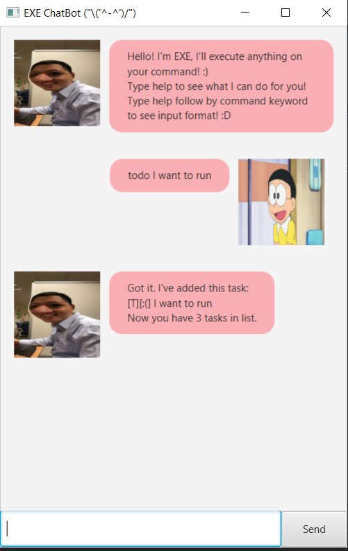
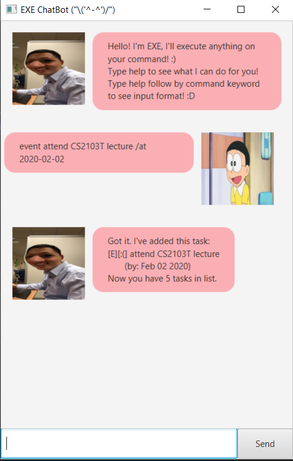
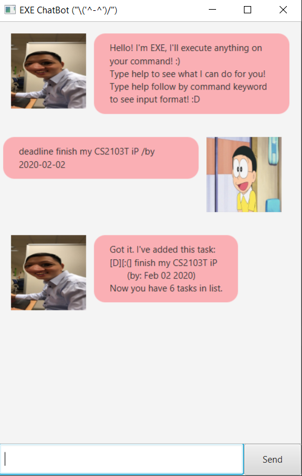
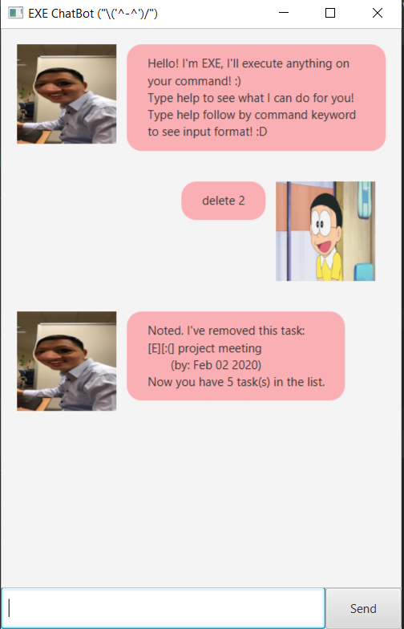
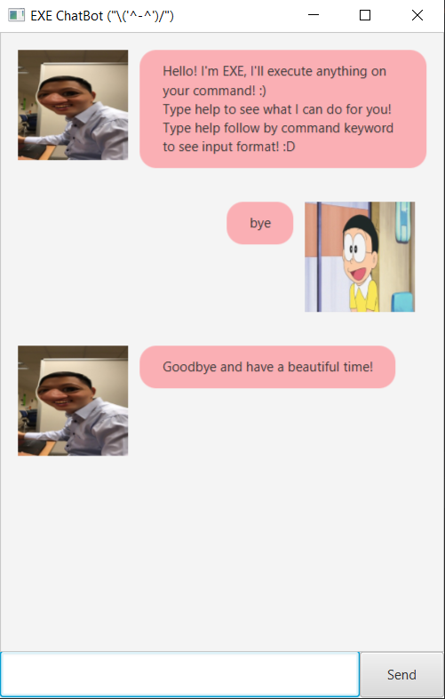
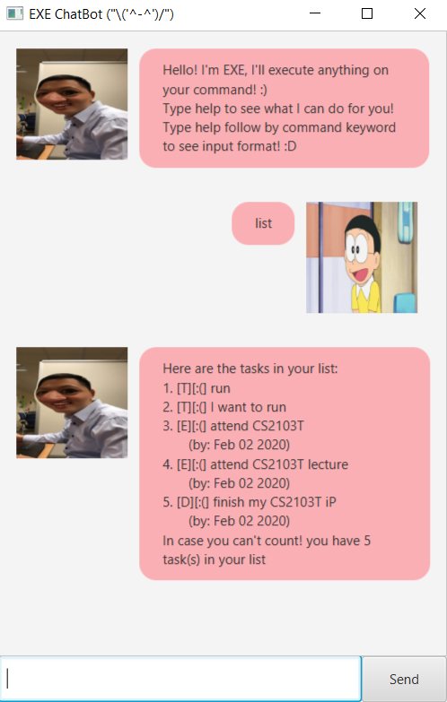
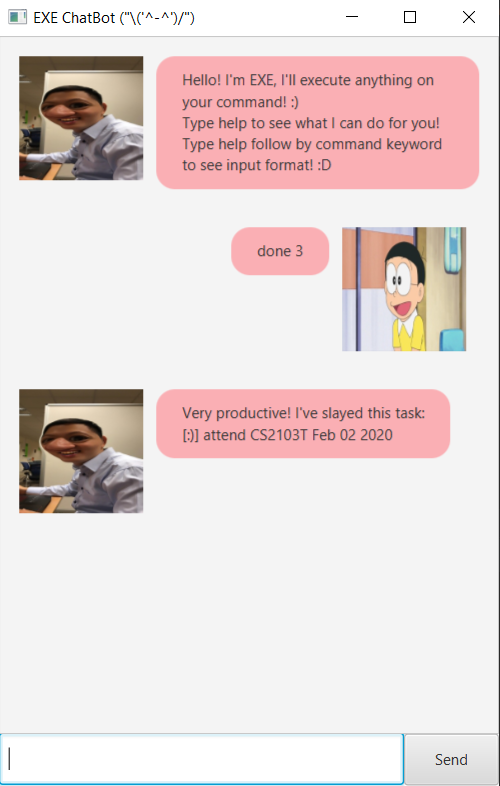
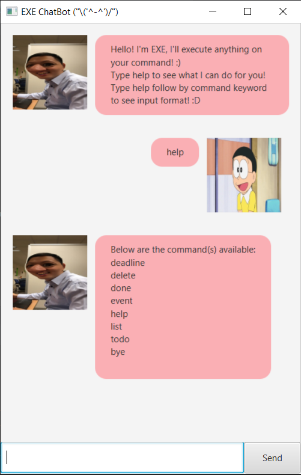
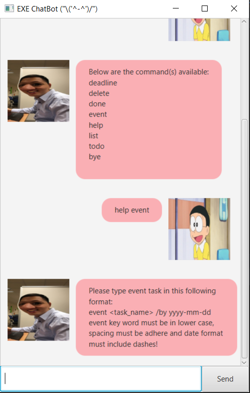

# EXE User Guide
By: [Kenny Ho](https://github.com/khsc96) Since: Jan 2020

## Table of Contents
* [Introduction](#introduction)
* [Features](#features)
    * [Adding Todo Task](#adding-todo-task)
    * [Adding Event Task](#adding-event-task)
    * [Adding Deadline task](#adding-deadline-task)
    * [Deleting existing task](#deleting-existing-task)
    * [Exiting the application](#exiting-the-application)
    * [List out all existing tasks](#list-out-all-existing-tasks)
    * [Marking task as done](#marking-task-as-done)
    * [Viewing help menu](#viewing-help-menu)
* [Usage](#usage) 
    * [Add todo task usage](#add-todo-task-usage)
    * [Add event task usage](#add-event-task-usage)
    * [Add deadline task usage](#add-deadline-task-usage)
    * [Deleting tasks](#deleting-tasks)
    * [Exiting application](#exiting-application)
    * [Listing out all tasks](#listing-out-all-tasks)
    * [Marking task as done](#marking-task-as-done-usage)
    * [Help menu](#help-menu)
* [Acknowledgements](#acknowledgements)
  
## Introduction
EXE is your very own personal assistant chatbot. EXE will always be there for you if you need someone to voluntarily 
record and remind you on your own personal tasks. 
 
 
Tasks can be categorised as Todo task, event task, or deadline
tasks. You can add, delete, mark as done and list down all your tasks. Want to further know what EXE can do for you?
Press [here](#features)
## Features 
**Command format**
 
* Words in `UPPER_CASE` are the parameters to be supplied by the user. e.g in `todo TASK_DESCRIPTION`, 
`TASK_DESCRIPTION` is a parameter you need to type in. 
Example is given [below](#usage).

* Words in `lower_case` are parameters that are optional, keying it will result in more specific command being executed.

* Parameters must be in order e.g, if the command feature specifies `command TASK_DESCRIPTION /at TIME` 
such order must be maintained for EXE to recognised command.

### Adding Todo task 
This feature adds a given task that is categorised as todo into the list of your existing task.
 
> Format: `todo TASK_DESCRIPTION`
>  
> e.g: `todo My CS2103T iP`

For visual example click [here](#add-todo-task-usage).
 

### Adding Event task
This feature adds a given task that is categorised as event into the list of your existing task.
 
> Format: `event TASK_DESCRIPTION /at YYYY-MM-DD`
>  
> e.g: `event attend CS2103T lecture /at 2020-02-02`

For visual example click [here](#add-event-task-usage).

### Adding Deadline task
This feature adds a given task that is categorised as deadline into the list of your existing task.
 
> Format: `deadline TASK_DESCRIPTION /by YYYY-MM-DD`
>  
> e.g: `deadline finish my CS2103T iP /by 2020-02-02`

For visual example click [here](#add-deadline-task-usage).
### Deleting existing task
This feature deletes one of your existing task from your list of tasks.  
> Format: `delete TASK_NUMBER`
>  
> e.g: `delete 3`

For visual example click [here](#deleting-tasks).
### Exiting the application
This feature give you an option to quit the application and enjoy the pretty goodbye message.
> Format: `bye`

To see the pretty goodbye message please click [here](#exiting-application). 

### List out all existing tasks
This feature allows you to see all your current existing tasks and will tell you how many tasks you have currently.
> Format: `list`

For visual example of how list command will look like click [here](#listing-out-all-tasks).

### Marking task as done
This feature allows you to change the status of a task from undone to done. 
Done tasks are denoted by a smiley face `:)`. While tasks that is undone are denoted by a 
sad face `:(`.

>Format: `done TASK_NUMBER`
> 
>e.g. `done 3`

For visual help please click [here](#marking-task-as-done-usage)
### Viewing help menu
This feature shows you all command EXE can execute. Also, it can show you specific command format.
>Format: `help [COMMAND_NAME]`

For a better understanding of how help command works please click [here](#help-menu)

## Usage
Below are pictures depicting all the scenarios that you should encounter when using EXE.
### Add todo task usage
*input:* `todo I want to run`
  
EXE will add `I want to run` as a todo task
  
*Expected outcome:*

### Add event task usage
*input:* `event attend CS2103T lecture /at 2020-02-02`
  
EXE will add `attend CS2103T lecture` as an event task
  
*Expected outcome:*

### Add deadline task usage
*input:* `deadline finish my CS2103T iP /by 2020-02-02`
  
EXE will add `finish my CS2103T iP` as an deadline task
  
*Expected outcome:*

### Deleting tasks
*input:* `delete 2`
  
EXE will delete task number 2 in the task list which is `project meeting by: Feb 02 2020`.
  
*Expected outcome:*

### Exiting application
*input:* `bye`
  
EXE will exit the application while showing the goodbye message.
  
*Expected outcome:*

### Listing out all tasks
*input:* `list`
  
EXE will list out all the existing tasks you have.
  
*Expected outcome:*

### Marking task as done usage
*input:* `done 3`
  
EXE will mark task 3 in the list to done, which is from a `:(` to a `:)`.
  
*Expected outcome:*

### Help menu
**Example 1** 
  
*input:* `help`
  
EXE will list out all commands it can execute to help you better communicate with it.
  
*Expected outcome:*

**Example 2**
  
*input:* `help event`
  
EXE will show the format of what event command need to be in.
  
*Expected outcome:*

## Acknowledgements 

