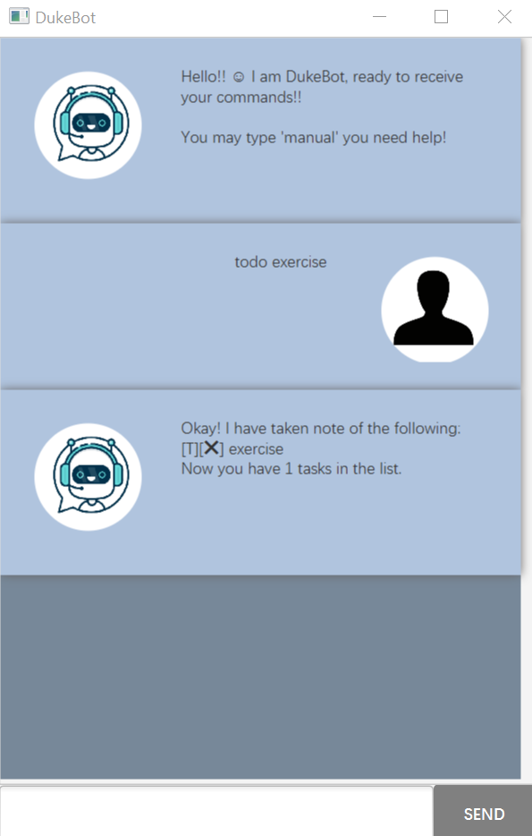
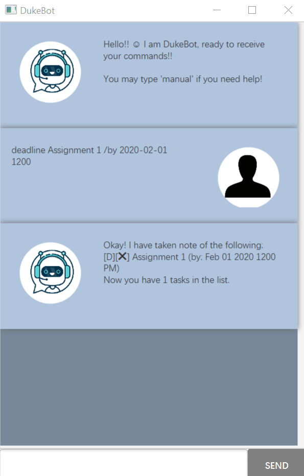
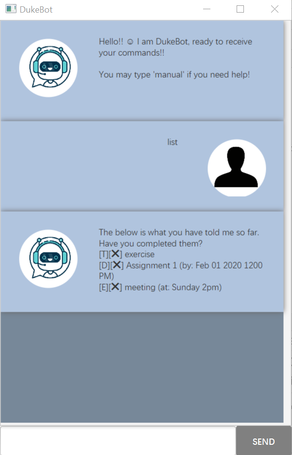
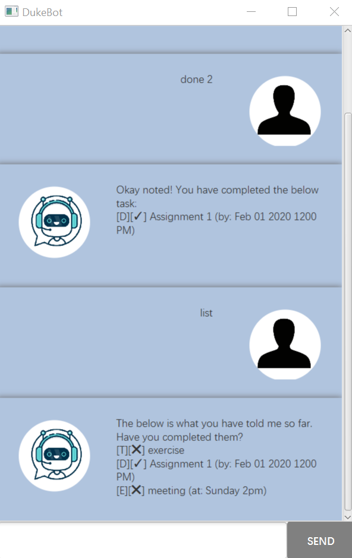
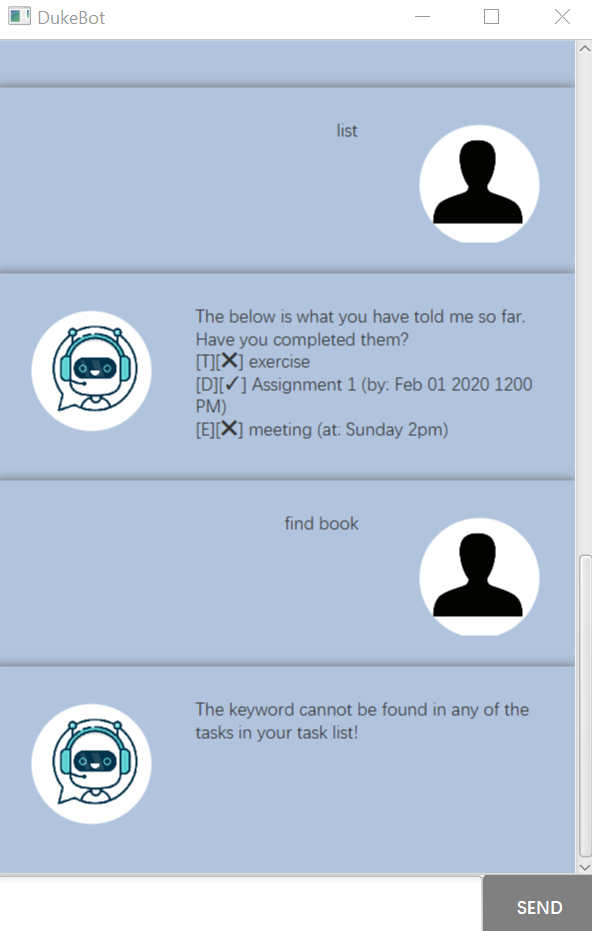
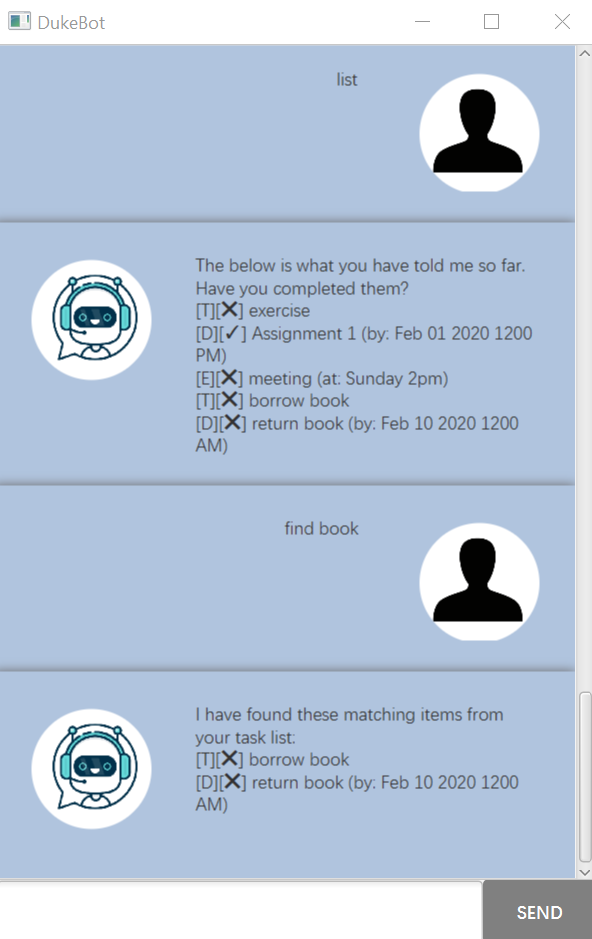
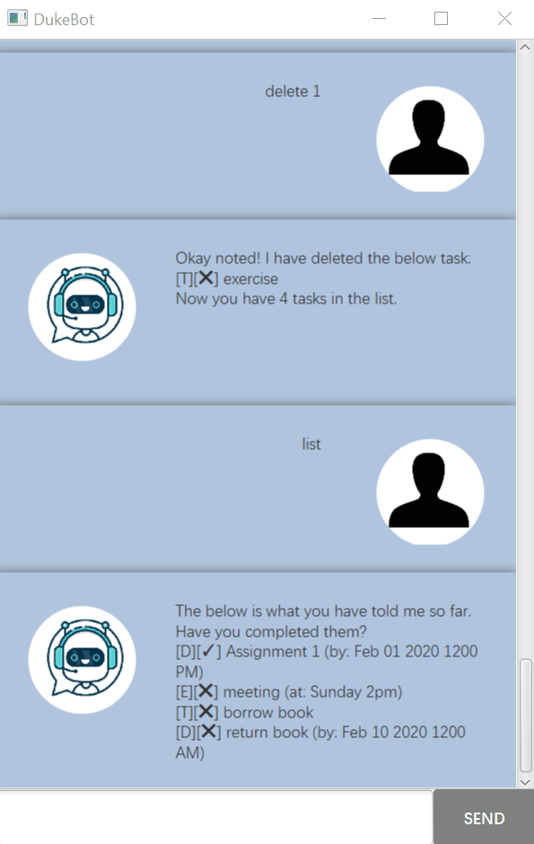
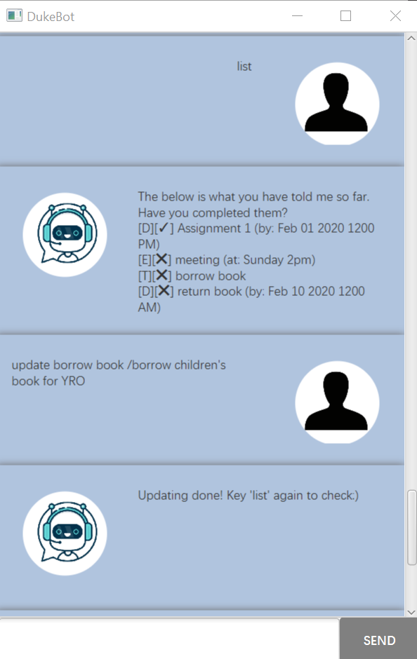
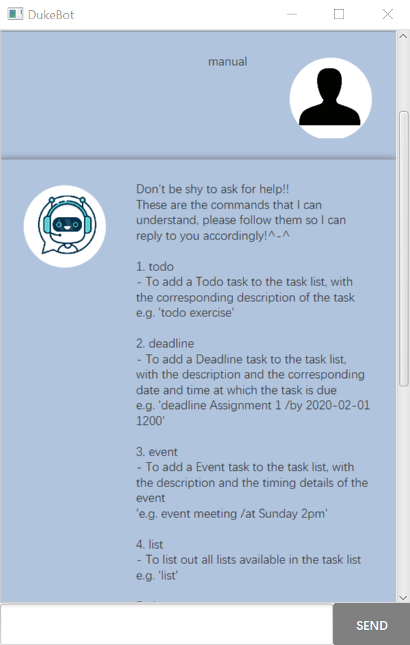

# User Guide

## Description
DukeBot is a personal chat bot to help a user keep track of tasks to be done by storing them in a task list.

 
## Features 

### Add task
* There are 3 kinds of tasks that a user can add to the task list: Todo, Deadline and Event.

<br/>

### List task
* The user can list out all tasks in the task list.

<br/>

### Mark task as done
* The user can mark a task as completed.

<br/>

### Find task
* The user can look for a particular task by inputting a keyword.

<br/>

### Delete task
* The user can remove a task from the task list.

<br/>

### Update description of task
* The user can update the description of a Todo task, the deadline date and time of a Deadline task or the timing details
of an event.

<br/>

### Exit from application
* The user can close the application by inputting `bye` and the application will store the tasks in the task list to a 
`duke.txt` file.

## Usage

### `todo` - Adds a Todo task to the task list

With this command, DukeBot will add a Todo task with the command inputted by the user, and update the task list.

Example of usage: 

`todo exercise`

Expected outcome:
```
Okay! I have taken note of the following:
[T][❌] exercise
Now you have 1 tasks in the list.
```


<br/>

### `deadline` - Adds a Deadline task to the task list

With this command, DukeBot will add a Deadline task with the command as well as the date and time at which the task is 
due which are inputted by the user, and update the task list.

Example of usage: 

`deadline Assignment 1 /by 2020-02-01 1200`

Expected outcome:
```
Okay! I have taken note of the following:
[D][❌] Assignment 1 (by: Feb 01 2020 1200 PM)
Now you have 1 tasks in the list.
```


<br/> 

### `event` - Adds a Event task to the task list

With this command, DukeBot will add a Event task with the command as well as the timing details of the event which are
inputted by the user, and update the task list.

Example of usage: 

`event meeting /at Sunday 2pm`

Expected outcome:
```
Okay! I have taken note of the following:
[E][❌] meeting (at: Sunday 2pm)
Now you have 1 tasks in the list.
```


<br/> 

### `list` - Lists all tasks in the task list

With this command, DukeBot will list all tasks in the task list.

Example of usage: 

`list`

Expected outcome:
```
The below is what you have told me so far. 
Have you completed them?
[T][❌] exercise
[D][❌] Assignment 1 (by: Feb 01 2020 1200 PM)
[E][❌] meeting (at: Sunday 2pm)
```


<br/> 

### `done` - Marks a task as done

With this command, DukeBot will mark a task as completed.

Example of usage: 

`done 2`

Expected outcome:
```
Okay noted! You have completed the below task:
[D][✓] Assignment 1 (by: Feb 01 2020 1200 PM)
```


<br/> 

### `find` - Looks for a particular task

With this command, DukeBot will tell the user which tasks present in the task list fit the keyword that the user has 
inputted.

Example of usage: 

`find book`

Expected outcome if keyword is **not found** in tasks present in task list:
```
The keyword cannot be found in any of the tasks in your task list!
```


<br/>

Expected outcome if keyword is **found** in tasks present in task list:
```
I have found these matching items from your task list:
[T][❌] borrow book
[D][❌] return book (by: Feb 10 2020 1200 AM)
```


<br/> 

### `delete` - Deletes a task from the task list

With this command, DukeBot will delete the task at the specified index of the task list.

Example of usage: 

`delete 1`

Expected outcome:
```
Okay! I have deleted the below task:
[T][❌] exercise
Now you have 4 tasks in the list.
```


<br/>

### `update` - Updates the information of a task

* For a Todo task, inputting the exact description of the task previously entered followed by the new description 
updates the task information.

Example of usage: 

`update borrow book /borrow children's book for YRO`

Expected outcome:
```
Updating done! Key 'list' again to check:)
```



<br/>

* For a Deadline task, inputting the exact description of the task previously entered followed by a new deadline and 
time updates the task information. Both the date and time has to be inputted, even if one of it did not change.

Example of usage: 

`update Assignment 1 /2020-02-20 0000`

Expected outcome:
```
Updating done! Key 'list' again to check:)
```


<br/>

* For a Event task, inputting the exact description of the task previously entered followed by the new timing details
updates the task information.

Example of usage: 

`update meeting /Monday 5pm`

Expected outcome:
```
Updating done! Key 'list' again to check:)
```


<br/>

### `manual` - Shows the different commands 

With this command, DukeBot will show all the different commands that a user can input as well as example inputs.

Example of usage: 

`manual`

Expected outcome:
```
Don't be shy to ask for help!! 
These are the commands that I can understand, please follow them so I can reply to you accordingly!^-^

1. todo 
- To add a Todo task to the task list, with the corresponding description of the task
e.g. 'todo exercise'

2. deadline 
- To add a Deadline task to the task list, with the description and the corresponding date and time at which the task is due
e.g. 'deadline Assignment 1 /by 2020-02-01 1200'

3. event 
- To add a Event task to the task list, with the description and the timing details of the event
'e.g. event meeting /at Sunday 2pm'

4. list 
- To list out all lists available in the task list
e.g. 'list'

5. done 
- To mark a task as completed, with its index specified
e.g. 'done 1' (this will mark the first task in the list as done)

6. find 
- To find all tasks present in the task list that fit a keyword inputted
e.g 'find book'

7. delete 
- To delete a task from the task list, with its index specified
e.g. 'delete 1' (this will delete the first task in the task list)

8. update 
- To update the description of a Todo task, the deadline date and time of a Deadline task or the timing details of a Event task, using the specific command entered previously
e.g. 'update borrow book /borrow children's book for YRO' (given that 'todo borrow book' was inputted previously)
```


