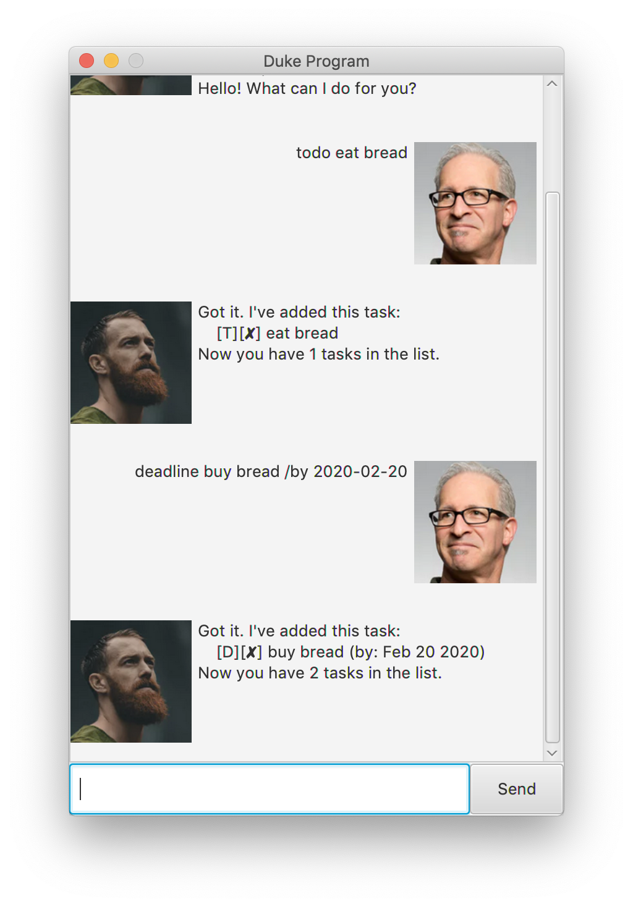
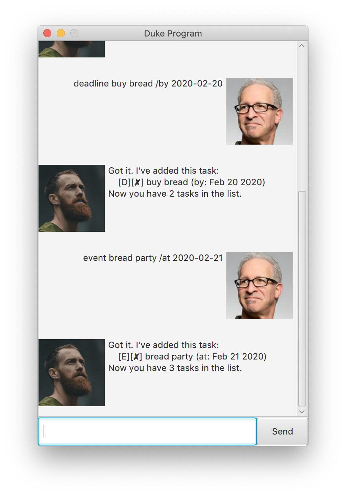
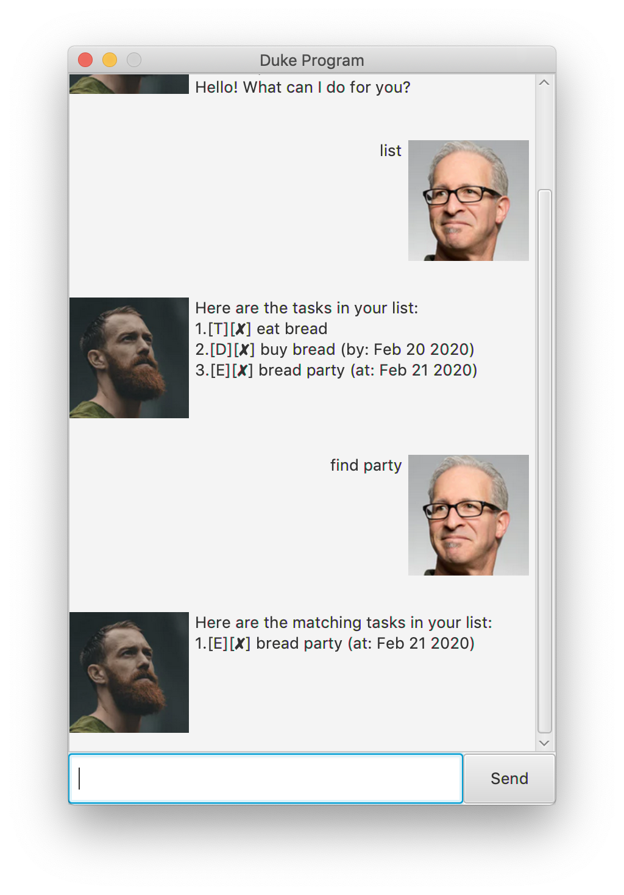
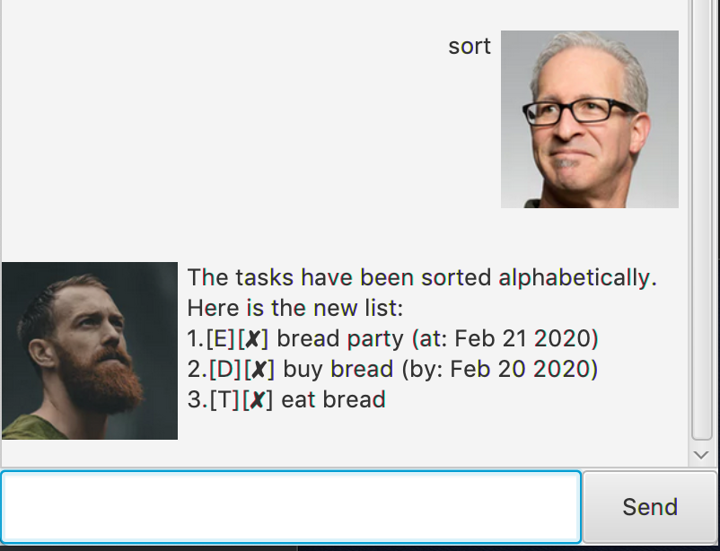
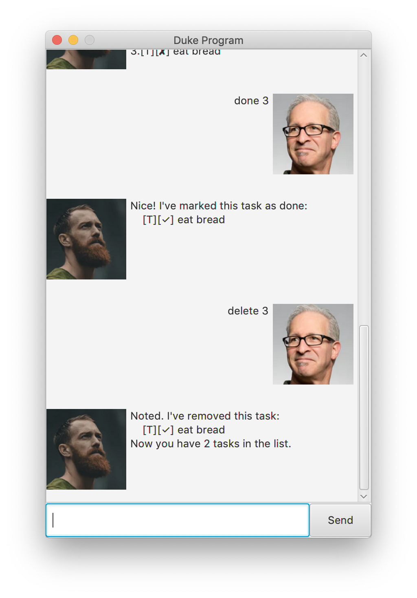

# User Guide
Duke is a personal assistant that helps you to keep track of your tasks, such as todos, deadlines and events.

## Features

### Simple To Use
A light-weight GUI program that allows you to add/remove tasks easily.

### Mark As Done
Tasks can be marked as done with the 'done' command once they are completed.

### Persistent Data
Your task list are stored in "data/tasks.txt" and will not be discarded even if you restart the program.

### Easy To Manage
Easily find your tasks with the 'find' and 'sort' commands.

## Usage

### Adding a task
- `todo [description]` - Adds the todo task to the list.
- `deadline [description] /by [YYYY-MM-DD]` - Adds the deadline with the due date to the list.
- `event [description] /at [YYYY-MM-DD]` - Adds the event with the event date to the list.

Expected outcome:

### Displaying the tasks
- `list` - Displays the task list.
- `find [keyword]` - Displays all the tasks in the task list that matches with the keyword.
- `sort` - Sorts the task list in alphabetical order.

Expected outcome:

### Modifying the tasks
- `done [task-index]` - Mark the specific task in the task list as done.
- `delete [task-index]` - Delete the specific task in the task list.

Expected outcome:

### Exiting the program
- `bye` - Terminates the Duke Program.
