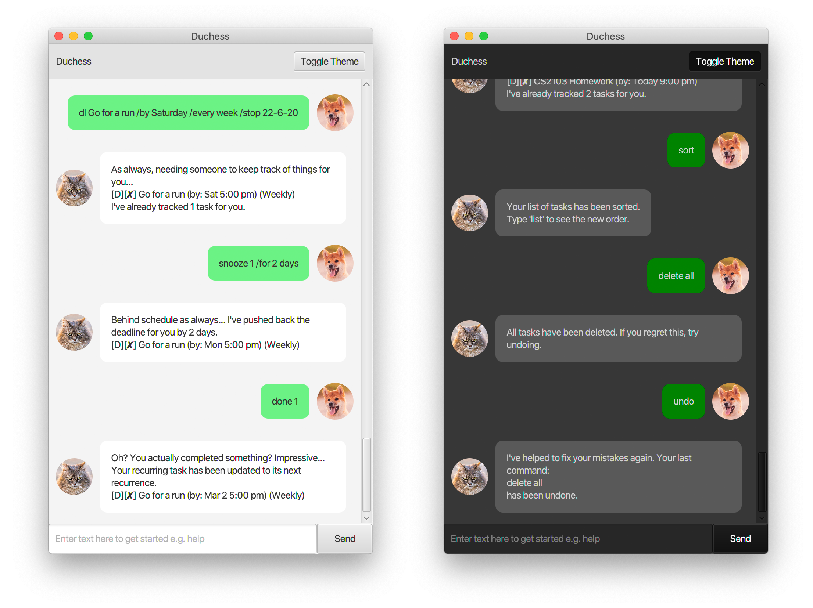
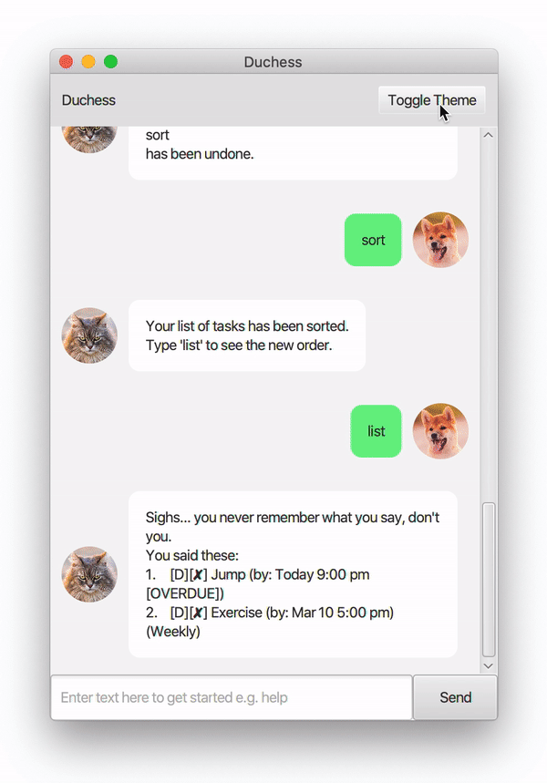
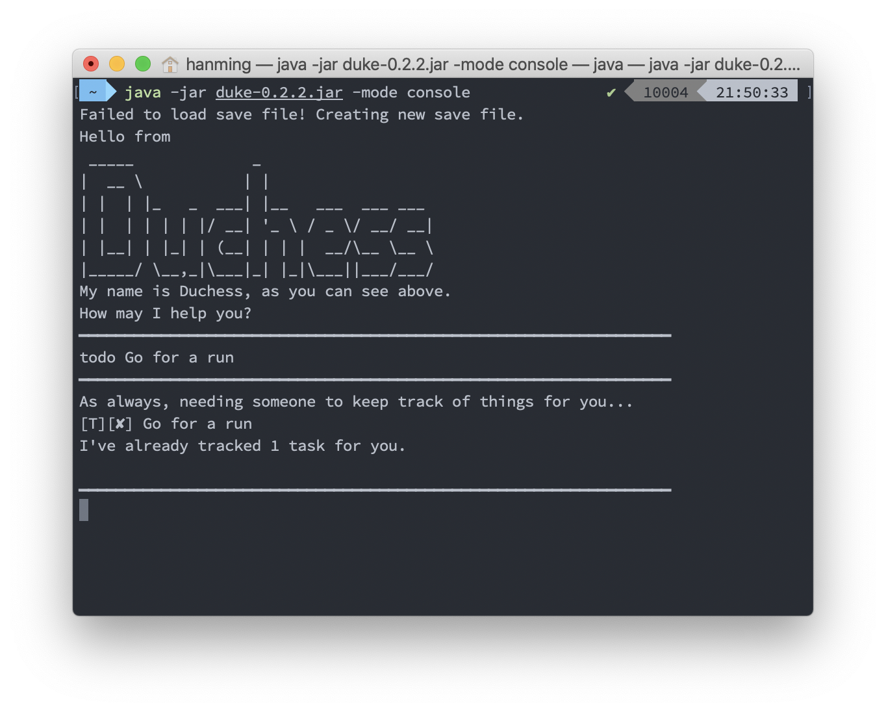

# User Guide for Duchess
_Zhu Hanming A0196737L_

<p align="center"></p>

Welcome to Duchess, the task manager app who just can't wait for you to go away!  

Track your todos, deadlines and events meticulously, and have fun while doing so!

## Features 

### Create Tasks Based on Your Needs

In Duchess, three different tasks can be created, depending on your needs:
* Todos
* Events
* Deadlines

#### Todos
Todos are simply tasks with a description and a completion status, much like a todo you'd have on your todo list. As
 such, it's very simple to create and use.
 
#### Events
Events on the other hand allow you to tag some particular time frame to your task. This is not a strict start and end
 date, but rather a casual description, such as "at University Town, 2-4pm".
 
#### Deadlines
Deadlines are the tasks with hard due dates. Upon going beyond these due dates, you will be given warnings.

Deadlines can also be recurring / repeated. More information on how to maximise the use of Deadlines will be included
 below!  
 
### Manage Your Tasks Easily
A variety of commands has been provided to enable quicker management and handling of tasks. Do check out the list below!

### Easy on Your Eyes

<p align="center"></p>

Say no to light mode. Simply click the Theme Toggle to turn on Dark Mode and save your eyes some pain.

### Averse to GUI? No problem.

<p align="center"></p>

If you don't want to use my GUI (which is a pity), simply download the `.jar` file and run the following command on
 your command line or terminal:  
```
java -jar duke-0.2.2.jar -mode console
```

With the `-mode console` flag, rest assured that you'll be having a **console-ing** experience.

## Usage

### `todo` - adds a todo

A todo will be added to your list of tasks.

Example of usage: 

`todo Jog`

Expected outcome:
```
As always, needing someone to keep track of your things for you...
[T][✘] Jog
I've already tracked 1 task for you.
```

Shorthands for this command:  
`t Jog`

### `event` - adds an event

An event will be added to your list of tasks.

Example of usage: 

`event Holiday /at Hawaii`

Expected outcome:
```
As always, needing someone to keep track of your things for you...
[E][✘] Holiday (at: Hawaii)
I've already tracked 2 tasks for you.
```

Shorthands for this command:  
`e Holiday /at Hawaii`

### `deadline` - adds a deadline

A deadline will be added to your list of tasks.

Example of usage: 

`deadline Go for a run /by 21-2-20 1800`

Expected outcome:
```
As always, needing someone to keep track of your things for you...
[D][✘] Go for a run (by: Fri 6:00 pm)
I've already tracked 3 tasks for you.
```

Shorthands for this command:  
`dl Go for a run /by 21-2-20 1800`

**More about Deadlines**

Deadline is the most powerful task in Duchess. It's extremely flexible, and you can make them repeat.

Here are the acceptable formats for the date time input:
* d-m-yy (e.g. `12-2-21`)
* d-m-yy HHmm (e.g. `12-2-21 1000`)
* Today / Tonight / Tomorrow
* Monday / Tuesday / Wednesday / etc. (assigns the coming Monday, Tuesday, etc. respectively)

To make your deadline repeat, you simply need to add a `/every FREQUENCY`, where `FREQUENCY` can be:
* Day / Daily
* Week / Weekly
* Biweekly / Fortnightly / Two weeks / 2 weeks
* Month

And if you want this repetition to stop, simply add `/stop TIME`, where `TIME` is of the same date time format as the
 due date. In other words, a full command might look something like this:

`deadline Do CS2103 Tutorial /by Thursday /every week /stop 16-4-20`

### `list` - lists out your tasks

Your tasks will be listed out.

Example of usage: 

`list`

Expected outcome:
```
Sighs... you never remember what you say, don't you.
You said these:
1.  [T][✘] Jog
2.  [E][✘] Holiday (at: Hawaii)
3.  [D][✘] Go for a run (by: Fri 6:00 pm)
```

Shorthands for this command:  
`l`  
`li`

### `done` - completes a task

You will complete the task indicated by the index after the `done` command. This index is with reference to its
 number on the list.

Example of usage: 

`done 1`

Expected outcome:
```
Oh? You actually completed something? Impressive...
[T][✓] Jog
```

Shorthands / Alternatives for this command:  
`d 1`  
`complete 1`

### `find` - finds a task

This is to search through tasks based on their name. This command is case insensitive, and the full word will need to
 be contained in the name for the task to be shown.

Example of usage: 

`find holiday`

Expected outcome:
```
Not bad, I found the following:
1.  [E][✘] Holiday (at: Hawaii)
    [REF INDEX FOR DELETE/DONE: 2]
```

The REF INDEX is with respect to the original list, and since the `done` and the later `delete` commands are with
 respect to that order, you will need to use that index instead of the filtered list index. 
 
Shorthands / Alternatives for this command:  
`f 2`  
`search 2`

### `delete` - deletes a task

Much like `done` marks a task at a certain index as done, `delete` deletes a task at a certain index.

Example of usage: 

`delete 2`

Expected outcome:
```
Great! One less thing for me to track for you.
[E][✘] Holiday (at: Hawaii) [DELETED]
Now I'm tracking 2 tasks for you.
``` 

You can also delete all tasks at once:  
`delete all`

Expected outcome:
```
All tasks have been deleted. If you regret this, try undoing.
```

You'll get to see `undo` later.
 
Shorthands / Alternatives for this command:  
`del 2`  

### `snooze` - pushes back a deadline

Pushes a deadline back by the duration indicated.

Example of usage: 

`snooze 2 /for 3 days`

Expected outcome:
```
Behind schedule as always... I've pushed back the deadline for you by 2 days.
[D][✘] Go for a run (by: Sun 6:00 pm)
``` 

*Formats for Durations*  
The formats accepted are (with x being a positive number):
* x hours
* x days
* x weeks
* x months
* x years (wow)
 
Shorthands / Alternatives for this command:  
None

### `sort` - sorts the task list

Sorts the task list by the following standards:
* Incomplete deadlines with the earliest due dates first
* Incomplete todos and events in the order that they were created
* Complete deadlines, todos and events in the order that they were created 

Example of usage: 

`sort`

Expected outcome:
```
Your list of tasks has been sorted.
Type 'list' to see the new order.
``` 

If you type in `list`, you'll see:  
```
Sighs... you never remember what you say, don't you.
You said these:
1.  [D][✘] Go for a run (by: Sun 6:00 pm)
2.  [T][✓] Jog
```

Shorthands / Alternatives for this command:  
`s`

### `help` - prints the help message

It's a very long help message that summarises what you see here.

Example of usage: 

`help`

### `undo` - undo your last action

This undoes your last action that made a change to the task list, be it sorting or deleting tasks.

Example of usage: 

`undo`

Expected outcome:
```
I've helped to fix your mistakes again. Your last command:
sort
has been undone.
``` 

Shorthands / Alternatives for this command:  
None

### `archive` - archive completed tasks or view your archived tasks

This command can be used to both archive your tasks and view currently archived tasks.

*To archive tasks:*  
Example of usage: 

`archive`

Expected outcome:
```
Your completed tasks have been archived.
Type 'list' to see your pending tasks.
``` 

*To view archived tasks:*
Example of usage:  

`archive view`  
`archive show`  
`archive list`

Expected outcome:
```
I'm impressed you actually have tasks completed and archived.
Colour me surprised:
1.  [T][✓] Jog
``` 

Shorthands / Alternatives for this command:  
`arc`  
`a`

### `stats` - view stats

This command can be used to view statistics about your progress with your tasks. Tasks in both your main list and
 archive are taken into consideration. Deleted tasks are not considered, and only deadlines are considered towards
  tasks completed on time.

*To archive tasks:*  
Example of usage: 

`stats this week`

Expected outcome:
```
The following data is for this week:
You created 2 tasks.
You completed 1 task.
Out of those, 0 were completed on time.
Interesting!
``` 

*Other possible options include:*  
`stats today`  
`stats this month`  
`stats this year`

Shorthands / Alternatives for this command:  
`stat`  
`statistics`
`statistic`

### `bye` - terminates the program

Closes the GUI window

Example of usage: 

`bye`

Expected outcome:

Window closes

Shorthands / Alternatives for this command:    
`exit`  
`quit`

## Acknowledgements

### External Packages Used
* [Gson by Google](https://github.com/google/gson) - For saving tasks into a JSON file.
* [JUnit by JUnit Team](https://github.com/junit-team/junit5/) - For testing classes and components in Duchess.
* [Mockito by Mockito](https://github.com/mockito/mockito) - For creating mocks in JUnit tests.
* [JavaFX by OpenJDK](https://github.com/openjdk/jfx) - For creating user interfaces.

### Other Licenses
All images used in this project have been properly licensed for use. The photos are namely:
* [Grumpy cat by fotyma](https://elements.envato.com/grumpy-cat-BVUARH4)
* [Beautiful Young Red Shiba Inu Puppy Dog Sitting Outdoor In Sandy by Grigory_bruev](https://elements.envato.com/beautiful-young-red-shiba-inu-puppy-dog-sitting-XMSN35D)

The photos have all been licensed under the Envato Elements License for CS2103 usage.
