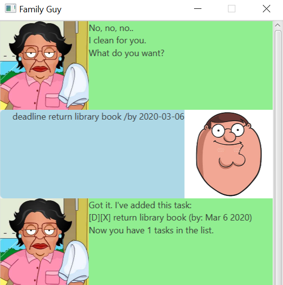
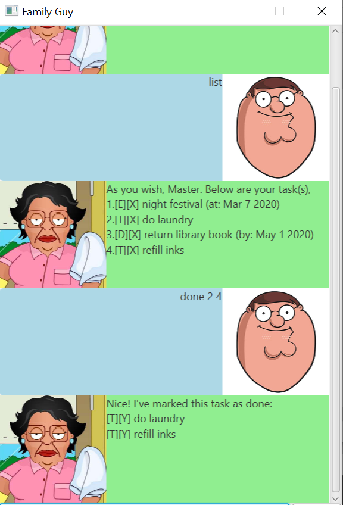
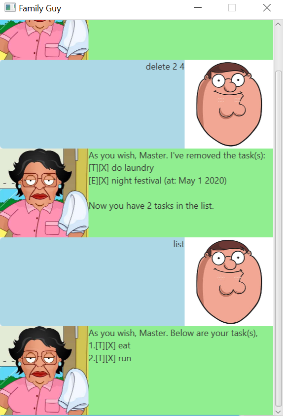
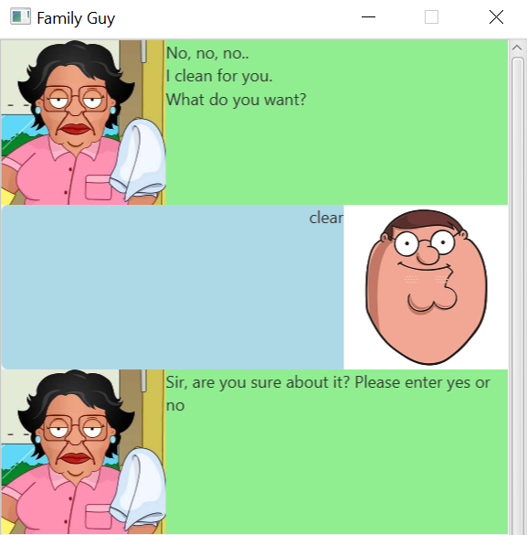
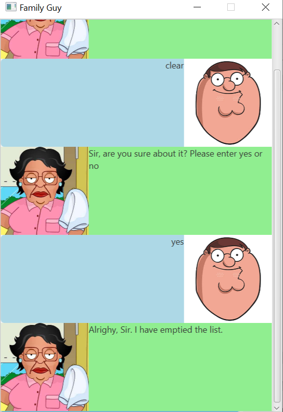
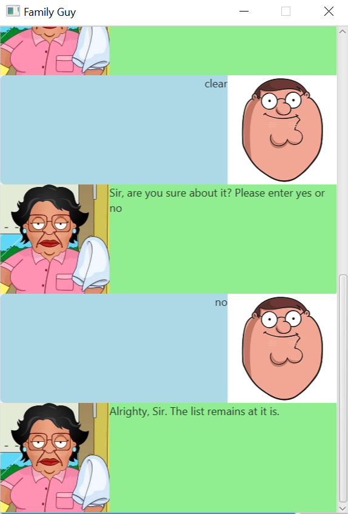

# Family guy - Consuela bot User Guide
By: [Kevin Law](https://github.com/kevvvinn) Since: Feb 2020

## Table of content
1. [Introduction](#introduction) 
1. [Features](#features) 
1. [Adding Todo task](#adding-todo-task) 
    1. [Adding Event task](#adding-event-task) 
    1. [Adding Deadline task](#adding-deadline-task) 
    1. [List all tasks](#list-all-tasks) 
    1. [Mark task(s) as done](mark-task(s)-as-done) 
    1. [Delete task(s)](delete-task(s)) 
    1. [Clear all tasks](clear-all-tasks) 
    1. [Exit the program](exit-the-program) 
1. [Acknowledgements](#acknowledgements) 

## Introduction
Family Guy - Consuela chat bot is a friendly bot to handle tasks using Command Line input. Consuela can help track and organise your tasks so that you would not need to!

She can be a little bit rude but she is efficient! Try it out for yourself!

## Features 
These are features that Consuela will understand and help you out!

### Command format 

* Words in UPPER_CASE are the parameters to be supplied by the user. e.g in todo TASK_DESCRIPTION, TASK_DESCRIPTION is a parameter you need to type in. Example is given below.
* Words in lower_case are parameters that are optional, keying it will result in more specific command being executed.
* Parameters must be in order e.g, if the command feature specifies command TASK_DESCRIPTION /at DATE (if applicable) for EXE to recognised command.

### Adding Todo task
Consuela will add a given todo task that requires no date and will be categorised as a todo in your list of tasks.
>Format : todo TASK_DESCRIPTION 
>Example: todo Refill Water Bottle

Expected outcome: 

### Adding Event task
Consuela will add a given event task that requires a date and will be categorised as an event in your list of tasks.
>Format : event TASK_DESCRIPTION /at [Date YYYY-MM-DD] 
>Example: event Singapore Night Festival /at 2020-08-01

Expected outcome: 

### Adding Deadline task
Consuela will add a given deadline task that requires a date and will be categorised as a deadline in your list of tasks.
>Format : deadline TASK_DESCRIPTION /by [Date YYYY-MM-DD] 
>Example: deadline Submit Assignment /by 2020-08-01

Expected outcome: 

### List all tasks
Consuela will list down all the tasks in your list of tasks.
>Format : list 
>Outcome: 
>As you wish, Master. Below are your task(s), 
>1.[E][Y] Night Festival (at: Mar 7 2020) 
>2.[T][Y] Do Laundry 

Expected outcome:  

### Mark task(s) as done
Consuela allows you to change the status of task(s) to done.
>Format : done [TASK_NUMBER][Space][TASK_NUMBER].. 
>Example: done 2 4

Expected outcome:  

### Delete task(s)
Consuela allows you to delete task(s) from your list of tasks.
>Format : delete [TASK_NUMBER][Space][TASK_NUMBER].. 
>Example: delete 2 4

Expected outcome:  

### Clear all tasks
Consuela allows you to clear and empty your list of tasks.
>Format : clear 
Expected outcome:  

Upon entering yes,  
Outcome: Alrighty, Sir. I have emptied the list. 
>Expected outcome: 

Upon enter no,  
Outcome: Alrighty, Sir. The list remains at it is.

### Exit the program
Consuela allows you to exit the bot.
>Format : bye 
>Outcome: Bye bye, Master! Please come back soon! 
>Expected outcome:  

## Acknowledgement
Consuela would like to thank Chester Sim for his help.
