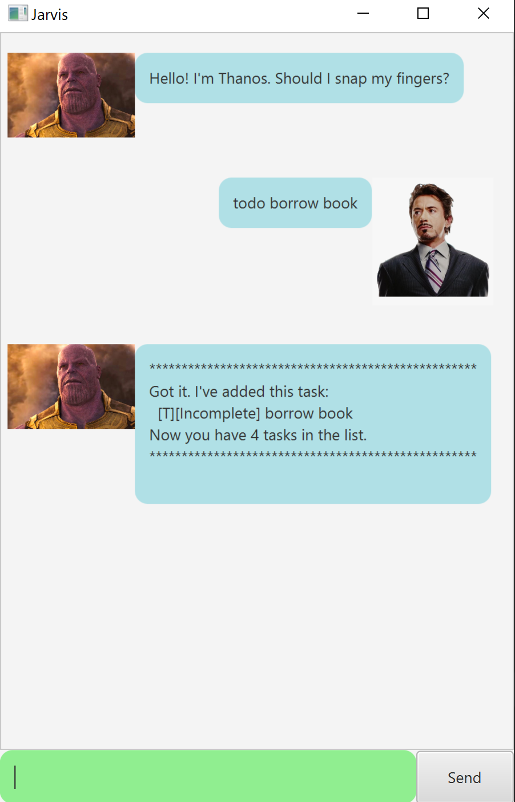
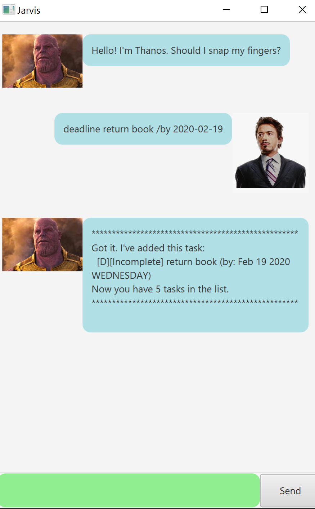
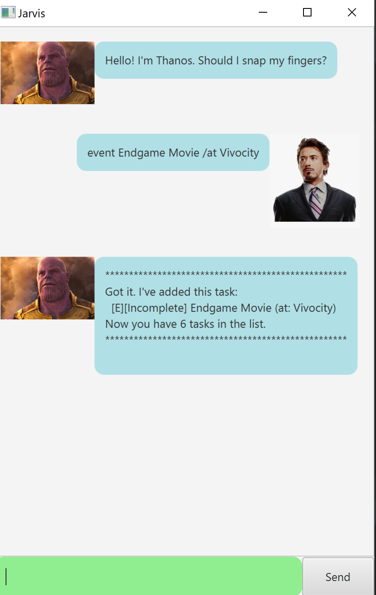
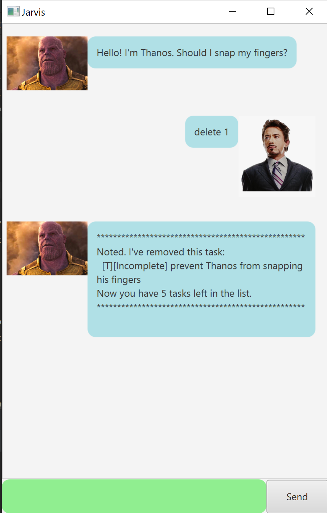
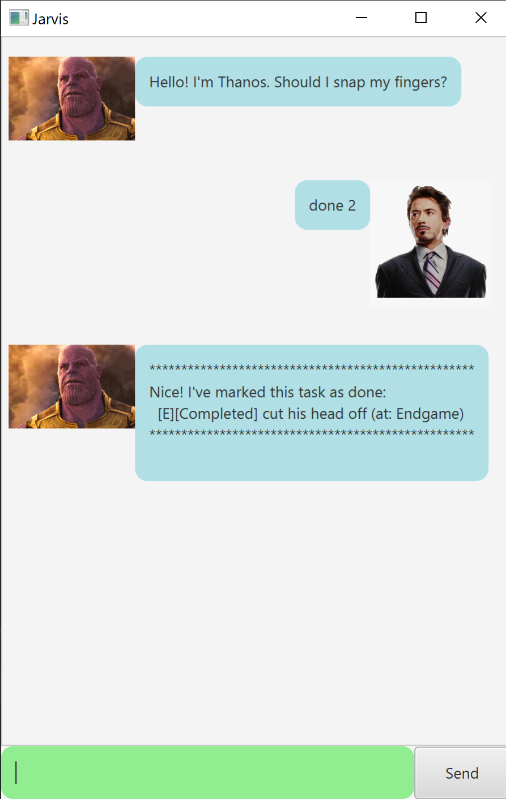
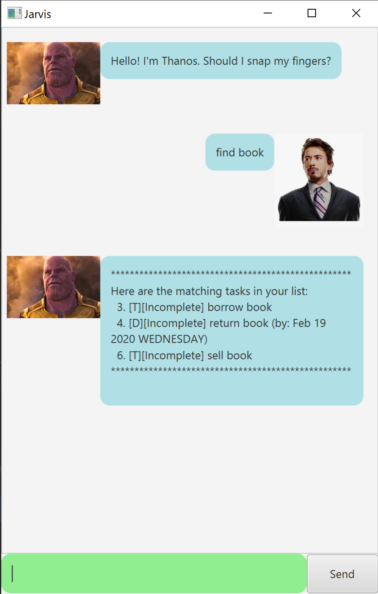
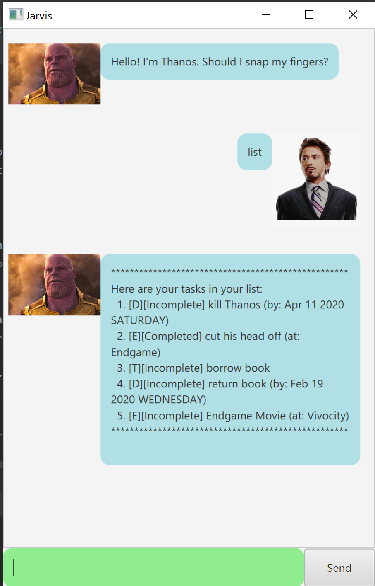
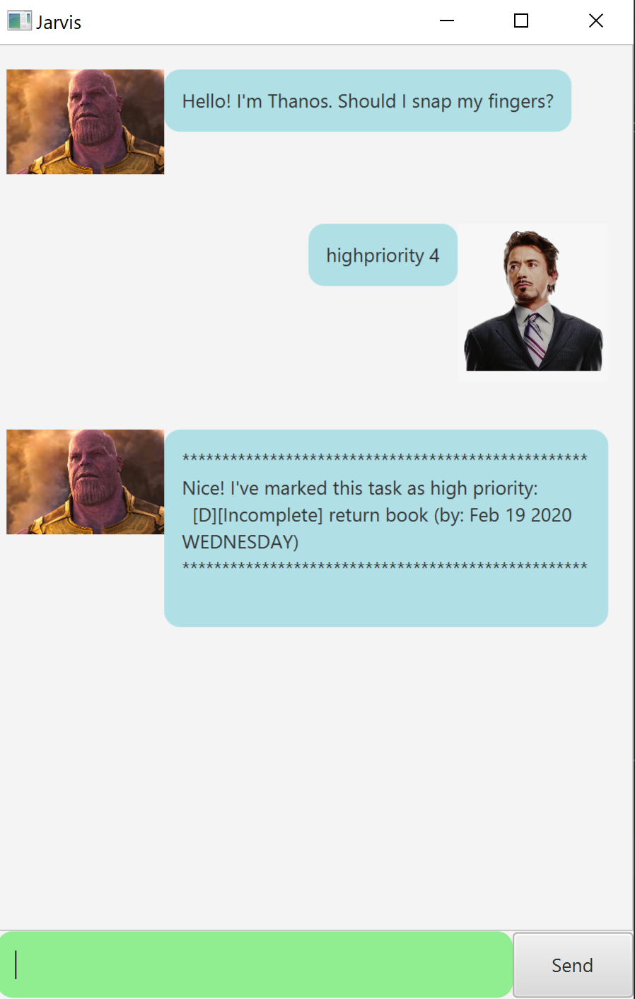
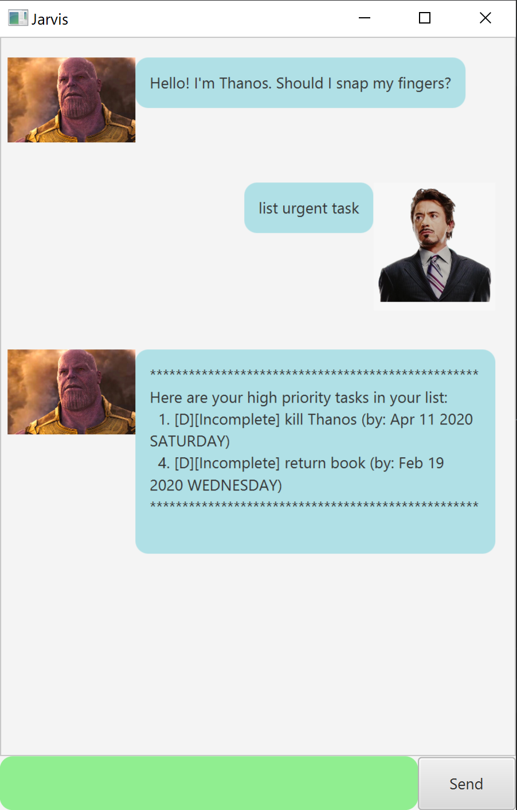

# User Guide for Edith

## Brief Description
Edith is a Personal Assistant Chatbot that helps a user keep track of various tasks.

## Usage

### Key Commands for Edith: 

1. **Add** a task

2. **Delete** a task

3. **Done** mark a task as completed

4. **Find** tasks with that given keyword

5. **List** out all tasks

6. **High Priority** set a task as high priority

7. **List urgent task** lists all the high priority tasks

8. **Bye** exits jarvis

<h3>How to executes those commands? </h3>

 - `Add`  
 There are 3 types of tasks that you can add. 
    - todo  
    `todo [description]`  
     Example: `todo borrow book` 
     Expected Output: 
     
                     
      
     
    - deadline  
    `deadline [description] /by [YYYY-MM-DD]`  
    Example: `deadline return book /by 2020-02-19`  
    Expected Output: 
    
                
     
    
    - event  
    `event [description] /at [a location or time]`  
    Example: `event Endgame Movie /at Vivocity` or  
    `event return book /at 2020-04-20`  
    Expected Output: 
    
                 
 

- `delete`  
    Removes a task by providing the task's index.
    Task number starts from 1.  
    Example: `delete 1` removes the task at index 1  
    Expected Output: 
    
                   
    
  

- `done`  
    Mark a task as completed by providing the task's index.
    Task number starts from 1.  
    Example: `done 2` mark task at index 2 as completed  
    Expected Output: 
    
                

 

- `find`  
    Allows you to find all tasks with that given keyword in your listsOfTasks.  
    Example: `find book` returns you only tasks with "book" in its description  
    Expected Output: 
    
                  

 

- `list`  
    Lists all your tasks.
    Example: `list` returns you all the tasks in your listOfTask  
    Expected Output: 
    
          

 

- `high priorty`  
    Sets the task of this index as high priority so you will be able to view it easily.
     
    Example: `highpriority 4` sets the task at index 4 as high priority.  
    Expected Output: 
    

    
    
 
 
- `list urgent task`  
    Lists **only** tasks that are marked as high priority  
    Example: `list urgent task` returns a list containing of tasks that are high priority.
     
    Expected Output: 
    
     
                     
     

- `bye`  
    Terminates the application  
    Example: `bye` exits the program 
    
    
    
## Acknowledgements
Credit to Jeffry Lum for the fxml and java files for JAVAFX GUI -  [JavaFx TutorialPart 4](https://github.com/nus-cs2103-AY1920S2/duke/blob/master/tutorials/javaFxTutorialPart4.md).  
Acknowledgements FastReader.java was adapted from https://www.javatips.net/api/AlgoDS-master/src/timus/FastReader.java. However, I tweaked some components to cater to my own needs.

Thanos Image for GUI is from https://www.theverge.com/2018/4/16/17243794/avengers-infinity-wars-thanos-origin-story-marvel

Tony Stark Image is from https://pngimage.net/tony-stark-png-5/

Edith Image is from https://www.amazon.com/Glasses-Sticker-Trucks-Laptop-NOK163/dp/B07VS9NPPL

