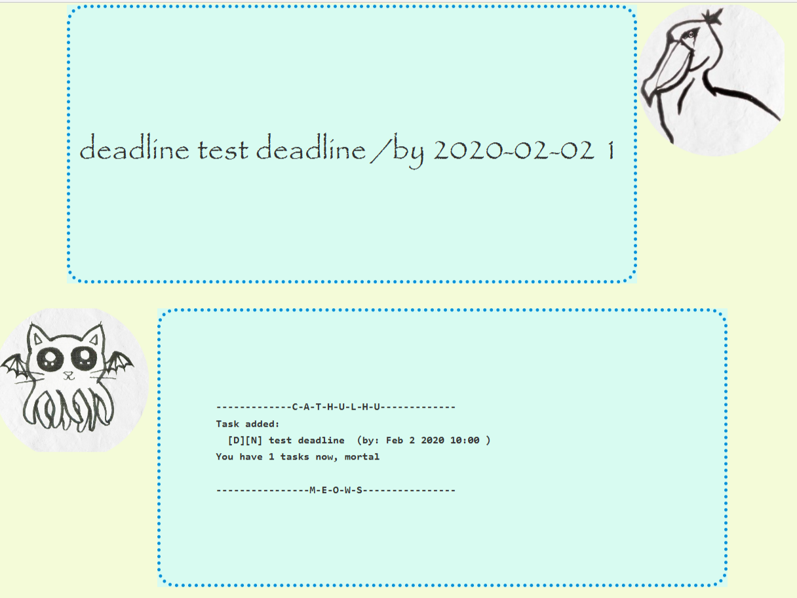
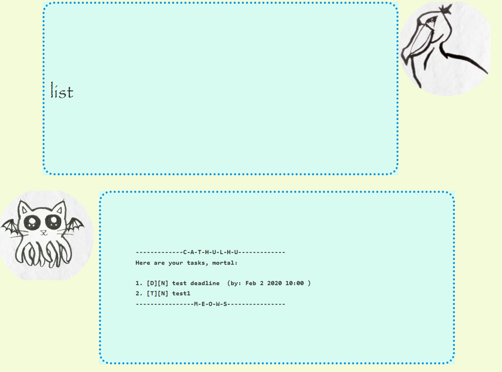
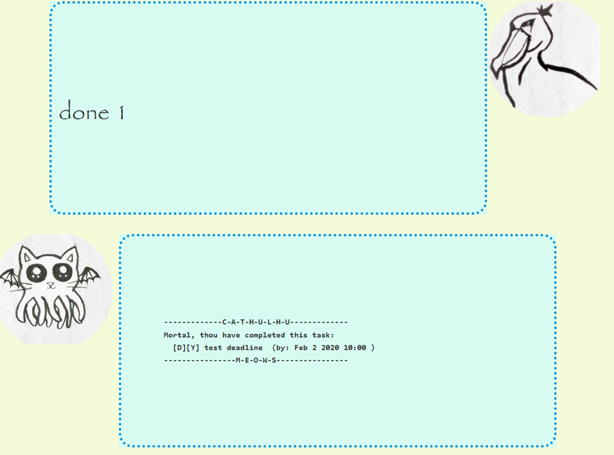
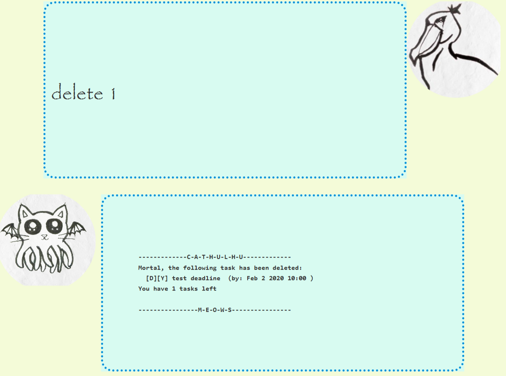
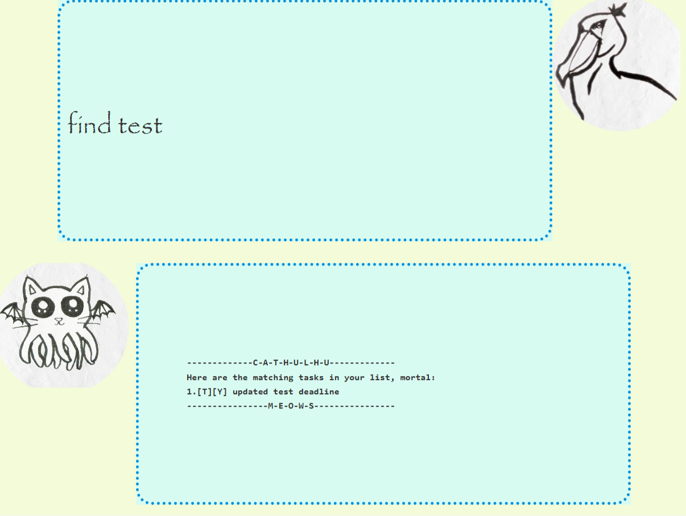
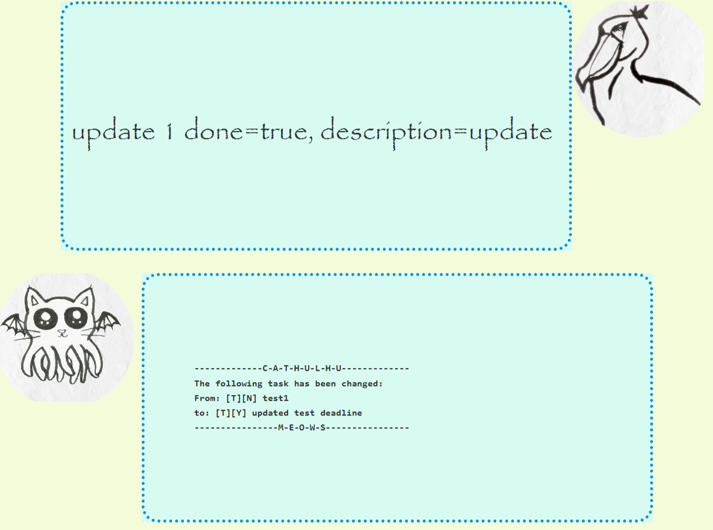
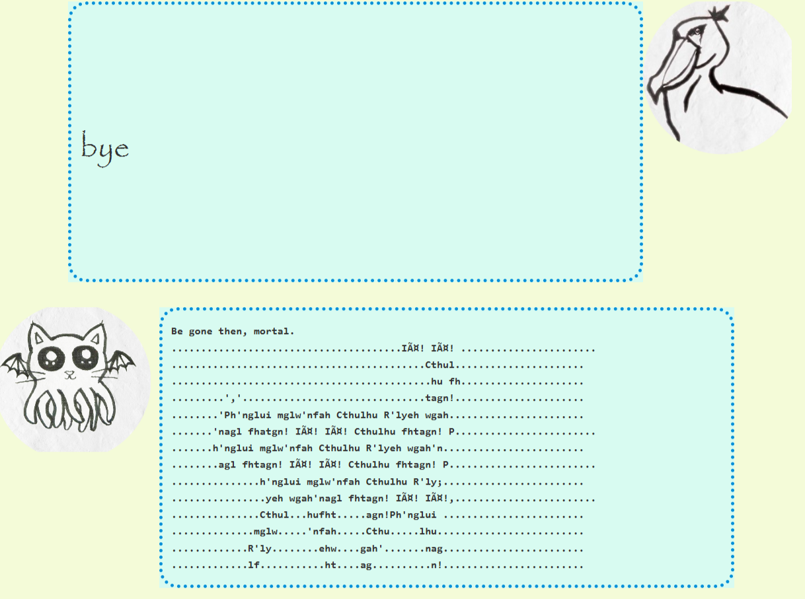

# Cathulhu Planner User Guide
Cathulhu Planner is a task manager based off the Duke Project https://github.com/nus-cs2103-AY1920S2/duke.
This planner offers better efficiency for users who prefer using a Command Line Interface (CLI). The simplistic gui design undoubtedly attracts all who loves Cathulhu and shoebills. 
[Image of Cathulhu Planner UI](./UI.png)

## Features 

### Feature 1 
You can add three different kinds of tasks: `Todo`, `Deadline` and `Event` for Cathulhu to track for you.

## Usage

Command | Parameters | Description
--------|------------|-------------
`todo`|`description`| Adds a `todo` Task with `description` for Cathulhu to Track.
`deadline`|`description` /by`by` | Adds a `deadline` Task with `description` for Cathulhu to Track. `by` notes the deadline time, in the format yyyy-mm-dd \[hh:mm\]
`event`|`description` /at`at` | Adds a `deadline` Task with `description` for Cathulhu to Track. `at` notes important details about the event such as venue and participants.

### Example of usage: 

`deadline test deadline /by 2020-02-02 10:00`

### Feature 2
View tasks in a `list`, mark a task as `done`,and `delete` a task.

## Usage

Command | Parameters | Description
--------|------------|-------------
`list`|| Lists down all the tasks Cathulhu is currently tracking.
`done`|`task id`| Marks the task with `task id` as done. 
`delete`|`task id`| Deletes the task with `task id`.

### Example of usage: 
`list`

`done 1`

`delete 1`

### Feature 3
Find tasks with `find` and modify a task with `update`.

## Usage

Command | Parameters | Description
--------|------------|-------------
`find`|`search keyword`|Searches and lists down all tasks that contains the `search keyword`
`update`|`task id` `parameter1`=`updated value1`,`parameter2`=`updated value2`,...  | Updates the entered parameters of the task with `task id`.

### Example of usage: 
`find test`

`update 0 done=true, description=updated test deadline`

### Feature 4
Terminate the program with `bye`

### Example of usage:
`bye`

