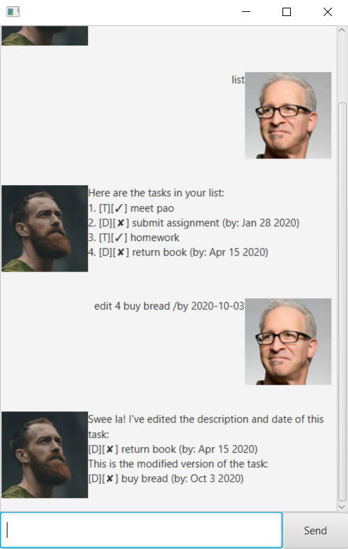

# User Guide

## About

Duke is a friendly chatbot who will manage your tasks, which include todo tasks, events and deadlines.

## Features 

### Feature 1 - Add/Delete Tasks
There are three kinds of tasks which Duke manages:
- ToDo
- Deadline
- Event

You can get Duke to manage a new task or remove an existing task.

### Feature 2 - Mark Task as Done
Once you have completed a task, you can choose to mark it as done.
This helps you to keep track of the tasks you have completed.

### Feature 3 - Find Tasks
Duke is able to filter tasks which contain a common keyword.
This will be useful in managing a long list of tasks.

## Usage

#### Command Format

- Words in `{UPPER_CASE}` are the parameters to be supplied by the user.
- For each input parameter labelled as `{DATE}`, enter date in the format: `YYYY-MM-DD`.
- For each input parameter labelled as `{INDEX}`, enter a positive integer corresponding
  to its index in the task list.

### 1. `list` - View current task list

Format: `list`

Expected outcome:

### 2. `todo` - Add a new todo task

Add a new unfinished todo task to the existing list of tasks.
Format: `todo {TASK_NAME}`

Example of usage:  
`todo homework`

Expected outcome:

### 3. `deadline` - Add a new deadline

Add a new unfinished deadline task to the existing list of tasks.  
Format: `deadline {TASK_NAME} /by {DATE}`

Example of usage:  
`deadline return book /by 2020-04-15`

Expected outcome:

### 4. `event` - Add a new event

Add a new unfinished event task to the existing list of tasks.  
Format: `event {TASK_NAME} /at {DATE}`

Example of usage:  
`event go cycling /at 2020-11-10`

Expected outcome:

### 5. `done` - Mark task as done

Mark an unfinished task as done.  
Format: `done {INDEX}`

Example of usage:  
`done 3`

Expected outcome:

### 6. `find` - Search list

Look for all tasks containing a given keyword.  
Format: `find {KEYWORD}`

Example of usage:  
`find work`

Expected outcome:

### 7. `delete` - Delete task

Delete a task in the list.  
Format: `delete {INDEX}`

Example of usage:  
`delete 4`

Expected outcome:

### 8. `edit` - Edit task

There are three ways to use this command:
- Modify the description of a task.  
  Format: `edit {INDEX} {TASK_NAME}`
- Modify the date of a deadline/event.  
  Format: 
  - `edit {INDEX} /by {DATE}`
  - `edit {INDEX} /at {DATE}`
- Modify both the description and the date of a deadline/event.  
  Format: 
  - `edit {INDEX} {TASK_NAME} /by {DATE}`
  - `edit {INDEX} {TASK_NAME} /at {DATE}`

Example of usage:  
`edit 4 buy bread /by 2020-10-03`

Expected outcome:

### 9. `bye` - Exit Duke

Format: `bye`
