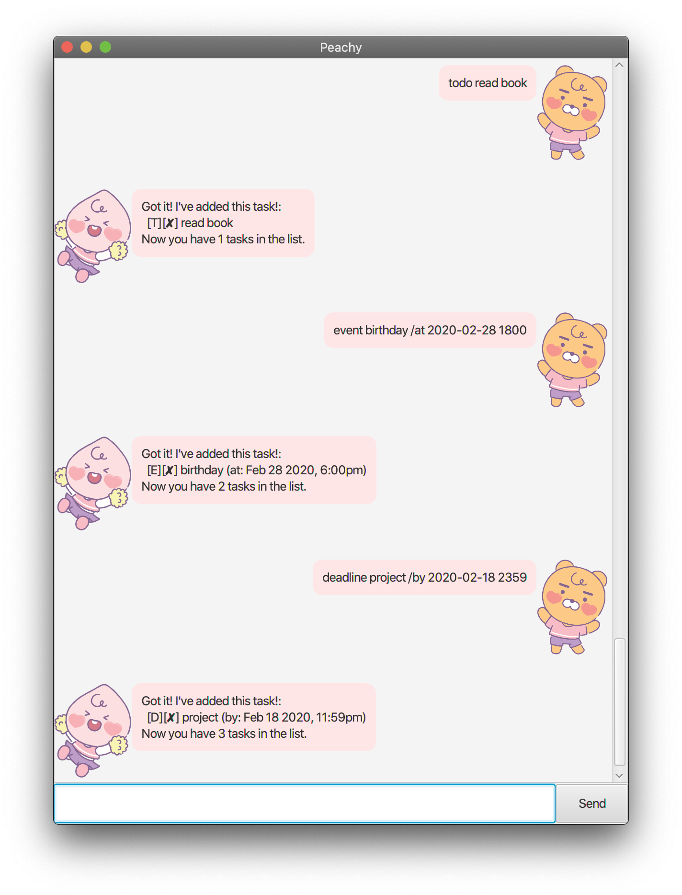
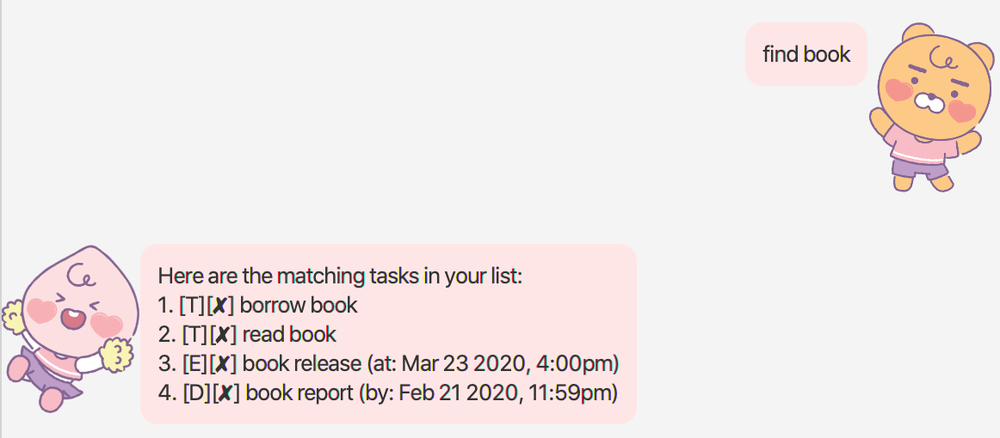
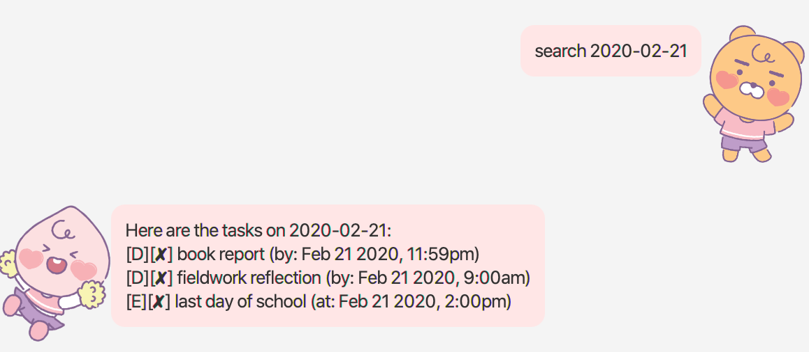
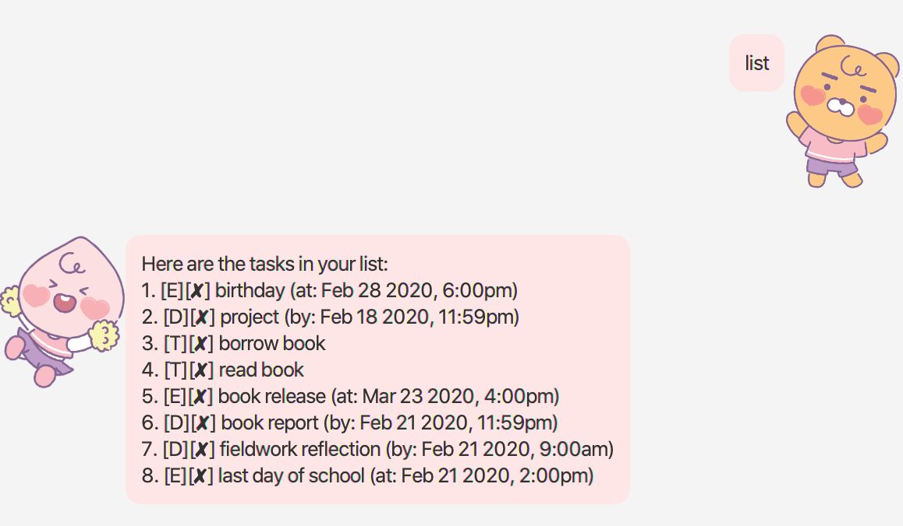
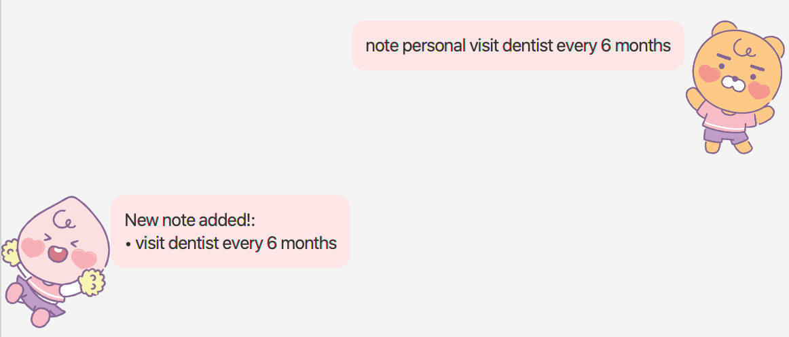
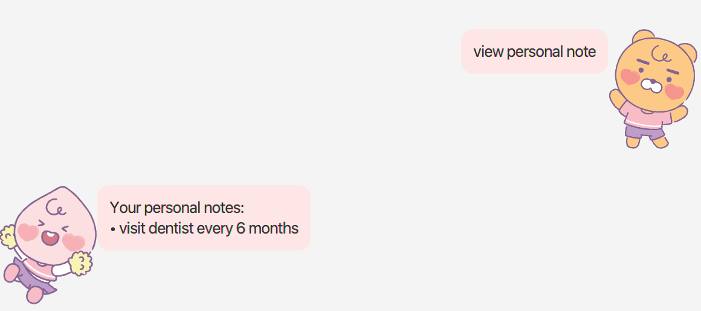
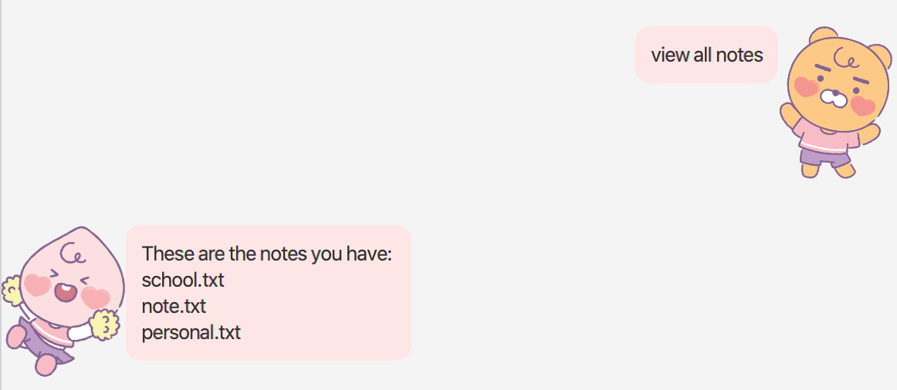
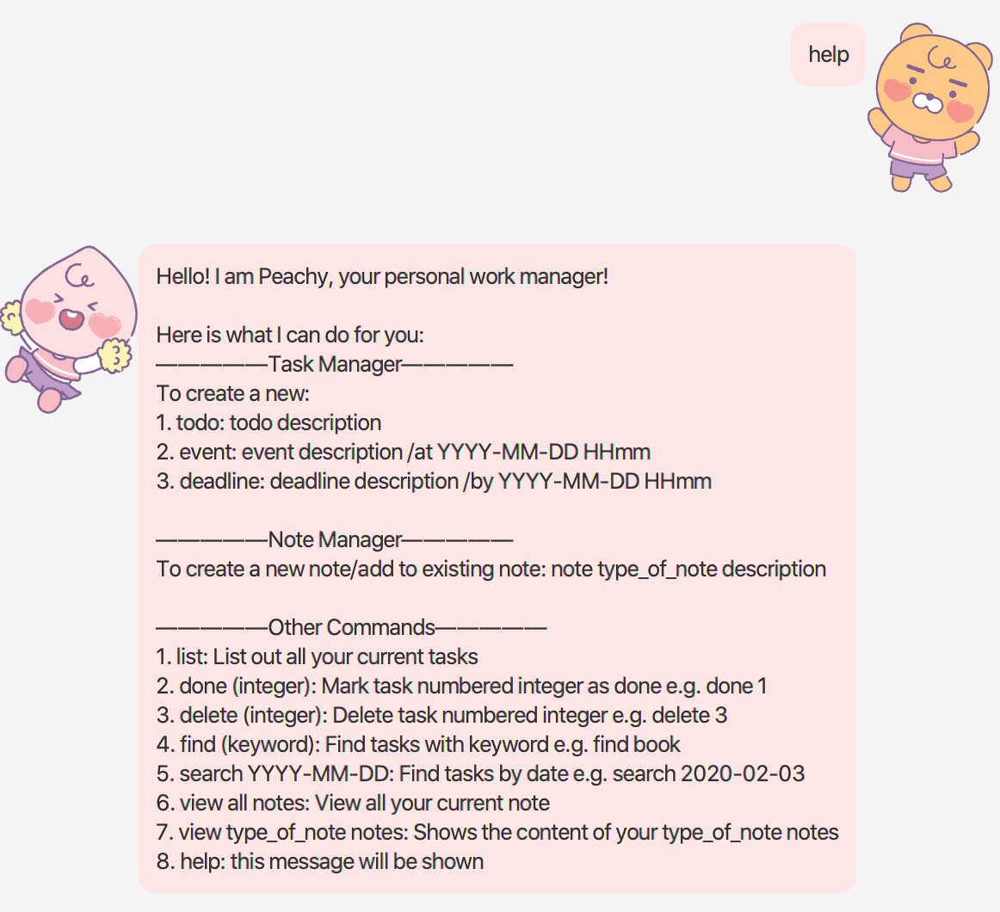

# User Guide

## About
Peachy is your new employed personal assistant 
who will help you through your daily tasks and schedule
to make sure you stay organised and productive!

## Features 

### Feature 1 - Adding Tasks
There are 3 kind of Tasks you can add namely:
1. todo
2. event
3. deadline

Input format:
1. `todo description` (i.e. todo read book)
2. `event description /at YYYY-MM-DD HHmm` (i.e. event birthday /at 2020-02-28 1800)
3. `deadline description /by YYYY-MM-DD HHmm` (i.e. deadline project /by 2020-02-18 2359)

### Feature 2 - Mark Task as done 
Upon completion of a task, you can check it off you task list.

Input format: `done number` (i.e. delete 1)

### Feature 3 - Delete Task
Removes task from your task list.

Input format: `delete number` (i.e. delete 1)

### Feature 4 - Finding Task
Find and list out all tasks containing keyword.

Input format: `find keyword` (i.e. find book)

### Feature 5 - Search for Task
Search and list out all tasks containing the same date.

Input format: `search YYYY-MM-DD` (i.e. search 2020-02-21)

### Feature 6 - List out all current tasks
List out all your current tasks.

Input format: `list`

### Feature 7 - Create new note
Create a new note with specific category (e.g. school, personal, misc).
Upon note creation, subsequent function call will result it addition to note.

Input format: `note category description` (i.e. note personal visit dentist every 6 months)

### Feature 8 - View note
View the contents of the note in the specific category.

Input format: `view category note` (i.e. view personal notes)

### Feature 9 - View all notes created
View all the note files created.

Input format: `view all notes`

### Feature 10 - Help
Welcome message will be printed, with all the commands format listed.

Input format: `help`

### Feature 11 - Exit Peachy
Quits Peachy and closes the window.

Input format: `bye`

