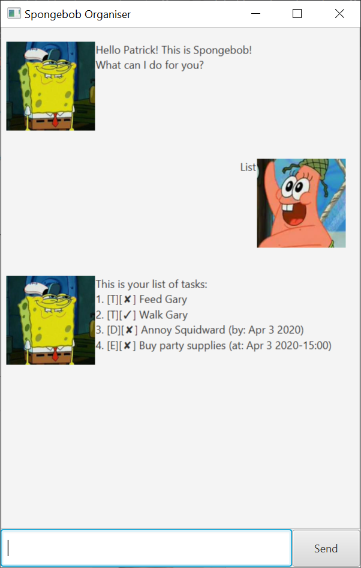

# User Guide
## Sample Interaction
Below is a sample interaction with the Duke Program.




## Images
### Duke's Images
There are total of 3 images that can represent the Duke.

Firstly, there is the image used on loadup.  
This image is only used for the first inteaction with the user and serves as an introduction to the Duke.  
The image looks like this:


Next, there is the image used when the Duke successfully carries out a command from the user.  
The image looks like this:


Lastly, there is the image used when the Duke is unable to carry out a command from the user.  
The image looks like this:


### User's Image
There is only 1 image that is used to represent the User.  
The image looks like this:


## Features 

### Feature 1 
Todo

## Usage

### `todo` - Describe action

Create a todo task in your task list.

Example of usage: 

`todo CS2103 Quiz`

Expected outcome:

```
I've added this task:
[T][N] CS2103 Quiz
Now you have 1 task in the list.  
```

### Feature 2
Event

## Usage

### `event` - Describe action

Create a event task in your task list.

Example of usage: 

`event xyz /at tomorrow`

Expected outcome:

```
I've added this task:
[E][N] xyz (at: tomorrow)
Now you have 1 task in the list.
```

### Feature 3
Deadline

## Usage

### `deadline` - Describe action

Create a deadline task in your task list. 
The date for the deadline should be keyed in.
The timing is optional, if no timing is provided, it is assumed to be 0000.
The format for the date to be keyed in is yyyy-mm-dd

Example of usage: 

`deadline CS2343 Assigment /by 2020-02-19'

Expected outcome:

```
I've added this task:
[D][N] CS3243 Assignment (by: 19-02-2020 0000)
Now you have 1 task in the list.
```


### Feature 4
List

## Usage

### `list` - Describe action

Display the list of tasks you currently have.

Example of usage: 

`list`

Expected outcome:

```
Here are the tasks in your list:
1. [T][N] learn java
2. [E][N] team meeting (at: Monday 2-4pm)
3. [D][N] watch webcast (by: 28-01-2020 1600)
```


### Feature 5
find

## Usage

### `find` - Describe action

Search for keywords in the list

Example of usage: 

`find learn`

Expected outcome:

```
Here are the matching keywords in your list:
1. [T][N] learn java
```


### Feature 6
Delete 

## Usage

### `delete` - Describe action

Remove task from task list.

Example of usage: 

`delete 2`

Expected outcome:

```
I've removed this task:
[E][N] team meeting (at: Monday 2-4pm)
you now have 2 tasks in the list.
```


### Feature 7
done

## Usage

### `done` - Describe action

Mark the task as done.

Example of usage: 

`done 1`

Expected outcome:

```
Nice! I've marked this task as done:
[T][Y] learn java
```


### Feature 8
snooze

## Usage

### `snooze` - changes the timing of a deadline or event


Example of usage: 

snooze 2 /to 2020-03-16

Expected outcome:

```
Got it, the updated deadline looks like:
[D][N] watch webcast (by: 16 Mar 2020 0000)
```


### Feature 9

bye

## Usage

### `bye` - exits the 'duke' program.

Example of usage: 

`bye`

Expected outcome:

```
Bye. Hope to see you again soon!
```