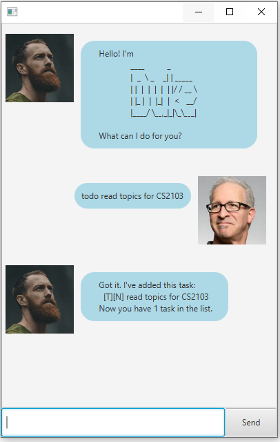
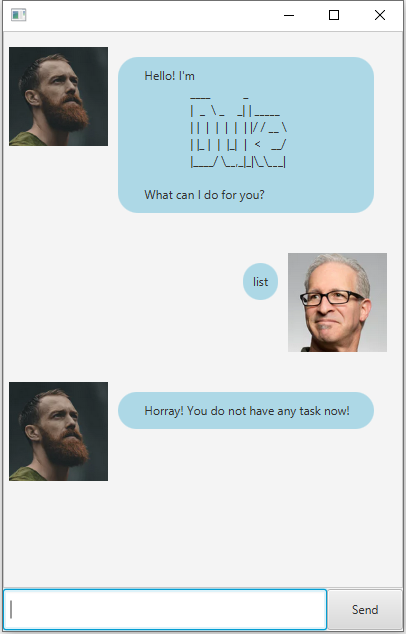
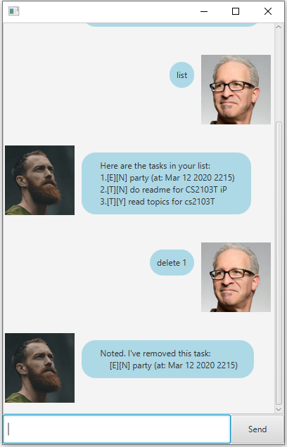

# User Guide

## Description
A personal assistant for tracking the tasks to be done.

## Features 

### Adding Task
Adding task as Todo, Event or Deadline to the list to `task.txt`.

### Delete Task
Delete task from the list.

### Storing tasks to `task.txt`
Store the list of tasks into hard disk in the file `task.txt`.

## Usage

### `todo` - Add todo to the list

Inform duke to add the todo with the description provided to the list and\
update the list in `task.txt`.

Example of usage: 

`todo read topics for CS2103`

Expected outcome:

`Got it. I've added this task:` \
`[T][N] read topics for CS2103T`\
` Now you have 1 task in the list.`

### `deadline` - Add deadline to the list

Inform duke to add the deadline with the description and due date provided to the list \
and update the list in `task.txt`. 

Example of usage: 

`deadline project /by 2020-02-20`

Expected outcome:

`Got it. I've added this task:` \
`[D][N] project (by: Feb 20 2020)`\
` Now you have 1 task in the list.`

### `event` - Add event to the list

Inform duke to add the event with the description, date and time provided to the list \
and update the list in `task.txt`. 

Example of usage: 

`event party /at 2020-03-12 2215`

Expected outcome:

`Got it. I've added this task:` \
`[E][N] party (at: Mar 12 2020 2215)`\
` Now you have 1 task in the list.`

### `List` - List the tasks

Tell Duke to list all of the tasks out.

Example of usage: 

`list`

Expected outcomes:

* When there are three tasks in the list:\
`Here are the tasks in your list:` \
`1.[E][N] party (at: Mar 12 2020 2215)`\
`2.[T][N] do readme for CS2103T iP`\
`3.[T][Y] read topics for cs2103T`

* When there are no task in the list:\
`Horray! You do not have any task now!`

### `done` - Mark the task done

Tell Duke to mark the task as done.

Example of usage: 

`done 1`

Expected outcomes:

`Nice! I've marked this task as done:` \
`[T][Y] do readme for CS2103T iP`

### `delete` - Remove the specific task at the index from the list

Tell Duke to remove the specific task at the index from the list and\
 update the list in `task.txt`.

Example of usage: 

`delete 1`

Expected outcomes:

`Nice! I've removed this task:` \
`[E][N] party (at: Mar 12 2020 2215)`

 ### `bye` - Exit the program
 
 Say goodbye to Duke and exit the program.
 
 Example of usage: 
 
 `bye`
 
 Expected outcomes:
 
 `Alright! See you next time!`
 
 
