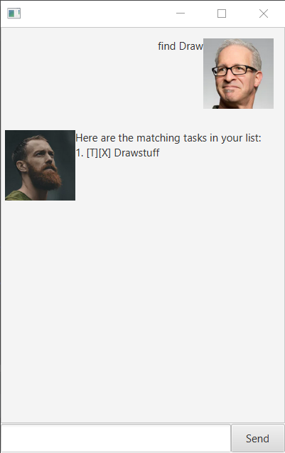

# User Guide
Duke is for users who prefer to use a desktop app for keeping track 
of users' todos, deadlines and events.

## Features

###Feature 1 - Todos.
Todos are a type of task that contain only an indicator to show if it is down, followed by a description.\
Todos are tagged with [T]\
eg. [T][X] Read finish chapter 3. 

###Feature 2 - Deadlines.
Deadlines are a type of task that contain only an indicator to show if it is down, followed by a description 
and a date to show its deadline.\
Deadlines are tagged with [D]\
eg. [D][X] Quizzes for CS2103T (by: May 5 2019, 18:00 PM). 

###Feature 3 - Deadlines.
Events are a type of task that contain only an indicator to show if it is down, followed by a description 
and a date to show its deadline.\
Deadlines are tagged with [D]\
eg. [E][X] Game farming event (at: May 6 2019, 20:00 PM).

### Feature 4 - Saving to file
Whenever you make any changes to the database (ie. Adding, removing or marking tasks as done), 

## General Commands

###`list` - Shows every todo, event and deadline in a list 
Example of usage:
`list`\
Expected outcome:
Returns all items printed in a list format.\

###`delete` - Deletes the task from the index
Example of usage:
`delete 2`\
Expected outcome:
Removes the 2nd task from the list in the database.

###`find` - Finds all tasks related to the keyword
Example of usage: 
`find Draw`\
Expected outcome:
Returns all tasks with the keyword 'book'.

###`done` - Marks the task from index as done
Example of usage: 
`done 2`\
Expected outcome:
Update the 2nd task from the list in the database as done.

## Commands to add tasks (ie. Todos, Events and Deadlines)
###`todo` - Adds a todo into the list. 
`todo <Description>`\
A todo has no date involved. `todo` should be followed by a short description\
Example of usage:
`todo Read Chapter 3`\
Expected outcome:
Adds a todo with the corresponding description to the list.
\

###`event` - Adds a event into the list. 
`event <Description> /at <Date>`\
For Date, please use the following format:\
yyyy-mm-dd hh:mm. Eg. `2020-02-14 18:00`\
An event has a date involved. \
Example of usage:
`event Job Seminar /at 2020-03-22 12:00`\
Expected outcome:
Adds a event with the corresponding description and date to the list.\

###`deadline` - Adds a deadline into the list. 
`deadline <Description> /by <Date>`\
For Date, please use the following format:\
yyyy-mm-dd hh:mm. Eg. `2020-02-14 18:00`\
An event has a date involved. \
Example of usage:
`deadline Finish CS2103T deliverables /by 2020-02-14 16:00`\
Expected outcome:
Adds a deadline with the corresponding description and date to the list.\
