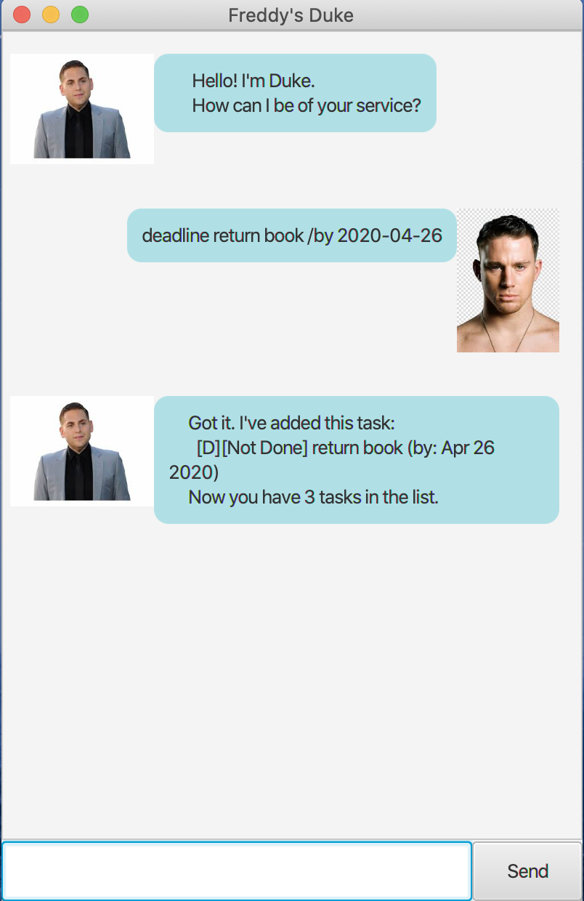
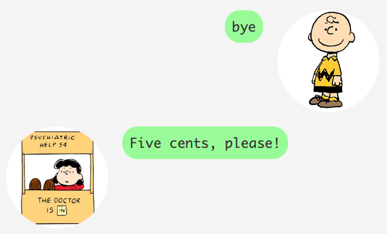

# User Guide
* [1. Introduction](#1-introduction)  
* [2. Features](#2-features)  
* [3. Usage](#3-usage)  
    * [3.1. `deadline` - Add a deadline](#deadline---add-a-deadline)
    * [3.2. `event` - Add an event](#event---add-an-event)
    * [3.3. `todo` - Add a todo](#todo---add-a-todo)
    * [3.4. `delete` - Delete a task](#delete---delete-a-task)
    * [3.5. `done` - Mark a task as done](#done---mark-a-task-as-done)
    * [3.6. `find` - Find tasks by keyword](#find---find-tasks-by-keyword)
    * [3.7. `list` - Display the task list](#list---display-the-task-list)
    * [3.8. `bye` - End the program](#bye---end-the-program)

## 1. Introduction
Duke is a light-weight task organiser, helping users to keep track of their
deadlines, events, and daily tasks. In addition, all tasks that are managed by
Duke are saved in a portable format so that users can easily upload or transfer
their tasks to any desktop platform!

## 2. Features
* Adding different types of tasks
    * Deadlines
    * Events
    * Todos
    
* Marking completed tasks
* Deleting tasks
* Finding tasks by keyword
* Automatically saving the task list in a save file (located in ./data/tasks.txt)
* Automatically Loading a task list from a save file  (located in ./data/tasks.txt)

## 3. Usage

### Command Format
* Each command begins with a keyword, followed by a number of compulsory parameters.

* Words in `UPPER_CASE` are the required parameters for the command.
    These parameters must be supplied by the user in order for the command to
    execute successfully.
    eg. in `todo Wake up!`, `Wake up!` is the `DESCRIPTION` parameter
    of the [`todo`](#todo---add-a-todo) command.

- Parameters are `CASE_SENSITIVE`, and are not formatted during input processing.

- `DATE` parameters must be supplied in the following format: `yyyy-mm-dd`.
    eg. `2020-12-25` for 25 December 2020.

- `START_TIME` and `END_TIME` are time parameters that must be
    supplied in the following 24-hour format: `HH:mm`.  eg. `08:30` for 8:30am.  
    
    Also, when a command has a `START_TIME` and `END_TIME`,
    `START_TIME` must be before `END_TIME`.

### Task Descriptions
- All tasks types require a `DESCRIPTION`.

- Descriptions are `CASE_SENSITIVE`, and will not be formatted.

- Two tasks cannot have the same description if they belong to the same type of task.  

### Command List

#### `deadline` - Add a deadline

Adds a deadline to the task list.
A deadline is a task that has a completion date,
which must be specified after the `/by` keyword.  

Format: `deadline DESCRIPTION /by DATE`

Example of usage: 

In blue: Adding a todo with `Buy Christmas presents` as the `DESCRIPTION`, and
`2020-12-24` as the `DATE`.  

In red: A message confirming that the deadline was added successfully.

---
#### `event` - Add an event

Adds an event to the task list.
An event is a task that has a scheduled date and time interval,
which must be specified in that order after the `/at` keyword.  

Format: `event DESCRIPTION /at DATE START_TIME END_TIME`

Example of usage: 

In blue: Adding a todo with `Christmas party` as the `DESCRIPTION`,
`2020-12-25` as the `DATE`,
`09:00` as the `START_TIME`, and
`15:00` as the `END_TIME`.  

In red: A message confirming that the event was added successfully.

---
#### `todo` - Add a todo

Adds a todo to the task list.
A todo is a task that only has a description.  

Format: `todo DESCRIPTION`

Example of usage: 

In blue: Adding a todo with `Practise piano` as the `DESCRIPTION`.  

In red: A message confirming that the todo was added successfully.

---
### `delete` - Delete a task

Removes a task from the task list by specifying their position in the current list.
To obtain the `TASK_ID` of a task, use the [`list`](#list---display-the-task-list) command.  

Format: `delete TASK_ID`
- `TASK_ID` - the position number of the task in the current task list.

Example of usage: 

In blue: Deleting task number `1` in the list.  

In red: A message confirming that the task deleted successfully.

---
### `done` - Mark a task as done

Marks a task as done in the task list by specifying their position in the current list.
A tick will appear next to the task description to indicate that the task is done.
To obtain the `TASK_ID` of a task, use the [`list`](#list---display-the-task-list) command.   

Format: `done TASK_ID`
- `TASK_ID` - the position number of the task in the current task list.

Example of usage: 

In blue: Marking task number `1` in the list as done.  

In red: A message confirming that the task was successfully marked as done.

---
### `find` - Find tasks by keyword

Searches through the list of tasks, and displays all tasks that contain the exact keyword (or phrase) in their description. The keyword used to search is `CASE_INSENSITVE`, meaning that all the task descriptions and the keyword will be compared in `LOWER_CASE`.  

Format: `find KEYWORD`

Example of usage: 

In blue: Finding all tasks that have the keyword `christmas`.  

In red: A message showing a list of tasks containing the `CASE_INSENSITIVE` keyword `christmas`.

---
### `list` - Display the task list

Displays the list of tasks and orders them numerically. Tasks will be listed in
the order that they were inserted into the list.  

Format: `list`

Example of usage: 

In blue: Asking for the list of tasks to be shown.  

In red: A message showing the entire list of tasks,
ordered numerically from earliest to latest addition.

---
### `bye` - End the program

Stops the chat-bot from replying. The user can continue to input commands,
but they will not be processed. Duke must be restarted in order to process more commands.  

Format: `bye`

Example of usage: 

In blue: Asking the bot to stop processing commands.  

In red: A message confirming that the chat-bot stopped successfully.
