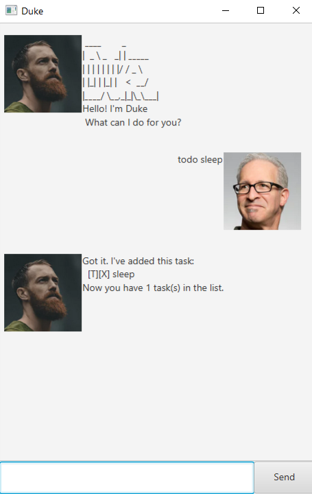
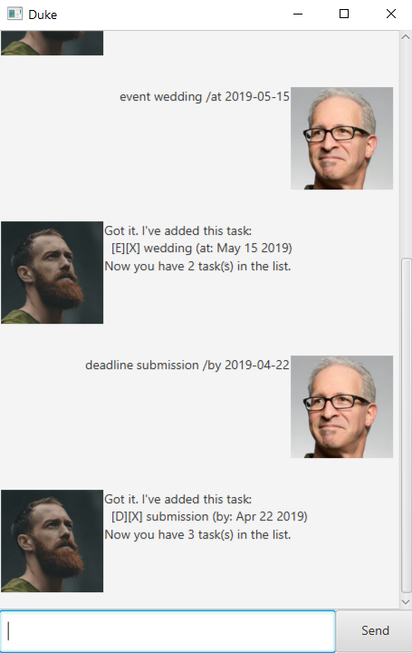
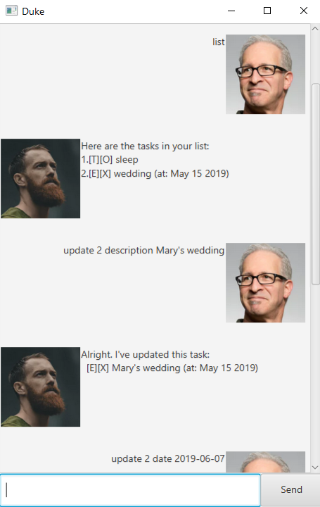

# User Guide
### Ui

## Features 

### Add tasks: `todo`, `event`, `deadline`

Adds a task to current list

Example of usage: 

`todo sleep`, `event wedding /at 2019-05-15`, `deadline submission /by 2019-04-22`

Expected outcome: 

 

### Listing out Tasks: `list`

Display current list of tasks

Example of usage: 

`list`

Expected outcome:

### Marking completed tasks: `done`

Mark a task as completed

Example of usage: 

`done 1`

Expected outcome:

### Deleting tasks: `delete`

Delete a task from current list

Example of usage: 

`delete 3`

Expected outcome:

### Searching for tasks: `find`

Search for tasks with a keyword.

Example of usage: 

`find sleep`

Expected outcome:

### Updating tasks: `update`

Update a task in the current list.

Example of usage: 

`update 2 description Mary's wedding`, `update 2 date 2019-06-07`

Expected outcome:

 