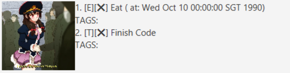
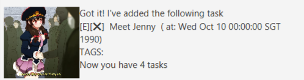
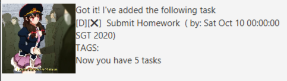
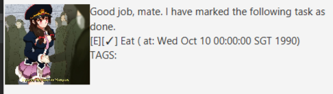
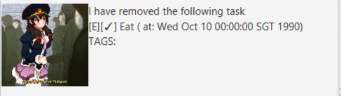
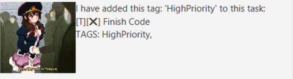

# User Guide
Welcome to YunYun Chatbot!

## Features
### Ability to Add Various Tasks
Able to have three different kinds of tasks for your different needs.
* ToDo Tasks for when only the task description is important.
* Deadline Tasks for when you need to do something by a deadline
* Event Tasks for when a particular thing is happening at a particular time
### Store Your Tasks and View Them Later
YunYun Chatbot automatically saves your tasks every time you change them so you can exit at anytime 
without worrying about losing your tasks
### Mark Tasks as Done
Done doing a task? Tell that to YunYun and she can mark you task done.
### Delete Tasks
Accidentally added a wrong task? Or just don't want to see a task
anymore? Just tell YunYun to delete and the task disappears.
### Tagging Tasks
Some tasks need some extra tags to remind you of certain important
things about them. Let YunYun know what tags you want and she'll 
attach them for you.

## Usage

### `list` 

Lists all the tasks that you have added so far including
information about whether it is done and timing information
for certain tasks

Example of usage: 

`list`

Expected outcome:

### `todo [task description]`

Adds a ToDo task to the list of tasks. A ToDo tasks is a task with
just a description and nothing else.

Example of usage: 

`todo Read Book`

Expected outcome:

### `event [task description] / at [task timing]`

Adds an Event task to the list of tasks. An Event task is a task with
a description and timing.

Example of usage: 

`event Meet Jeff / at 1990-10-10`

Expected outcome:

### `deadline [task description] / by [task timing]`

Adds a Deadline task to the list of tasks. A Deadline task is a task with
a description and deadline.

Example of usage: 

`deadline Submit Homework / by 2020-10-10`

Expected outcome:

### `done [index]`

Marks the task with the given index as done.

Example of usage: 

`done 1`

Expected outcome:

### `delete [index]`

Deletes the task with the given index.

Example of usage: 

`delete 1`

Expected outcome:

### `tag [tag description] [index]`

Tags the task with the given index with a new tag with the
given tag description.

Example of usage: 

`tag HighPriority 1`

Expected outcome:

