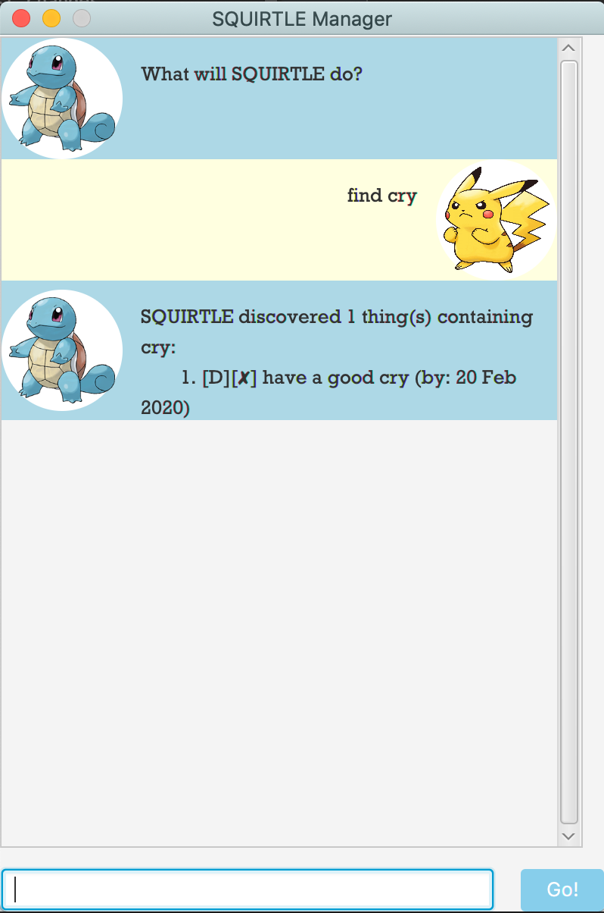

# Duke User Guide

## 1. About Duke
Duke is your companion who helps you to keep track of your tasks at hand. Some of Duke's key features include:
- Storing tasks
  - Todos
  - Deadlines
  - Events
- Add tags to tasks
- View tasks with a specific tag
- Search for tasks containing a keyword

## 2. Quick Start
1. Ensure that you have Java 11 or above set up on your computer.
2. Download the latest release [here](https://github.com/firzanarmani/duke/releases).
3. Start the app by simply double-clicking.
4. Type in your command (refer to 3 for usage details) and hit `enter` to submit the command to Duke.
  > Try these commands out!
  > - `todo Clean room` to add a Todo task called "Clean room"
  > - `list` to show all tasks currently Duke knows
  > - `done 1` to mark the first task as done

## 3. Features

### 3.1. View all tasks
View a list of all saved tasks or view a list of saved tasks that are tagged with a specific tag.

### Usage

### `list [/tag <tag name>]`
Format: `list`

Example of usage:

`list`

Expected outcome:

Example of usage:

`list /tag personal`

Expected outcome:

---

### 3.2. Add a Todo
Add a todo task to the list of saved tasks (with an option to add many single-word tags).

### Usage

### `todo`
Format: `todo <task description> [/tag <single-word tag name>]`

Example of usage:

`todo homework`

Expected outcome:

---

### 3.3. Add an Event
Add an event task with event date to the list of saved tasks (with an option to add many single-word tags).

### Usage

### `event`
Format: `event <description> /at <Event date in YYYY-MM-DD> [/tag <single-word tag name>]`

Example of usage:

`event My birthday /at 2020-02-26 /tag personal /tag birthdays`

Expected outcome:

---

### 3.4. Add a Deadline
Add a deadline task to the list of saved tasks (with an option to add many single-word tags).

### Usage

### `deadline`
Format: `deadline <description> /by <Deadline in YYYY-MM-DD format> [/tag <single-word tag name>]`

Example of usage:

`deadline Group project /by 2020-02-25`

Expected outcome:

---

### 3.5. Delete task
Delete a task from the list of saved tasks.

### Usage

### `delete`
Format: `delete <Task number>`

Example of usage:

`delete 1`

Expected outcome:

---

### 3.6. Mark task as done
Set a specified task in the list of saved tasks, to done.

### Usage

### `done`
Format: `done <Task number>`

Example of usage:

`done 1`

Expected outcome:

---

### 3.7. Find tasks
Find tasks with descriptions that contain the specified keyword, in the list of saved tasks.

### Usage

### `find`
Format: `find <Keyword to find>`

Example of usage:

`find project`

Expected outcome:

---

### 3.8. Show all tags
List all tags that are currently in use.

### Usage

### `tags`
Format: `tags`

Example of usage:

`tags`

Expected outcome:

