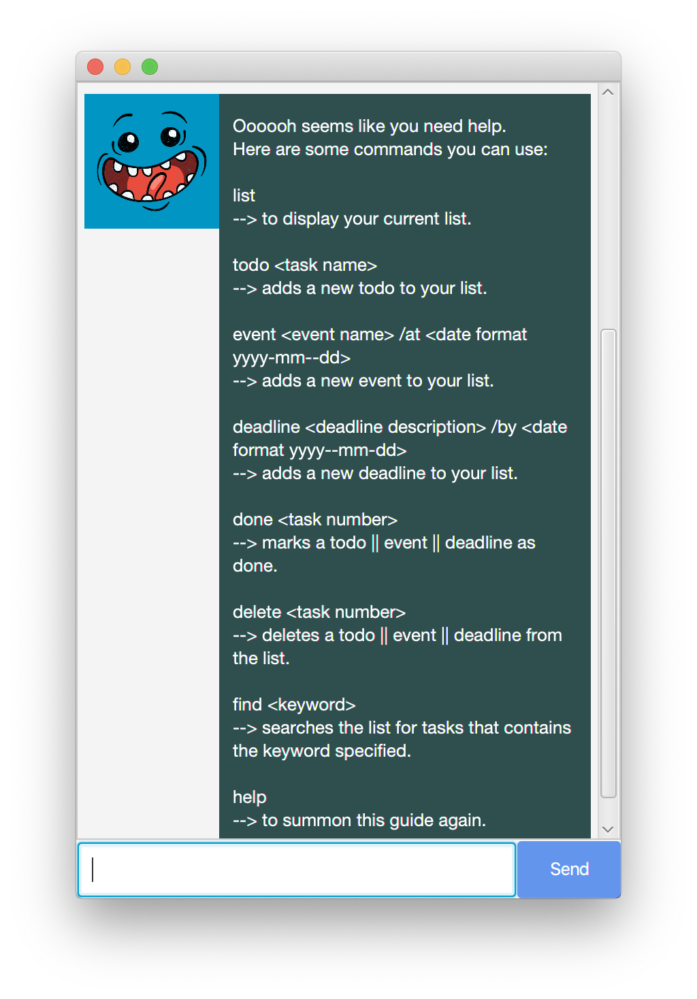

# User Guide
Duke is a simple and easy to use platform to help you keep track of your activities.

## Features 

#### **Adding a task**
* Duke allows one to add a todo, deadline or a event task to the task list.

#### **Deleting a task**
* Duke allows one to remove a task from the task list.

#### **Getting the task list**
* Duke allows one to see all the tasks in the task list.

#### **Marking a task as done**
* After completing a task, one can mark a task as done in the task list.

#### **Finding a task**
* One can find all tasks containing the desired keyword in the task list.

#### **Getting help**
* Duke also provides help for those who are unfamiliar with using Duke.


## Usage

## `todo` - Adds a todo task into the task list.

By keying in the `todo` command along with the description of task, one can insert a todo task into the task list.

Example of usage: 

`todo go for a run`

Expected outcome:

```
Got it. I've added this task:
 [T][Not Done] go for a run
Now you have 1 tasks in the list.
```


## `event` - Adds an event task into the task list.

By keying in the `event` command along with the description of task, followed by an `/at` and the date of the event, one 
can insert an event task into the task list. Take note that the date must be keyed in this format: "YYYY-MM-DD".

Example of usage: 

`event project meeting /at 2020-04-26`

Expected outcome:

```
Got it. I've added this task:
 [E][Not Done] project meeting (at: Apr 26 2020)
Now you have 2 tasks in the list.
```


## `deadline` - Adds a deadline task into the task list.

By keying in the `deadline` command along with the description of task, followed by a `/by` and the date of the event, 
one can insert an event task into the task list. Take note that the date must be keyed in this format: "YYYY-MM-DD".

Example of usage: 

`deadline return book /by 2020-04-26`

Expected outcome:

```
Got it. I've added this task:
 [D][Not Done] return book (at: Apr 26 2020)
Now you have 3 tasks in the list.
```


## `list` - Displays all the tasks in the task list.

By keying in the `list` command, one can see all the tasks in the task list.

Example of usage:

`list`

Expected outcome:

```
Here are the tasks in your list:
1.[T][Not Done] go for a run
2.[E][Not Done] project meeting (at: Apr 26 2020)
3.[D][Not Done] return book (by: Apr 26 2020)
```


## `delete` - Removes a task from the list.
By keying in the `delete` command along with the index of the task, one can remove a task from the task list.

Example of usage: 

`delete 1`

Expected outcome:

```
Noted. I've removed this task:
 [T][Not Done] go for a run
Now you have 2 tasks in the list.
```


## `done` - Marks a task as done in the task list.

By keying the command `done` followed by the index of the task, one can mark the task as done.

Example of usage: 

`done 1`

Expected outcome:

```
Nice! I've marked this task as done:
 [E][Done] project meeting (at: Apr 26 2020)
```


## `find` - Displays all the tasks with the keyword provided in the task list.

By keying the command `find` followed by the keyword, one can see the list of tasks with that keyword.

Example of usage: 

`find book`

Expected outcome:

```
Here are the tasks in your list:
 1.[D][Not Done] return book (by: Apr 26 2020)
```


## `bye` - Terminates the program.

By keying in the command `bye`, one can terminate the duke program.

Example of usage:

`bye`

Expected outcome:

```
See ya later alligator!
```

## `help` - Displays all the tasks with the keyword provided in the task list.

By keying the command `help` followed by the keyword, one can see all the available commands in duke.

Example of usage: 

`help`

Expected outcome:

```
Here are the available commands:

1) todo: To add a todo task, enter the command todo followed by the description of the task.
   For example: todo go for a run

2) event: To add an event task, enter the command event followed by the description of the task, followed by /at and 
   then finally the date of the event. Take note that the date should be entered in this format: YYYY-MM-DD.
   For example: event project meeting /at 2020-12-12

3) deadline: To add a deadline task, enter the command deadline followed by the description of the task, followed by /by
   and then finally the date of the event. Take note that the date should be entered in this format: YYYY-MM-DD.
   For example: event return book /at 2020-09-09

4) delete: To delete a task from the task list, enter the command delete followed by the index of the task to be 
   deleted.
   For example: delete 3

5) done: To mark a task as done, enter the command done followed by the index of the task to be marked as done.
   For example: done 3

6) list: To see all the tasks in the task list, enter the list command.
   For example: list

7) bye: To terminate the program, enter the bye command.
   For example: bye 
```


## Acknowledgements
Credit to Jeffry Lum for the fxml and java files for [JAVAFX GUI](https://github.com/nus-cs2103-AY1920S2/duke/blob/master/tutorials/javaFxTutorialPart4.md).

Credit to @MintBerryCrunch for the [code to create a new thread and terminating the program](https://stackoverflow.com/questions/52393982/javafx-problem-with-platform-runlater-delayed-rendering-of-canvas-graphic).

Credit to @Ernest Friedman-Hill for the [redirection code](https://stackoverflow.com/questions/8708342/redirect-console-output-to-string-in-java/8708357).

