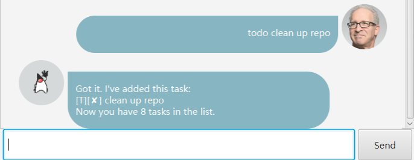
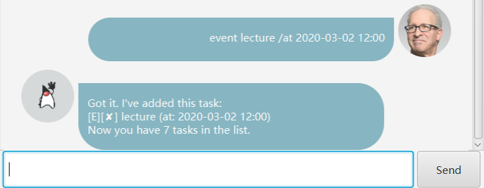
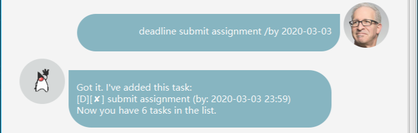
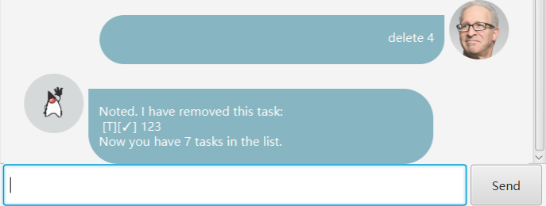

# User Guide

Duke

## Features 

### 1. Add a todo task 
Add a todo task to the task list.   

### 2. Add an event task
Add an event task to the task list.  

### 3. Add a deadline task
Add a deadline task to the task list  

### 4. Mark a task as done
Mark a task as finished.   

### 5. Delete a task
Delete a task from the task list.  

### 6. List all tasks
List all tasks in the task list.   

### 6. Find a task by keyword
Find a task by keyword  

### 7. View schedule on certain day
View the schedule on a selected day.

### 8. View schedule on certain day
View the schedule on a selected day.

## Usage

### `todo` - Add a todo task

Add a todo task to the task list.   
Format `todo TASK_CONTENT`
* `TASK_CONTENT` must not be empty.

Example of usage:   
> todo draft user guide

Expected outcome: 
> Got it. I've added this task:  
> [T][x] write user guide  
> Now you have 1 task in the list.   

### `event DESCRIPTION /at DATE_TIME` - add an event task

Add an event task to the task list.
Example of usage:   
> event career fair /at 2020-02-02   

Expected outcome:  
> Got it. I've added the task:   
> [E][x] career fair (at: 2020-02-02 23:59)  
> Now you have 2 tasks in the list.

### `deadline DESCRIPTION /by DATE_TIME` - add an deadline task

Add a deadline task to the task list.  
Example of usage:   
> deadline commit ip /by 2020-02-03 19:00

Expected outcome:
> Got it. I've added the task:   
> [D][x] commit ip (by: 2020-02-03 19:00)  
> Now you have 3 tasks in the list.

### `delete POSITION` - delete a task at certain position

Delete a task at certain index from task list.  
Example of usage: 
> delete 1

Expected outcome:
> Noted. I've removed this task:   
> [E][X] career fair (at: 2020-02-02 23:59) 

### `done POSITION` - Mark a task as done

Mark a task as finished.  
Example of usage:   
> done 1

Expected outcome:
> Nice! I've marked this task as done:   
> [E][&#9745;] career fair (at: 2020-02-02 23:59)  
> Now you have 2 tasks in the list.

### `find KEY_WORD` - find tasks by keyword

Find all tasks whose description contains the keyword.  
Example of usage: 
> find career

Expected outcome:
> Here are the matching tasks in your list:  
> [E][&#9745;] career fair (at: 2020-02-02 23:59)  

### `list` - list all tasks

List all tasks in the task list.  
Example of usage: 
> list

Expected outcome:
> Here are the tasks in your list:  
> [E][&#9745;] career fair (at: 2020-02-02 23:59)  
> [D][x] commit ip (by: 2020-02-03 19:00)  

### `view schedule DATE_TIME` - view schedule on specific day

View the tasks on a specific day.  
Example of usage:   
> view schedule 2020-02-02

Expected outcome:
> Here are the tasks on Date: 2020-02-02:
> 1. [E][&#9745;] career fair (at: 2020-02-02 23:59)

### `bye` - exit from the application.

Exit.  
Example of usage:   
> bye

Expected outcome: Application terminates.