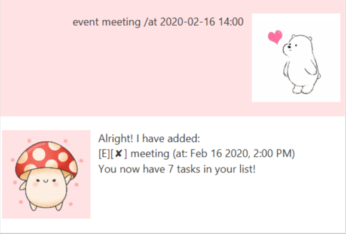
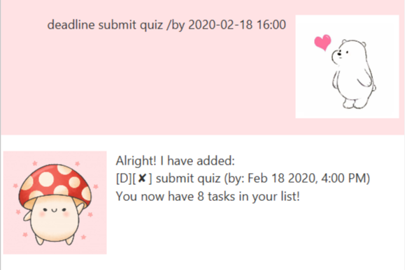

# User Guide

## Brief Description
Ronaldo is a **personal task manager** in the form of a chatbot. Simply key in the command and your task. It's that easy!

## Features 

#### Help
You can get help from Ronaldo so as to familiarise familiarise yourself with the chatbot.

#### Add
You can add ToDo, Event, or Deadline tasks to your list.

#### List
You can display all the tasks in your list.

#### Done
You can mark the tasks in your list as completed.

#### Delete
You can delete the task once you have completed it.

#### Save and Exit
You can save the tasks and exit the program.


## Usage

### `help` : lists out all the commands

`help` displays all the available commands

Example of usage: 

`help`

Expected outcome:

````
1. help - lists out available commands
2. list - lists out all the tasks
3. todo <task name> - adds a ToDo task
4. event <task name> /by <event date: YYYY-MM-DD> - adds an Event task
5. deadline <task name> /by <event date: YYYY-MM-DD> - adds a Deadline task
6. done <task number> - marks indicated task as complete
7. delete <task number> - deletes the indicated task
8. find <keyword> - searches for tasks with <keyword>
9. bye - saves and closes the program
````

Example:


___

### `todo` : adds a Todo task

`todo [description]` adds a Todo task

Example of usage:

`todo buy bottle`

Expected outcome:
````
I have added [T][ incomplete ] buy bottle
You now have 1 tasks!
````

Example:


___

### `event` : adds a Event task

`event [description] /by [YYYY-MM-DD]` adds an Event task

Example of usage:

`event olympics /by 2020-06-01`

Expected outcome:
````
I have added [E][ incomplete] olympics (by: Jun 1 2020)
You now have 2 tasks!
````

Example:


___

### `deadline` : adds a Deadline task

`deadline [description] /by [YYYY-MM-DD]` adds a Deadline task

Example of usage:

`deadline finish assignment /by 2020-03-01`

Expected outcome:
````
I have added [D][ incomplete] finish assignment (by: Mar 1 2020)
You now have 3 tasks!
````

Example:


___

### `list` : lists out all the tasks

`list` displays all the current tasks in the list

Example of usage:

`list`

Expected outcome:
````
Here are the tasks in your list:
1.[T][ incomplete ] buy bottle
2.[E][ incomplete] olympics (by: Jun 1 2020)
3.[D][ incomplete] finish assignment (by: Mar 1 2020)
````

Example:


___

### `done` : marks indicated task as complete

`done [index]` marks the task at index as complete

Example of usage:

`done 1`

Expected outcome:
````
I have marked 1.[T][  complete  ] buy bottle as done!
You now have 3 tasks left!
````

Example:


___

### `delete` : deletes the indicated task

`delete [index]` removes the task at index from the list

Example of usage:

`delete 1`

Expected outcome:
````
I have deleted 1.[T][  complete  ] buy bottle
You now have 2 tasks remaining!
````

Example:


___

### `find` : searches through the list for the keyword

`find [keyword]` displays all the tasks with the keyword

Example of usage:

`find olympics`

Expected outcome:
````
Here are the matching tasks in your list:
1.[E][ incomplete] olympics (by: Jun 1 2020)
````

Example:


___

### `bye` : saves and exits

`bye` saves and exits the program

Example of usage:

`bye`

Expected outcome:
````
Bye. Hope to see you again soon!
````

Example:


## Acknowledgements
Credit to @j-lum (Jeffry Lum) for the FXML and Java files for [JAVAFX GUI](https://github.com/nus-cs2103-AY1920S2/duke/blob/master/tutorials/javaFxTutorialPart4.md).

Credit to MintBerryCrunch for the [code that creates a new thread to display the bye message and terminating the program](https://stackoverflow.com/questions/52393982/javafx-problem-with-platform-runlater-delayed-rendering-of-canvas-graphic).

Credit to Ernest Friedman-Hill for the [code to redirect console output to string in Java](https://stackoverflow.com/questions/8708342/redirect-console-output-to-string-in-java/8708357).

Credit to Skysports.com for the [Ronaldo](https://www.skysports.com/football/news/12961/11812691/cristiano-ronaldo-says-he-deserves-more-ballon-dors-than-lionel-messi) image.

Credit to Biography.com for the [Messi](https://www.biography.com/athlete/lionel-messi) image.