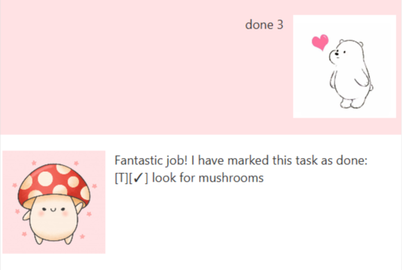

# User Guide
Ooooooh here is the user guide for Duke.

##Table of Contents

-[Usage](#usage)

-[Todo](todo.png)

-[Event](event.png)

-[Deadline](deadline.png)

-[List](list.png)

-[Done](done.png)

-[Find](find.png)

-[Help](help.png)

-[Bye](#bye---terminate-program)

##Features
1. Add todo task.
2. Add event with date (yyyy-mm-dd).
3. Add deadline with date (yyyy-mm-dd).
4. Show all tasks in list.
5. Set task as done.
6. Delete specific task.
7. Find tasks that contains specific keywords
8. Help to show commands usable. 
9. Bye
## Usage

### `todo [description]` - Adds a todo task.  
Example of usage: 

`todo Workout`

Expected outcome:

### `event [description] /at [yyyy-mm-dd]` - Adds an event task.  
Example of usage: 

`event Annual dinner /at 2020-03-12`

Expected outcome:

### `deadline [description] /by [yyyy-mm-dd]` - Adds a deadline task.  
Example of usage: 

`deadline Analysis report /by 2020-02-20`

Expected outcome:

### `list` - Show all tasks in list.  
Example of usage: 

`list`

Expected outcome:

### `done [task number]` - Sets a specific task as done.  
Example of usage: 

`done 1`

Expected outcome:

### `delete [task number]` - Deletes a specific task in list.  
Example of usage: 

`delete 2`

Expected outcome:

### `find [task decription]` - Finds task with keywords specified.  
Example of usage: 

`find workout`

Expected outcome:

### `help` - Show commands available.  
Example of usage: 

`help`

Expected outcome:

### `Bye` - Terminate program.  
Example of usage: 

`bye`

