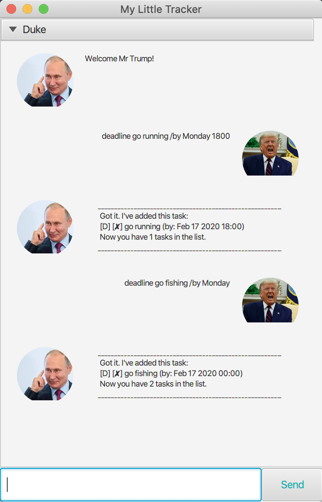
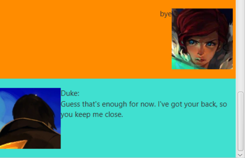

# User Guide


E-1337 is a Personal Assistant Chatbot which stores and records your to-dos, deadlines, events, and loans.
This User Guide will demonstrate how to use its capabilities, such that users will have a smooth and productive
experience with the software.


## Start Program

- Simply open the .jar file on your computer/machine to launch the program.
- Upon creating an entry or updating any Tasks, a separate file will be created so that you can
refer to it outside of the program.

```
Note: this file will be used for subsequent launches of the program, hence any edits will be reflected the next launch.
Note: Should this file be absent, a new empty file will be created in its place.
```

## Task Types
There are 4 types of Tasks that E-1337 can process. These include:

```
ToDo
Deadline
Event
Loan
```

## Features 

- Help
- Add a Task
- List down all Tasks
- Mark Tasks as Done
- Find Tasks by Keywords
- Delete Tasks
- Exit the Program

## Usage

### `Help`

The 'help' command provides the users with a list of instructions on how to use the chatbot.

Example of usage: 

`help`

Expected outcome:


### `Add a Task`

- Adding a Task requires users to know what kind of Task they would like to add. Here, users can choose
from ToDo, Deadline, Event, or Loan. Below are some provided examples.

```
The format for adding Tasks is as follows:
<Task Type> <Task Name> </separator> <Date as YYYY-MM-DD>
```

#### `Add a ToDo`

For ToDo Tasks, simply type `todo` and the Task name.

Example of usage:

- Say there was a ToDo Task called Good to be recorded.

`todo Good`

Expected outcome:


#### `Add a Deadline`

For Deadline Tasks, `/by` separates the Task name and the deadline of completion.

Example of usage:

- Say there was a Deadline Task called Software Engineering Project, due 6 April 2019.

`deadline Software Engineering Project /by 2019-4-6`

Expected outcome:



#### `Add an Event`

For Event Tasks, `/at` separates the Task name and the date of the Event.

Example of usage:

- Say there was an Event Task called Samuel's Birthday Party happening on 5 May 2019.

`event Samuel's Birthday Party /at 2019-5-5`

Expected outcome:


#### `Add a Loan`

For Loan Tasks, `/value` separates the name of the other party and the value involved.

Example of usage:

- Say that a Loan was made to Judy with a value of $18 worth.

`loan Judy /value 18`

Expected outcome:


### `List down all Tasks`

To list down all Tasks that have been recorded, simply use the command `list`.

Example of usage:

`list`

Expected outcome:


Should the list of Tasks be empty, running the `list` command gives the outcome below.


### `Marking Tasks as Done`

To indicate a Task has been Done, we simply use `done <index number>`.

- `[V]` denotes a Task as Complete, while `[X]` denotes a Task as Incomplete.
- Note: The `index number` would be the same we obtain from performing a `list` command.

Example of usage:

- Given that a Loan to Judy worth $18 has an index number of 4, as seen in the section for the list command,

`done 4`

Expected outcome:


### `Find Tasks by Keywords`

E-1337 can help find Tasks by keywords, regardless if the kaywords entered are full or partial, uppercase or lowercase.
To do so, simply use the `find <keyword>` command.

Example of usage:

- Suppose we want to find any Task containing the variant of 'good' from the list shown.


- Performing the `find good` command provides the desired outcome.

Expected outcome:


### `Delete Tasks`

To delete Tasks, simply perform the `delete <index>` command.
- Note: `<index>` can be a single number, a sequence of space-separated numbers, or 'all'.

Example of usage:

- Suppose we wanted to delete the Task with index 4, which is the Loan to Judy.

`delete 4`

Expected outcome:


We can also **delete Multiple Tasks** with their index number specified.

Example of usage:

- Suppose we wanted to Delete Tasks 3 (Samuel's Birthday Party) and 5 (GooD) from the list.


`delete 3 5`

Expected outcome:


We can also delete the **entire list** using `delete all`.

Example of usage:

- Suppose we wanted to delete all the Tasks in the list.


`delete all`

Expected outcome:


### `Exit the Program`

Besides clicking the Close Window button, E-1337 also facilitates exiting the program via chat.
To do so, simply use the `bye` command, which E-1337 responds with a farewell greeting, before exiting in `3 seconds`.

Example of usage:

`bye`

Expected outcome:



- Note: Upon exit, should there have been any changes (addition, removal, update) of Tasks, a file (LastSavedTasks.txt)
is created.
- LastSavedTasks.txt stores the previous session's Tasks to be loaded the next time the application is launched.
- Should you like to export your Tasks, E-1337 recommends making a copy of it rather than removing it.

#### Disclaimer:

The project uses references from tutorials by Jeffry Lum (@j-lum) for JavaFX.

```
https://github.com/nus-cs2103-AY1920S2/duke/blob/master/tutorials/javaFxTutorialPart1.md
https://github.com/nus-cs2103-AY1920S2/duke/blob/master/tutorials/javaFxTutorialPart2.md
https://github.com/nus-cs2103-AY1920S2/duke/blob/master/tutorials/javaFxTutorialPart3.md
https://github.com/nus-cs2103-AY1920S2/duke/blob/master/tutorials/javaFxTutorialPart4.md
```