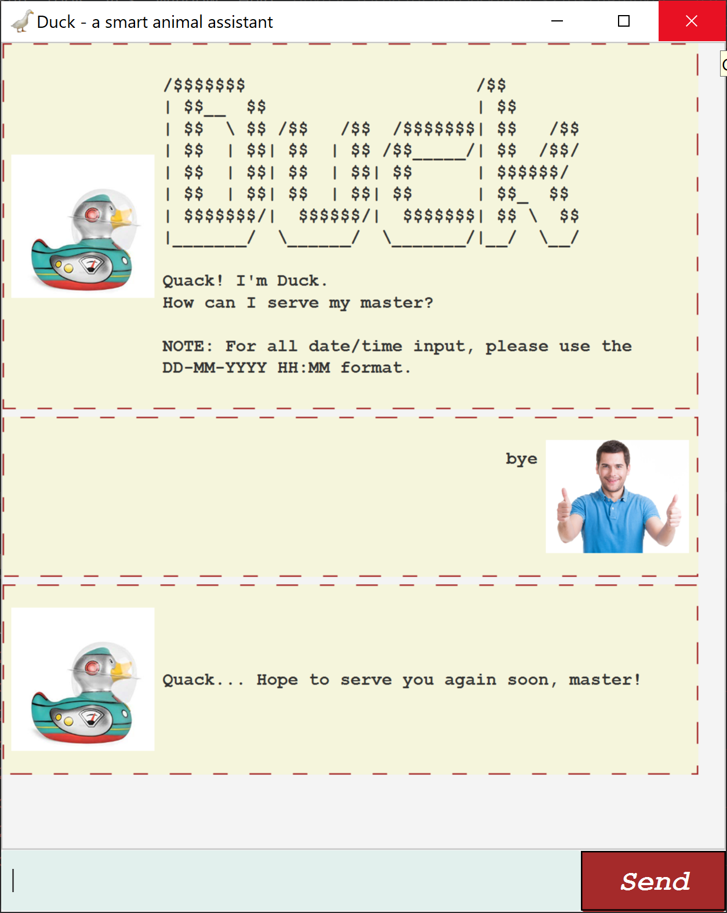

# Duck: User Guide

## Introduction
Duck is a personal assistant chat bot. It primarily serves as a task manager.

## Usage
Command format:
1. Words in `UPPER_CASE` are the parameters to be supplied by the user.
2. Items in square brackets are optional.

## Features 

### 1. Adding a to-do task: `todo`
#### 1.1. Without a time period
Adds a to-do task to the list.

Format: `todo TASK_NAME`

Examples:
* `todo Go to the gym`
* `todo Eat more`

#### 1.2. Within a time period
Adds a to-do task to the list, specifying a date range. Date should be specified in DD-MM-YYYY format.

Format: `todo TASK_NAME [/between START_DATE /and END_DATE]`

Examples:
* `todo Go for runs /between 01-03-2020 /and 31-03-2020`
* `todo Eat more /between 02-03-2020 /and 03-03-2020`

### 2. Adding an event task: `event`
Adds an event task to the list, specifying a date (and optionally, time). Date should be specified in DD-MM-YYYY format. Time should be specified in HH:MM 24-hour format.

Format: `event EVENT_NAME /at EVENT_DATE [EVENT_TIME]`

Examples:
* `event Gym session /at 05-03-2020 08:00`
* `event Eating competition /at 04-03-2020`

### 3. Adding a deadline task: `deadline`
Adds a deadline task to the list, specifying a date (and optionally, time). Date should be specified in DD-MM-YYYY format. Time should be specified in HH:MM 24-hour format.

Format: `deadline DEADLINE_NAME /by DEADLINE_DATE [DEADLINE_TIME]`

Examples:
* `deadline Start healthy diet /by 04-03-2020 23:00`
* `deadline Stop eating /by 05-03-2020`

### 4. Viewing list of tasks: `list`
Displays the list of tasks, including all information about each task.

Format: `list`

### 5. Finding a task: `find`
Displays tasks in which the searched keyword can be found.

Format: `find KEYWORD`

Example: `find Eat`

### 6. Marking a task as done: `done`
Marks a task at a specified index on the list as done. Tasks which are completed are marked as `OK!` while tasks which are not completed are marked as `X`.

Format: `done INDEX`

Example: `done 2`

### 7. Deleting a task: `delete`
Deletes a task at a specified index on the list as done.

Format: `delete INDEX`

Example: `delete 5`

### 6. Ending the conversation: `bye`
Displays a farewell message from Duck.

Format: `bye`

## Command Summary
* Todo: `todo TASK_NAME [/between START_DATE /and END_DATE]`
* Event: `event EVENT_NAME /at EVENT_DATE [EVENT_TIME]`
* Deadline: `deadline DEADLINE_NAME /by DEADLINE_DATE [DEADLINE_TIME]`
* List: `list`
* Find: `find KEYWORD`
* Done: `done INDEX`
* Delete: `delete INDEX`
* Bye: `bye`