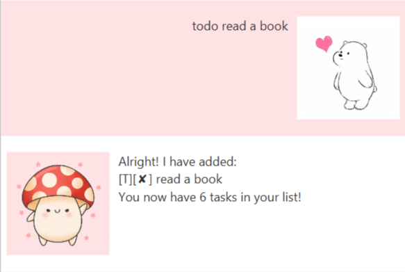

# User Guide

## About 
Mbot Jr is a personal assistant chatbot who will help you keep track of your tasks!

## Usage

### `todo` - Adds a to-do task 

Describe action and its outcome.

Example of usage: 

`todo read a book`

Expected outcome:

### `event` - Adds an event task 

Describe action and its outcome.

Example of usage: 

`event meeting /at 2020-02-16 14:00`

Expected outcome:

### `deadline` - Adds a deadline task 

Describe action and its outcome.

Example of usage: 

`deadline submit quiz /by 2020-02-18 16:00`

Expected outcome:

### `done` - Marks a task as done

Describe action and its outcome.

Example of usage: 

`done 3`

Expected outcome:

### `delete` - Deletes a task 

Describe action and its outcome.

Example of usage: 

`delete 7`

Expected outcome:

### `list` - Lists all tasks 

Describe action and its outcome.

Example of usage: 

`list`

Expected outcome:

### `find` - Searches for tasks with keyword 

Describe action and its outcome.

Example of usage: 

`find mushroom`

Expected outcome:

### `sort` - Sorts tasks chronologically 

Describe action and its outcome.

Example of usage: 

`sort`

Expected outcome:

### `bye` - Exits the application 

Describe action and its outcome.

Example of usage: 

`bye`
