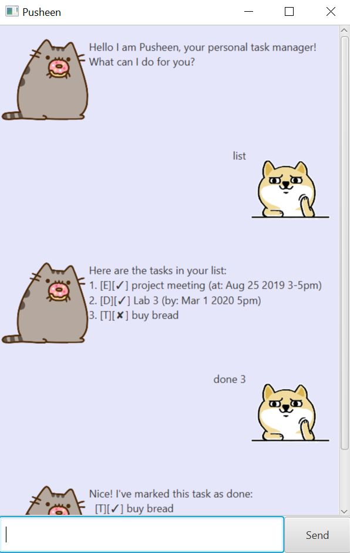

# Duke - Interactive Task Tracker
 
* This is a desktop task tracking application. It has a GUI but most of the user interaction happens using a CLI (Command Line interface)

# User Guide

## Features

##### Commands overview
* [todo](#11-todo---add-a-todo-task) - Create a new Todo task with a description
* [event](#12-event---add-an-event-task) - Create a new Event task with a description and time
* [deadline](#13-deadline---add-a-deadline-task) - Create a new Deadline task with a description and deadline
* [list](#2-list-all-tasks) - List all tasks
* [delete](#3-delete-a-task) - Delete a specified task
* [done](#4-mark-a-task-as-done) - Marks a task as done
* [update](#6-get-reminders-for-tasks) - Update the description or time of a task
* [bye](#7-exit-the-application) - Exits the application

##### Command Format
* Words in `<UPPER_CASE>` are parameters to be supplied by the user
  * E.g In `todo <DESCRIPTION>`, `DESCRIPTION` is a parameter which can be used as `todo call oppa`.
---

### Feature 1: Adding tasks to the tracker
Three types of tasks, `Todo`, `Event` and `Deadline` can be added.

##### Format: `<TASK_TYPE> <PARAMETERS>`

#### 1.1) `todo` - Add a `TODO` task

###### Syntax:

`todo <DESCRIPTION>`

* Adds a new `TODO` with `DESCRIPTION` to the list.

###### Example usage:

`todo meet oppa`

###### Output:

    [T][N] meet oppa

* Adds a new `Todo` to *meet oppa*.

#### 1.2) `event` - Add an `Event` task

###### Syntax:

`event <DESCRIPTION> /at <DATETIME>`

* Adds a new `Event` with `DESCRIPTION` and `DETAILS` to the list.

###### Example usage:

    event eat dinner with oppa /at Wednesday 2pm

###### Output:

    [E][N] eat dinner with oppa (at: Wednesday 2pm)

* Adds a new `Event` to *eat dinner with oppa* at *Wednesday 2pm*.

#### 1.3) `deadline` - Add a `Deadline` task

###### Syntax:

    deadline <DESCRIPTION> /by <DATETIME>

* Adds a new `Deadline` with `DESCRIPTION`, to be done by `DATETIME` to the list.

###### Example usage:

    deadline wash oppa's clothes /by 2019-12-02

###### Output:

    [D][X] wash oppa's clothes (by: Dec 2 2019)

* Adds a new `Deadline` to *wash oppa's clothes* by Dec 2 2019.

---

### 2. List all task
Displays all tasks in the list to the screen.

###### Syntax: `list`

###### Example usage:

    todo kiss oppa
    list

###### Output:

    1. [T][N] kiss oppa  // only showing 'list' output

---

### 3. Delete a task

Delete a particular task from the list.

###### Syntax: `delete <TASK_NUMBER>`
* `TASK_NUMBER` is the numbering of the task when the `list` command is executed.

###### Example usage:

    todo kiss oppa
    event eat dinner with oppa /at 2019-12-02
    list
    delete 2
    list

###### Output:

    1. [T][N] kiss oppa  // before delete
    2. [E][N] eat dinner with oppa (at: Dec 2 2019)

    ...

    1. [T][N] kiss oppa  // after delete

---

### 4. Mark a task as done

###### Syntax: `done <TASK_NUMBER>`

Marks a particular task in the list as done.
* `TASK_NUMBER` is the numbering of the task when the `list` command is executed.

###### Example Usage:

    todo kiss oppa
    event eat dinner with oppa /at 2019-12-02
    list
    done 2
    list

###### Output:

    1. [T][N] kiss oppa  // before 'done'
    2. [E][N] eat dinner with oppa (at: Dec 2 2019)

    ...

    1. [T][N] kiss oppa  // after 'done'
    2. [E][Y] eat dinner with oppa (at: Dec 2 2019)
---

### 5. Find a task

Searches and retrieves all tasks with the `KEYWORD` in the `DESCRIPTION`

###### Syntax: `find <KEYWORD>`
* `KEYWORD` is the string keyword.

###### Example Usage:

    todo kiss oppa
    event eat dinner with oppa /at 2019-12-02
    find ith

###### Output:

    1. [E][N] eat dinner with oppa (at: Dec 2 2019)

---

### 6. Update task description or time:

Update the description or time of a task in the list.

###### Syntax: `update <TASKNUMBER> <TORD> <CHANGE>`
* `TASK_NUMBER` is the numbering of the task when the `list` command is executed.
* `TORD` T OR D depending on if user wants to update the time or description of the task.
* `CHANGE` is the string change you want to update to.

###### Example Usage:

    todo kiss oppa
    event eat dinner with oppa /at 2019-12-02
    list
    update 2 T breakup with oppa
    list

###### Output:

    1. [T][N] kiss oppa  // before 'update'
    2. [E][N] eat dinner with oppa (at: Dec 2 2019)

    ...

    1. [T][N] kiss oppa  // after 'update'
    2. [E][Y] breakup with oppa (at: Dec 2 2019)

---

### 7. Exit the Application:

###### Syntax: `bye`

###### Example Usage:

    todo kiss oppa
    bye

###### Output:

* No output

---
