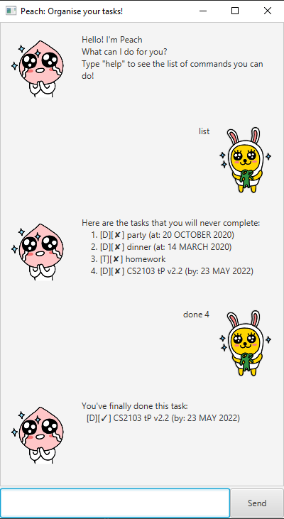

# Kim's Secret Chat - User Guide

- [1. Introduction](#1-introduction)
- [2. Quick Start](#2-quick-start)
- [3. Features](#3-features)
    - [3.1 Listing all the tasks added](#31-list---listing-all-the-tasks-added)
    - [3.2 Creating a todo](#32-todo---creating-a-todo)
    - [3.3 Creating an event](#33-event---creating-an-event)
    - [3.4 Creating a deadline](#34-deadline---creating-a-deadline)
    - [3.5 Deleting a task](#35-delete---deleting-a-task)
    - [3.6 Finding a task](#36-find---finding-a-task)
    - [3.7 Marking a task as done](#37-done---marking-a-task-as-done)
    - [3.8 Sorting the tasks](#38-sort---sorting-the-task-list)
    - [3.8 Sorting the tasks](#38-sort---sorting-the-task-list)
    - [3.9 Exiting the program](#39-bye---exiting-the-program)
- [4. FAQ](#4-faq) 

## Features 

## 1. Introduction
Kim's Secret Chat is a helpful tool that you can talk to to keep track of your tasks and everything going on in your life. He is friendly, I promise.

## 2. Quick Start
1. Ensure you have Java `11` or above installed in your Computer.
2. Download the latest release here
3. Copy the file to the folder you want to use as the home folder for the tool.
4. Double-click the file to start the app. The GUI should appear in a few seconds.

5. Type the command in the command box and press <kbd>enter</kbd> to execute it.  
e.g. typing `list` and pressing <kbd>enter</kbd> will list all the tasks in task list
6. Refer to Section 3, Features for details of each command

## 3. Features
### 3.1 `list` - Listing all the tasks added

Lists all the tasks that has been added in the task list

Format: `list`

### 3.2 `todo` - Creating a todo

Creates a todo task with description and add it to task list 

Format: `todo TASK`

Example of usage:  
`todo sleep`

Expected outcome: 
The todo task `sleep` is added to the task list

### 3.3 `event` - Creating an event

Creates an event task with description and date

Format: `event TASK /at DATE`
- `DATE` : `DD:MM:YYYY`

Example of usage:  
`event dinner /at 10/08/2020`

Expected outcome: 
The event task `dinner` with date `10/08/2020` is added to the task list

### 3.4 `deadline` - Creating a deadline

Creates an deadline task with description and date

Format: `deadline TASK /at DATE`
- `DATE` : `DD:MM:YYYY`

Example of usage:  
`deadline homework /at 01/04/2020`

Expected outcome: 
The deadline task `homework` with date `01/04/2020` is added to the task list
 
### 3.5 `delete` - Deleting a task

Deletes a specified task from the task list

Format: `delete INDEX`
- Deletes the task at specified `INDEX` 
- The index refers to the index number shown in the displayed task list when running command `list`
- Index **must be a positive integer** 1,2,3...

Example of usage:  
`delete 2`

Expected outcome: 
Deletes the second task from the task list

### 3.6 `find` - Finding a task

Finds all tasks whose descriptions contain the keyword

Format: `find KEYWORD`
- The search is **case sensitive** e.g. `hi` will not match `HI`
- If part of description word contains keyword, it will still be matched. e.g. `he` will match `hello who dis` 

Example of usage:  
`find bobo`

Expected outcome: 
Finds all the tasks in the task list whose descriptions contain the keyword `bobo`

### 3.7 `done` - Marking a task as done

Marks a specified task from the task list as done

Format: `done INDEX`
- Marks the task at specified `INDEX` as done
- The index refers to the index number shown in the displayed task list when running command `list`
- Index **must be a positive integer** 1,2,3...

Example of usage:  
`done 1`

Expected outcome: 
Marks the first task in the task lis as done

### 3.8 `sort` - Sorting the task list 

Sorts the tasklist by alphabetical order

Format: `sort`

### 3.9 `bye` - Exiting the program

Exits the program 

Format: `bye`

## 4. FAQ
**Q**: How do I save the tasks in the task list so that they will still be there when i exit the program and reopen it again  
**A**: The program will automatically save all your tasks for you. 