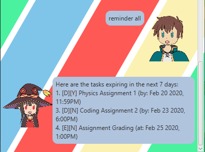

# User Guide

This page serves as a guide to mastering Megumin, the master of explosion magic and an expert task handler.

## Features 

There are several useful features Megumin has to offer.

### Adding and Managing Tasks  

There are 3 types of tasks you can add and manage:

1. Todo
    * Todo tasks are tasks with only description.
2. Deadline
    * Deadline tasks are tasks with description and a due date and time.
3. Event
    * Event tasks are tasks with description and the date and time it is happening.

### Reminders

Megumin will show you reminders for your deadlines and events up till the next 7 days at startup.
You can also use the `reminder` command to bring it up again if needed.

## Commands

### `help` - Opens Help Menu

Opens up the help menu with all available commands.

Command format:

`help`

Example of usage: 

`help`

Expected outcome:

### `bye` - Exits the Program

Exits the program with farewell message.

Command format:

`bye`

Example of usage: 

`bye`

Expected outcome:

### `todo` - Adds Todo Task

Adds a todo task with the given description to the task list.

Command format:

`todo (description)`

Example of usage: 

`todo math homework`

Expected outcome:

### `deadline` - Adds Deadline Task

Adds a deadline task with the given description and due date and time to the task list.

Command format:

`deadline (description) /by dd/MM/yyyy hhmm`

Example of usage: 

`deadline Physics Assignment 1 /by 20/02/2020 2359`

Expected outcome:

### `event` - Adds Event Task

Adds a event task with the given description and the date and time is it happening at to the task list.

Command format:

`event (description) /at dd/MM/yyyy hhmm`

Example of usage: 

`event Movie /at 27/02/2020 1200`

Expected outcome:

### `list` - Displays List of Tasks

Displays the list of tasks if there if any.

Command format:

`list`

Example of usage: 

`list`

Expected outcome:

### `done` - Marks a Task as Done

Marks the task corresponding to the given index in task list given by `list` command as done.

Command format:

`done (index of task in list)`

Example of usage: 

`done 2`

Expected outcome:

### `delete` - Deletes a Task

Deletes the task corresponding to the given index in the task list given by `list` command.

Command format:

`delete (index of task in list)`

Example of usage: 

`delete 1`

Expected outcome:

### `find` - Finds a Task Containing a Search Phrase

Finds a task with the description containing the search phrase (case sensitive).

Command format:

`find (search phrase)`

Example of usage: 

`find Assignment`

Expected outcome:

### `reminder` - Gets Reminder for Deadline and Event Tasks

Gets reminder of deadline, event of both type of tasks up to 7 days from the current day.
You must specify what reminders you want to view with `deadline`, `event` or `all`.

Command format:

`reminder (deadline/event/all)`

Example of usage: 

`reminder all`

Expected outcome:

