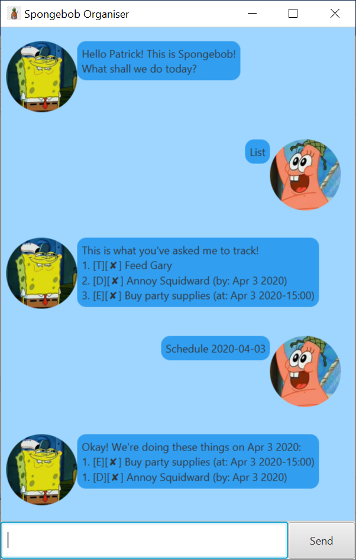
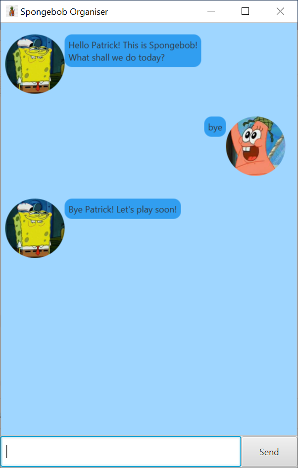

# User Guide
Spongebob Organiser is an organiser which helps you manage your tasks

## Tasks 
There are 3 types of tasks that Spongebob can help you track.
* Todo
* Deadline
* Event

### Task Descriptions
* Todo
  * A basic task to be done without any specific date or time
* Deadline
  * A task that has to be completed by a specified date
* Event
  * An upcoming task that will occur on a specified date and time

## Features
1. List
1. Add
1. Complete
1. Delete
1. Find
1. Schedule

### Feature 1 - List
Spongebob will show you the list of all existing tasks he is tracking.

### Feature 2 - Add
You can add one of the three tasks for Spongebob to help you track.

### Feature 3 - Complete
Spongebob will mark this task as completed.

### Feature 4 - Delete
Spongebob will stop tracking this task.

### Feature 5 - Schedule
Spongebob will show you a list of tasks that is occurring on a specified date.

## Usage
With reference to [Ben's User Guide](https://github.com/chanckben/duke/tree/master/docs)
* Words in `{UPPER_CASE}` are user supplied parameters
  * `{DATE}` parameters are to be in the format `YYYY-MM-DD`
  * `{TIME}` parameters are to be in the format `HHMM`
  * `{INDEX}` parameters are the indexes of the specified tasks in the task list
  
### `list` - View all tasks

Spongebob shows all the tasks that he is tracking.

Format: `list`

Expected outcome:

### `todo` - Add a new Todo task

Adds a new task to be tracked by Spongebob.

Format: `todo {TASK_DESRCIPTION}`

Example of usage: `todo Walk Gary`

Expected outcome: 

### `deadline` - Add a new Deadline task

Adds a new task to be tracked by Spongebob. This task comes with a deadline date.

Format: `deadline {TASK_DESRCIPTION} /by {DATE}`

Example of usage: `deadline Annoy Squidward /by 2020-04-03`

Expected outcome:

### `event` - Add a new Event task

Adds a new task to be tracked by Spongebob. This task comes with an upcoming date and time.

Format: `event {TASK_DESRCIPTION} /at {DATE} {TIME}`

Example of usage: `event Buy party supplies /at 2020-04-03 1500`

Expected outcome:

### `done` - Mark a task as complete

Spongebob marks this task as completed.

Format: `done {INDEX}`

Example of usage: `done 2`

Expected outcome:

### `delete` - Delete a task from list

Spongebob removes a task from the list of tracked tasks.

Format: `delete {INDEX}`

Example of usage: `delete 2`

Expected outcome:

### `find` - View all tasks containing a given keyword

Spongebob shows all tasks that contain the given keyword.

Format: `find {KEYWORD}`

Example of usage: `find Gary`

Expected outcome:

### `schedule` - View all tasks occurring on a given date

Spongebob shows all tasks that are occurring on the given date

Format: `schedule {DATE}`

Example of usage: `schedule 2020-04-03`

Expected outcome:

### `help` - Provides list of available commands 

Spongebob shows a list of all available commands

Format: `help`

Expected outcome:

### `bye` - Exit 

Exits Spongebob Organiser

Format: `bye`

Expected outcome:

