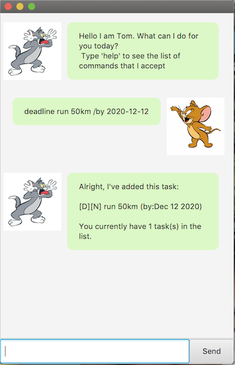
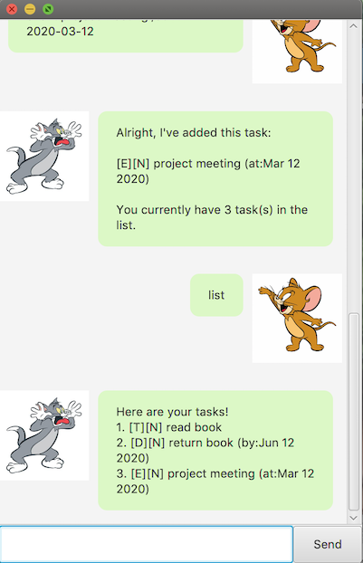

# User Guide

## Description
Tom is an assistant that helps to track your list of tasks to be completed.

## Features
These are the features offered by Tom:
1. Add a task to the list of tasks
2. Delete a task from the list of tasks
3. Marking a particular task as done upon completion
4. Mass deletion of tasks of a particular type
5. Display the entire list of tasks

### Add Task
You can add tasks to Tom's list of tasks. 
You may enter 'ToDo', 'Deadline' and 'Event' tasks.

### Delete Task
You can delete tasks from Tom's list of tasks.

### Marking Task(s) as Done 
You can mark tasks as 'done' after completing them to be reflected in Tom's list of tasks.

### List Tasks
You can look at all the tasks in Tom's list of tasks.

### Storage of Tasks
You can store the list of tasks in Tom's list and it will be saved automatically.

### Mass Deletion
You can mass delete tasks from Tom's list of tasks based on a particular type of task.

### Exit Application
You can exit the application by inputting `bye` and it will be automatically closed.

## Usage
### `todo` - Add a ToDo task to the list

Adds a 'todo' task to the list of tasks and updates the list in `duke.txt`.

Example of usage:

`todo read CS2103 Textbook`

Expected outcome:

```
Alright, I've added this task:

[T][N] read CS2103 Textbook

You currently have 1 task(s) in the list.
```


### `deadline` - Add a Deadline task to the list

Adds a 'deadline' task to the list of tasks and updates the list in `duke.txt`. 

Example of usage:

`deadline run 50km /by 2020-12-12`

Expected outcome:

```
Alright, I've added this task:

[D][N] run (by:Dec 12 2020)

Now you have 1 task(s) in the list.
```



### `event` - Add an Event task to the list

Adds a 'event' task to the list of tasks and updates the list in `duke.txt`. 

Example of usage:

`event project meeting /at 2020-06-12`

Expected outcome:

```
Alright, I've added this task:

[E][N] project meeting (at:Jun 12 2020)

You currently have 1 task(s) in the list.
```


### `List` - Displays the entire list of tasks 

Display the entire list of tasks from the `duke.txt` file.

Example of usage:
 
`list`

Expected outcomes:

* When the list of tasks is empty: <br>
`Your current list of tasks is empty! Try adding some tasks.`


* When there are tasks in the list of tasks: <br>
```
Here are your tasks!
1. [T][N] read book
2. [D][N] return book (by: Jun 12 2020)
3. [E][N] project meeting (at:Mar 12 2020)
```



### `done` - Mark a particular task as done

Upon completion of a task, you can mark the particular task as completed. 

Example of usage: 

`done 3`

Expected outcome:

```
Fantastic! This task is a done-deal!

[E][Y] project meeting (at:Mar 12 2020)
```


### `delete` - Deletes the specified task from the list of tasks

Delete a particular task from the list of tasks in `duke.txt`

Example of usage: 

`delete 2`

Expected outcome:

```
Alright, I've removed this task: 

[D][N] return book (by:Jun 12 2020)
```


### `delete all` - Mass deletion of a particular type of tasks

This will delete all tasks of a particular type from the list of tasks.

Example of usage:

`delete all todo`

Expected outcome:
* When specified tasks are deleted from the list: <br>
```
Alright, I've removed all todo tasks.
You currently have 1 task(s) in the list.
```


### `bye` - Terminates the program
 
Terminates the application and the application window will be automatically closed.
 
Example of usage: 
 
`bye`
 
Expected outcome:
 
```
Bye-bye! See you again, my friend! 
Please close this window if you do not wish to continue this session.
```


## Acknowledgements
The GUI was done based on the 
[JavaFX Tutorial](https://github.com/nus-cs2103-AY1920S2/duke/blob/master/tutorials/javaFxTutorialPart4.md)
written by Jeffry Lum.


