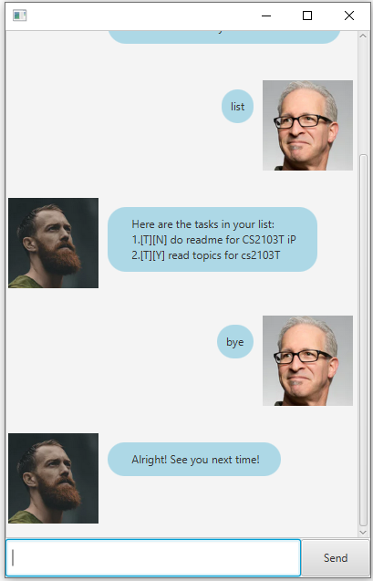

# User Guide

## Description
A personal assistant for tracking the tasks to be done.


## Features 

### Adding Task
* You can add task as either Todo or Event or Deadline to the list to `task.txt`.

### Delete Task
* You can delete task from the list.

### Mark Task as Done
* You can mark the task as done.

### List Tasks
* You can list the tasks out to see.

### Storing tasks to `task.txt`
* You can store the list of tasks into hard disk in the file `task.txt`.

### Sorting tasks
* You would not required to sort the tasks manually. <br/>
Duke will sort the tasks according to date and time first. If it is same for both tasks, <br/> 
Duke will sort them according to their descriptions in alphabetical order.

### Exit the program
* You could close the GUI by input `bye`.

## Usage

### `todo` - Add todo to the list

Inform duke to add the todo with the description provided to the list and update the list in `task.txt`.

Example of usage:

`todo read topics for CS2103`

Expected outcome:

```
Got it. I've added this task: 
  [T][N] read topics for CS2103T
Now you have 1 task in the list.
```


### `deadline` - Add deadline to the list

Inform duke to add the deadline with the description and due date provided to the list 
and update the list in `task.txt`. 

Example of usage:

`deadline project /by 2020-02-20`

Expected outcome:

```
Got it. I've added this task:
 [D][N] project (by: Feb 20 2020)
Now you have 1 task in the list.
```


### `event` - Add event to the list

Inform duke to add the event with the description, date and time provided to the list 
and update the list in `task.txt`. 

Example of usage:

`event party /at 2020-03-12 2215`

Expected outcome:

```
Got it. I've added this task:
 [E][N] party (at: Mar 12 2020 2215)
Now you have 1 task in the list.
```


### `List` - List the tasks

Tell Duke to list all of the tasks out.

Example of usage:
 
`list`

Expected outcomes:

* When there are three tasks in the list:<br/>
```
Here are the tasks in your list:
  1.[E][N] party (at: Mar 12 2020 2215)
  2.[T][N] do readme for CS2103T iP
  3.[T][Y] read topics for cs2103T
```


* When there are no task in the list: <br/>
`Horray! You do not have any task now!`


### `done` - Mark the task done

Tell Duke to mark the task as done.

Example of usage: 

`done 1`

Expected outcomes:

```
Nice! I've marked this task as done:
  [T][Y] do readme for CS2103T iP
```


### `delete` - Remove the specific task at the index from the list

Tell Duke to remove the specific task at the index from the list and <br/>
 update the list in `task.txt`.

Example of usage: 

`delete 1`

Expected outcomes:

```
Nice! I've removed this task: 
[E][N] party (at: Mar 12 2020 2215)
```


### `bye` - Exit the program
 
 Say goodbye to Duke and exit the program.
 
 Example of usage: 
 
 `bye`
 
 Expected outcomes:
 
 `Alright! See you next time!`
 


## Acknowledgements
Credit to Jeffry Lum for the fxml and java files for JAVAFX GUI - <br/>
[JavaFx TutorialPart 4](https://github.com/nus-cs2103-AY1920S2/duke/blob/master/tutorials/javaFxTutorialPart4.md).
