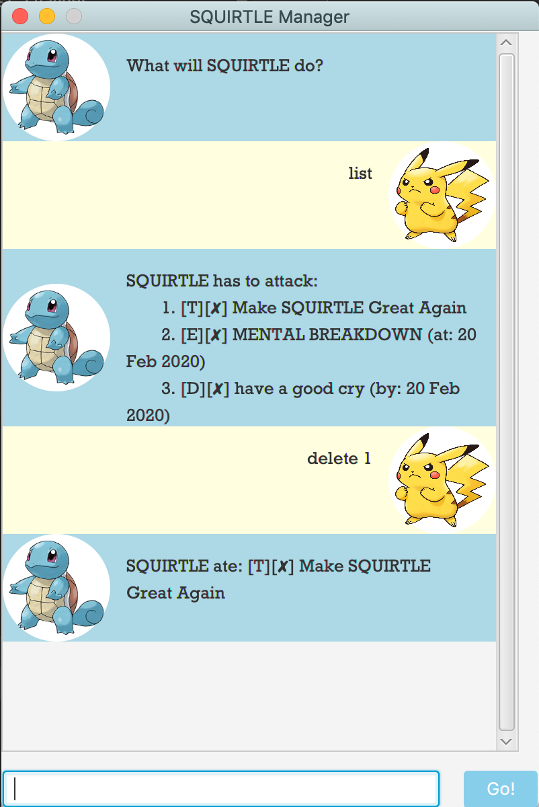

# Welcome to Squirtle Manager!
Squirtle Manager is a lightweight command line interface application built with Java and JavaFX. Squirtle Manager makes use of local storage to remember your agenda, and is an _easy_, _quick_ and _fun_ way to stay on top of your tasks.
 

## What Squirtle Can Do:

**1. Task tracking**

Squirtle Manager can track 3 types of tasks:

1. Events: These come with a _description_ and _date_

2. Deadlines: These come with a _description_ and _date_

3. Todos: These are tasks with a _description_ only

**2. Task deletion**

**3. Task updating**
* Modify task descriptions and dates easily

**4. Mark finished tasks as done**

**5. Task listing**
* Get a list of all your ongoing tasks, and their done status

**6. Find tasks using given keyword**  

## Setting up
* Download the jar file
* Run it using the command line command java -jar <name of jar file>
* Alternatively, double-click on the jar application to launch  

## Command List
Words in brackets refer to placeholders. Replace them with the appropriate command.

Example|
-------|
eg. to create a new deadline, called "download Squirtle Manager", due by 19 February 2020|
deadline download Squirtle Manager /by 19/2/2020|

Function | Command | Notes
---------|---------|-------
**Create new task**|todo (description)  deadline /by (description) (deadline)  event /at (description) (date)|Leave a space between each item. Refer to above example. Note the difference in construction between creating an event and deadline. (typing '/at' _vs_ '/by')
**List Tasks**|list|Gives a numbered list of all your current tasks.
**Delete Task**|delete (item number)|Item number corresponds to the sequence of the task in the list.
**Update Task** Stage 1|update (item number)|Upon entering this command, Squirtle Manager will ask you to indicate which items to update, and what to update to. See: Update Task Stage 2
**Update Task** Stage 2|(des/date) (update)|_Eg. to change the date of task to 9 February 2020:  date 9/2/2020_
**Find Task**|find (keyword)|Squirtle Manager currently only accepts one keyword. Plans are being made to accept more keywords at one go to improve application versatility.
**Mark Task as Done**|done (item number)|Item number corresponds to the sequence of the task on the list.  

## Sample Use
Creating different tasks:

Deleting a task:

Updating a selected task:
  

Finding a task:

# Credits
Squirtle Manager is based on the popular [Duke][a2] software engineering tutorial, while this repository is forked from [this repo][a1], which contains modified code for instruction in module CS2103T taught by National University of Singapore.  

[a1]:https://github.com/nus-cs2103-AY1920S2/duke
[a2]:https://github.com/se-edu/duke

# Feedback, Bug Reports

* If you have feedback or bug reports, please post in [airshhlay/duke issue tracker](https://github.com/airshhlay/duke/issues).
* I welcome pull requests too.

