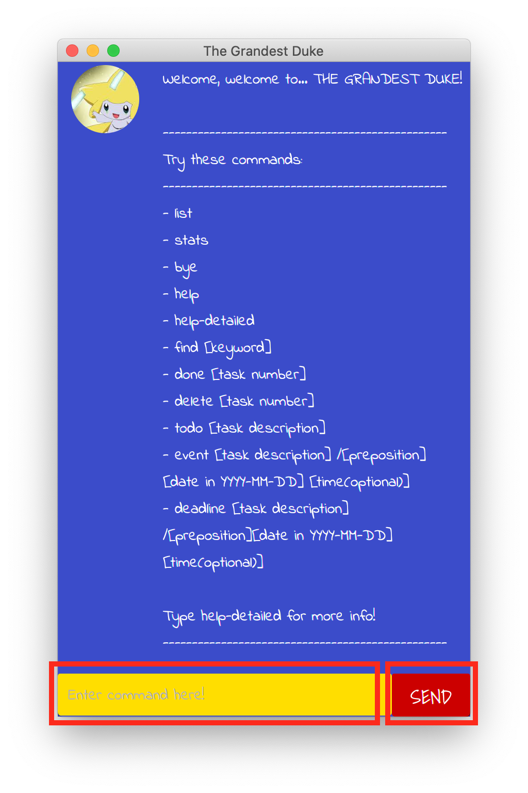

# The Grandest Duke User (TGD) Guide


## Introduction
The Grandest Duke (TGD) is a task tracker desktop application aimed at helping user keep track
of their daily tasks. It has a clean and simple GUI which accepts user keyboard input as its main
mode of interaction.

## Quick start



User input commands are entered in the highlighted field. Press the 'SEND' button to send commands to TGD.
#####**Note: Unless stated otherwise, all input commands in TGD are non case-sensitive**

## Features 

### 1. Adding a task : `todo`, `deadline`, `event`
#### There are 3 types of tasks that you can add to TGD:
- `todo` - task with only a task description
- `deadline` - task with a description, date and time(optional)
- `event` - task with a description, date and time(optional)

#### Format:
```
todo <task description>
deadline <task description> /<preposition> <date> <time>
event <task description> /<preposition> <date> <time>
```
Note: 
1. Date in ``YYYY-MM-DD`` format 
2. Time is optional
3. Task description is **case-sensitive** and will be reflected in the list accordingly 

#### Example of usage:
```
todo read a book
deadline AI project /by 2019-12-30 1300h
deadline CS Assignment /by 2020-01-15
event Birthday party /on 2020-03-30 4pm
event Networking /on 2020-05-01
```

#### Expected outcome:
When adding the commands in 'Examples of usage' in order, upon 
entering the 4th command `event Birthday party /on 2020-03-30 4pm`:
```
Got it. I've added this task:
[E][X] Birthday party on Mar 30 2020 4pm
Now you have 4 tasks in the list.
```

### 2. Viewing all tasks : `list`
### Format:
```
list
```

### 3. Mark task as done : `done`
### Format:
```
done <task index>
```
Note: Task index is the task's number obtained from the `list` command

#### Example of usage:
```
done 1
```

#### Expected outcome:
With the existing tasks in the list,
```
Nice! i've marked this task as done:
    1.[T][✓] read a book
```

### 4. Delete task : `delete`
### Format:
```
delete <task index>
```
Note: Task index is the task's number obtained from the `list` command

#### Example of usage:
```
delete 2
```

### 5. Find task in list with keyword : `find`
### Format:
```
find <keyword>
```
Note: 
1. Keyword must be either
    - Task description obtained from the `list` command
    - Existing task type (ie. ``task``, ``todo``, ``event``, ``deadline``)
2. Keyword 'task' will show all tasks (ie. same as ``list``)
3. Search is *non case-sensitive*

#### Example of usage:
```
find read
```

#### Expected outcome:
With the existing tasks in the list,
```
Here are the matching tasks found in your list:
    1.[T][✓] read a book
```

### 5. View TGD stats : `stats`
### Format:
```
stats
```

### 6. View simple help : `help`
### Format:
```
help
```

### 7. View detailed help : `help-detailed`
### Format:
```
help-detailed
```

### 8. Exit TGD : `bye`
### Format:
```
bye
```