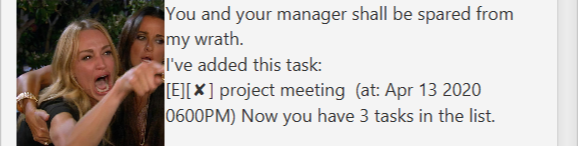
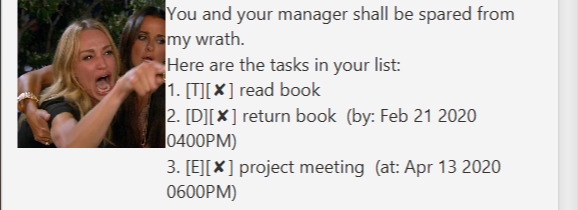
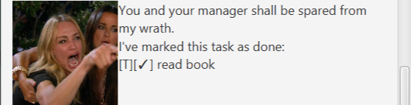
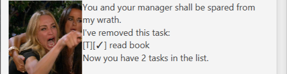
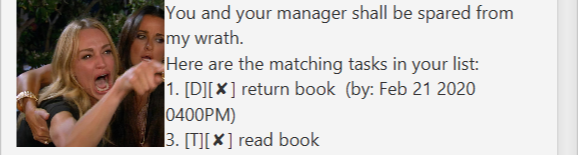
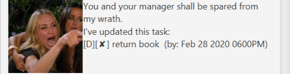
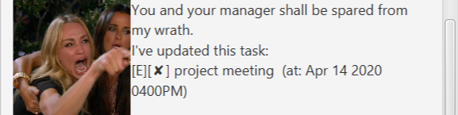

# User Guide
Karen is a Personal Assistant Chatbot that helps the user to keep track of various tasks.

## Features 

### Quit and Save
Saves data and closes the GUI.

#### Usage

##### `bye` - Saves all the data in the TaskList and automatically closes the GUI.

Example of usage: 

`bye`

Expected outcome:

`(GUI closes)`

### Add Task
Adds a new ToDo, Event or Deadline depending on the user input.

ToDos: tasks without any date/time attached to it e.g., visit new theme park.

Deadlines: tasks that need to be done before a specific date/time e.g., submit report by 11/10/2019 5pm.

Events: tasks that start at a specific time and ends at a specific time e.g., team project meeting on 2/10/2019 2-4pm.

#### Usage

##### `todo <description>` - Adds a new task of type todo.
##### `deadline <description> /by <dd-MM-yyyy HHmm>` - Adds a new task of type deadline.
##### `event <description> /at <dd-MM-yyyy HHmm>` - Adds a new task of type event.

Example of usage: 

Expected outcome:

### List Tasks
Displays all the tasks in the TaskList.

#### Usage

##### `list` - Displays all the tasks back to the user in the TaskList from least to most recently added.

Example of usage: 

Expected outcome:

### Mark as Done
Mark a task as done when completed.

#### Usage

##### `done <index>` - Mark the task at the specified index in the TaskList with a checkmark.

Example of usage: 

Expected outcome:

### Delete Task
Remove a task from the list.

#### Usage

##### `delete <index>` - Remove the task at the specified index from the TaskList permanently.

Example of usage: 

Expected outcome:

### Find Tasks
Find (a) task(s) by searching for a keyword in the description.

#### Usage

##### `find <pattern>` - lists all tasks containing the specified input <pattern> within their description.

Example of usage: 

Expected outcome:

### Update Task 
Edit the timing field for a task of type event or deadline.

#### Usage

##### `update <index> (/by or /at) <time>` - Updates the event or deadline at the specified index with a new timing.

Example of usage: 

Expected outcome:

