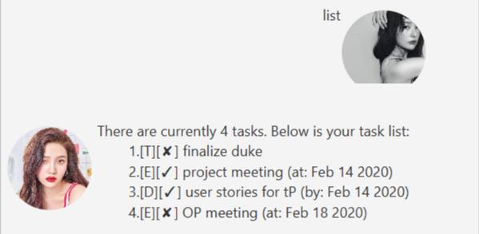

# User Guide

## Features 
* Create, show and delete tasks
* Save tasks and load past tasks
* Mark tasks as done or not done
* Find tasks
* Get help
* Exit application

### Feature 1: Create, show and delete tasks
Users can create tasks of different types such as todo, deadlines and events. Each task has a short description and 
status to indicate if the task has been completed. Users can list all created tasks for viewing. When a task is no 
longer relevant, it can be deleted, which permanently removes it from the data file. 

### Feature 2: Save tasks and load past tasks
Duke saves all created tasks and loads all previously saved tasks to a designated file on start up.

### Feature 3: Mark tasks as done or unmark if not done.
Users can mark tasks as done to indicate completion and a tick will be displayed. If a task has been accidentally marked 
as done, users can unmark it and a cross will be displayed.

### Feature 4: Find tasks
Users can search for tasks using keywords and all tasks with matching descriptions will be listed for viewing.

### Feature 5: Get help
Users can get help from Duke for commands they can use to run Duke, which will be listed for viewing.

### Feature 5: Exit application
Users can leave the application and close the GUI.

## Usage

### 1. `list` - Shows list of tasks created and saved

Describe action and its outcome.

Example of usage: 

`list`

Expected outcome:

### 2. `todo <task description>` - Creates a task of todo type

Describe action and its outcome.

Example of usage: 

`todo upload meeting minutes`

Expected outcome:

### 3. `deadline <task description> /by <YYYY-MM-DD>` - Creates a task of deadline type

Describe action and its outcome.

Example of usage: 

`deadline CS2103T duke submission /by 2020-03-02`

Expected outcome:

### 4. `event <task description> /at <YYYY-MM-DD>` - Creates a task of event type

Describe action and its outcome.

Example of usage: 

`event project meeting /at 2020-02-18`

Expected outcome:

### 5. `done <task id>` - Marks task as completed

Marks task with matching task id as completed.

Example of usage: 

`done 4`

Expected outcome:

### 6. `unmark <task id>` - Marks a done task as not done

Marks a done task with matching task id as not completed.

Example of usage: 

`unmark 3`

Expected outcome:

### 7. `delete <task id>` - Deletes a task

Deletes the task with matching task id.

Example of usage: 

`delete 2`

Expected outcome:

### 8. `find <keyword>` - Finds tasks with matching keyword

Finds all tasks that have descriptions matching the provided keyword

Example of usage: 

`find meeting`

Expected outcome:

### 9. `help` - Lists commands user can use in Duke

Displays all commands including expected input parameters sequence for user to use. 

Example of usage: 

`help`

Expected outcome:

### 10. `bye` - Leaves application

Automatically closes Graphical User Interface of Duke application.

Example of usage: 

`bye`

Expected outcome:

Application window closes.