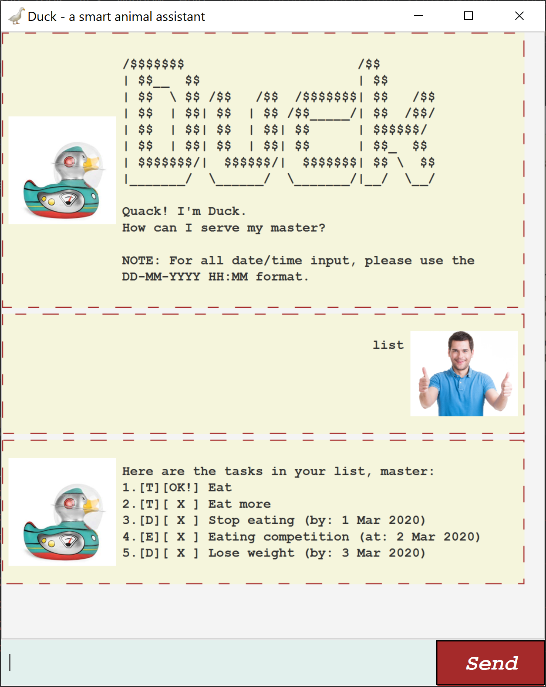

# User Guide for Duke

## Features 
1. List current tasks
2. Delete task by task number
3. Add different kinds of tasks
    * Todo
    * Deadline
    * Event
4. Mark tasks as done
5. Trivia

### **List** 
Look at all the items in your task list.

### **Delete**
Delete a task in your list.

### **Add Task**
Add a task to your list. You can add a ToDo, Deadline or Event task.

### **Marking task as done**
Marking a task in your list as done.

### **Trivia**
Gives you a random trivia fact.

### **Exiting the program**
Exits the program.

## Usage

### `list` - Lists all current tasks in your task list

Lists all the current tasks in your task list, and their completion status.

Example of usage: 

`list`

Expected outcome:

```
Here are the tasks in your list!
1. [T][✔] sleep
2. [D][✘] homework by: Feb 28 2020
```


### `delete` - Deletes task from the task list
Deletes the task at the number specified from the task list.

Example of usage:

`delete 1`

Expected outcome:
```
Understood. I've deleted this task:
[D][✔] homework by: Feb 28 2020
Now you have 3 tasks in the list.
```


### `todo` - Adds a todo task to your task list
Adds a task categorised as a todo to your task list.

Example of usage:

`todo buy groceries`

Expected outcome:
```
Got it. I've added this task:
[T][✘] buy groceries
Now you have 4 tasks in the list.
```


### `deadline` - Adds a deadline task to your task list
Adds a task categorized as a deadline to your task list. Dates should be entered in the YYYY-MM-DD format

Example of usage:

`deadline CS1231 Homework /by 2020-02-28`

Expected outcome:
```
Got it. I've added this task:
[D][✘] CS1231 Homework by: Feb 28 2020
Now you have 5 tasks in the list.
```


### `event` - Adds an event task to your task list
Adds a task categorized as an even to your task list. Dates should be in the YYYY-MM-DD format.

Example of usage:

`event meeting /at 2020-02-28`

Expected outcome:
```
Got it. I've added this task:
[E][✘] meeting at: 28 Feb 2020
Now you have 1 tasks in the list.
```


### `done` - Marks a task in your task list as done
Marks the task specified by the task number in your task list as done.

Example of usage:

`done 4`

Expected outcome:
```
Alright! I've marked this task as done:
[D][✔] CS3230 Assignment by: Mar 1 2020
```


### `trivia` - Mr. Duke tells you a random trivia 
You will be shown a random trivia fun fact!

Example of usage:

`trivia`

Expected outcome:
```
Did you know?
Coca-Cola was the first soft drink in space!
```


### `bye` - Exits the application
Exits the application upon the entry of the command 'bye'.

Example of usage:

`bye`

Expected outcome:
The Mr. Duke window will close.


## Acknowledgements
The GUI was done based on the
[JavaFX Tutorial](https://github.com/nus-cs2103-AY1920S2/duke/blob/master/tutorials/javaFxTutorialPart4.md)
written by Jeffry Lum
