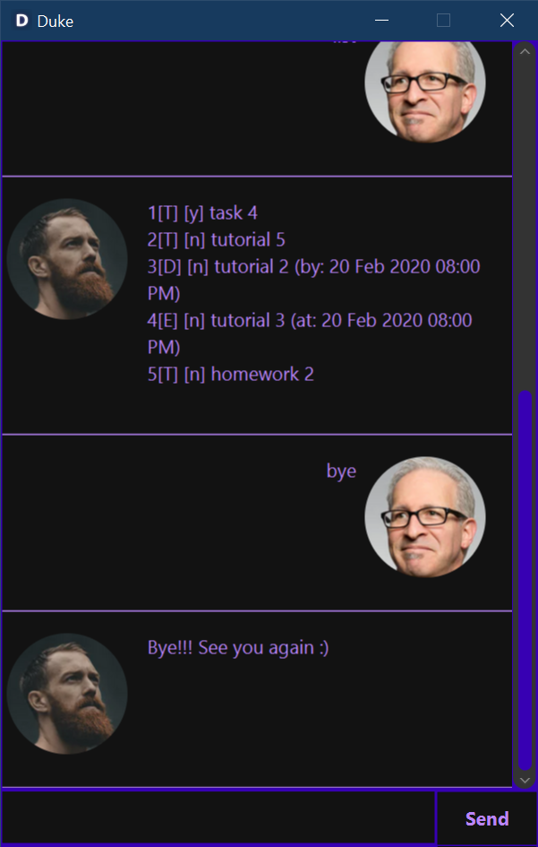

# User Guide

## Description
Duke is a **Personal Assistant ChatBot** to help for tracking various tasks.


## Features 

### Adding a task
- You can add a new tasks by using one of the keywords below:
  - todo
  - event
  - deadline

### Delete tasks
- You can delete single or multiple tasks at a time.

### Mark task as done
- You can mark a specific task as done.

### Find task
- You can find specific task that match the keyword.

### List tasks
- You can view all of the tasks.

### Exit the program
- You can say goodbye and exit the program.

## Usage

### `todo` - Add a new todo task

Adding a new todo task to the system.  
Format: `todo <TASK>`

Example of usage: 

`todo tutorial 5`

Expected outcome:

```
Got it. I've added this task:  
[T] [n] tutorial 5
Now you have 1 tasks in the list.
```


### `event` - Add a new event task

Adding a new event task with date and time to the system.  
Format: `event <TASK> /at dd/MM/yyyy HHmm`

Example of usage: 

`event birthday party /at 24/02/2020 1800`

Expected outcome:

```
Got it. I've added this task:  
[E] [n] birthday party (at: 24 Feb 2020 06:00PM)
Now you have 1 tasks in the list.
```


### `deadline` - Add a new deadline task

Adding a new deadline task with date and time to the system.  
Format: `deadline <TASK> /by dd/MM/yyyy HHmm`

Example of usage: 

`deadline assignment /by 25/02/2020 2300`

Expected outcome:

```
Got it. I've added this task:  
[D] [n] assignment (at: 25 Feb 2020 11:00PM)
Now you have 1 tasks in the list.
```


### `delete` - Delete a tasks or multiple tasks

Delete single or multiple tasks in the system based on index number.  
Format: `delete <NUM>...`

Example of usage: 

`delete 3 1 2`

Expected outcome:

```
Noted. I've removed these tasks:  
1[T] [n] task 3
2[T] [n] task 1
3[T] [n] task 2
Now you have 1 tasks in the list.
```


### `done` - Mark a task as done

Mark a specific task as done.  
Format: `done <NUM>`

Example of usage: 

`done 1`

Expected outcome:

```
Nice! I've marked this task as done:  
[T] [y] task 4
```


### `find` - Find the tasks that match the keyword

Find the tasks that match the keyword given and return the list of matched tasks.    
Format: `find <KEYWORD>`

Example of usage: 

`find tutorial`

Expected outcome:

```
Here are the matching tasks in your list:  
1[T] [n] tutorial 5
2[D] [n] tutorial 2 (by: 20 Feb 2020 08:00PM)
3[E] [n] tutorial 3 (at: 20 Feb 2020 08:00PM)
```


### `list` - Show all of the tasks in the system

Display all tasks in the system.    
Format: `list`

Example of usage: 

`list`

Expected outcome:

```
1[T] [y] task 4
2[T] [n] tutorial 5
3[D] [n] tutorial 2 (by: 20 Feb 2020 08:00PM)
4[E] [n] tutorial 3 (at: 20 Feb 2020 08:00PM)
5[T] [n] homework 2
```


### `bye` - Exit the program

Say goodbye to ChatBot. The program will close after 1 second.  
Format: `bye`

Example of usage: 

`bye`

Expected outcome:

```
Bye!!! See you again :)
```



## Acknowledgements
Credit to Jeffry Lum for the fxml and java files for JAVAFX GUI -  [JavaFx TutorialPart 4](https://github.com/nus-cs2103-AY1920S2/duke/blob/master/tutorials/javaFxTutorialPart4.md)  
Credit to Software Engineering Education addressbook-level2 for code Organization - [AddressBook (Level 2)](https://github.com/se-edu/addressbook-level2)  
Credit to MintBerryCrunch for the solution to close GUI window - [stackOverflow](https://stackoverflow.com/questions/52393982)  
Credit to Ernest Friedman-Hill for the solution to redirect console output to string in java - [stackOverflow](https://stackoverflowcom/questions/8708342)  