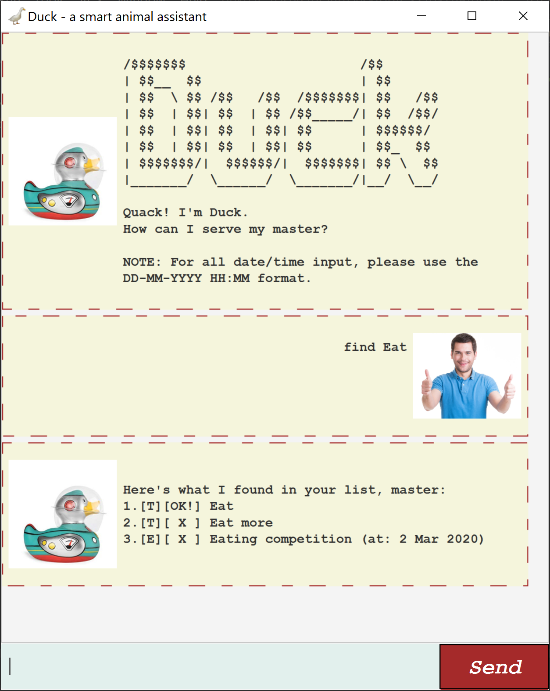

# User Guide for ***Johnny***
## Overview
1. About
2. Features
   1. Tasks
   2. Task List
   3. Saving/Loading
3. Usage
   1. Adding tasks
   2. Deleting tasks
   3. Displaying tasks
   4. Marking tasks as done
   5. Finding tasks
   6. Help page
   7. Exiting the application
 
## 1. About
***Johnny*** is a chat bot cum task manager to assist you in keeping 
track of important tasks in a neat and organised manner. It features
a simple Graphical User Interface (GUI) and uses a Command Line 
Interface (CLI) for user input. 

## 2. Features 
### i. Tasks
***Johnny*** keeps track of 3 types of tasks:
1. __To-Dos__: Tasks with no due date
2. __Deadlines__: Tasks to be completed by a certain date
3. __Events__: Activities/appointments to attend on a certain date
### ii. Task List
***Johnny*** keeps track of your tasks using a list which offers the
following commands:
1. **Adding**: add one of the 3 types of tasks to the list

2. **Deleting**: remove a chosen task from the list
3. **Displaying**: display the current list
4. **Marking as complete**: marks chosen tasks as complete
5. **Finding**: search for tasks in the list using keyword(s)
### iii. Saving/Loading
***Johnny*** automatically saves the list of tasks whenever a task 
is added, deleted, or marked as complete. 

When the application is launched subsequently, ***Johnny*** 
automatically loads the saved list to be used again.

## 3. Usage

### i. Adding tasks
a. `todo` - Adds a to-do to the task list.

- This command takes 1 parameter, `DESCRIPTION`, for entry.     

Syntax | Example
-------|---------
`todo [DESCRIPTION]`| `todo finish math assignment`

When the `todo` task is added successfully, ***Johnny*** will
display a confirmation message that the task has been added
to the list.

b. `deadline` - Adds a deadline to the task list.

- This command takes 2 parameters, `DESCRIPTION` and `DATE`, for 
entry.

- `DATE` is preceded by a `/` character and must be provided in 
YYYY-MM-DD format.

Syntax | Example
-------|---------
`deadline [DESCRIPTION] /[DATE]`| `deadline philo essay /2020-03-12`

When the `deadline` task is added successfully, ***Johnny*** will
display a confirmation message that the task has been added
to the list.

c. `event` - Adds an event to the task list.

- This command takes 2 parameters, `DESCRIPTION` and `DATE`, for 
entry.

- `DATE` is preceded by a `/` character and must be provided in 
YYYY-MM-DD format.

Syntax | Example
-------|---------
`event [DESCRIPTION] /[DATE]`| `event Shermaine's wedding /2020-06-24`

When the `event` task is added successfully, ***Johnny*** will
display a confirmation message that the task has been added
to the list.

### ii. Deleting tasks

`delete` - Deletes the chosen task from the task list

- This command takes 1 parameter, `INDEX`
- `INDEX` refers to the index number of the task to be deleted in the task list 

Syntax | Example
-------|---------
`delete [INDEX]` | `delete 2`

When the chosen task has been successfully deleted, ***Johnny*** will display a 
confirmation message.

### iii. Displaying task list

`list` - Displays the current task list

- This command does not take any additional parameters

### iv. Marking tasks as complete

`done` - Marks a chosen task as done

- This command takes 1 parameter, `INDEX`
- `INDEX` refers to the index number of the task to be marked as done
in the task list 

Syntax | Example
-------|---------
`done [INDEX]` | `done 1`

When the chosen task has been successfully marked as done, ***Johnny*** will 
display a confirmation message.

### v. Finding a task 

`find` - Displays a sub-list of tasks from the task list that match a given 
search term

- This command takes 1 parameter, `SEARCH_TERM`
- `SEARCH_TERM` is a keyword(s) that must fully match the `DESCRIPTION` of a 
task for that task to be displayed in the sub-list

Syntax | Example
-------|---------
`find [SEARCH_TERM]` | `find Shermaine's wedding`

If a matching task(s) is found, ***Johnny*** will display the found task(s).
If no matches are found, ***Johnny*** will display a message stating as such.

### vi. Help page

`help` - Displays a summary of available commands

- This command does not take any additional parameters

Syntax | Example
-------|---------
`help`|`help`

### vii. Exiting the application

`bye` - Closes the application

- This command does not take any additional parameters

Syntax | Example
-------|---------
`bye`|`bye`

If command is successfully given, the application will shut down and its window
will be closed.

