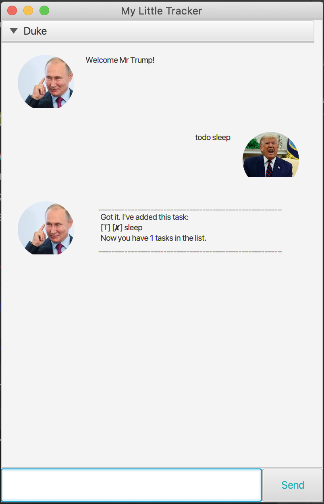
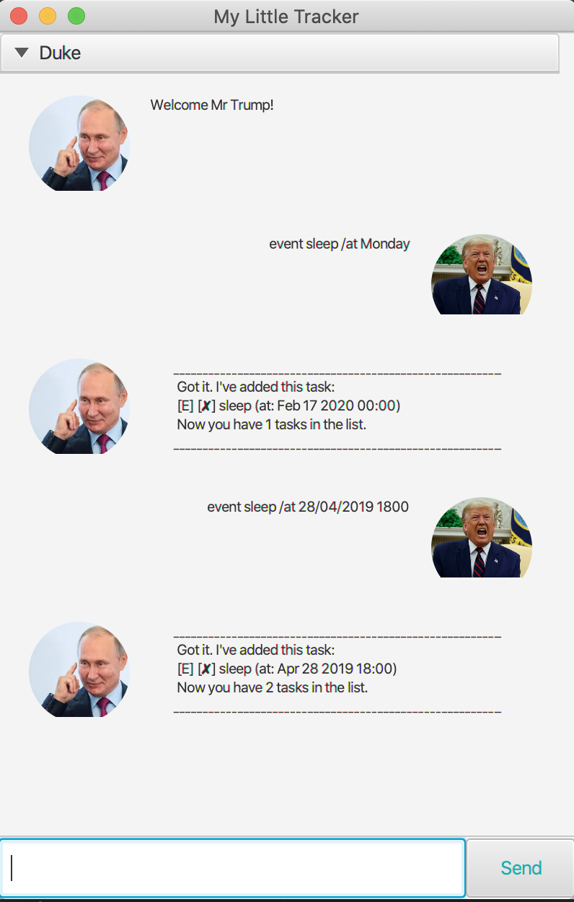
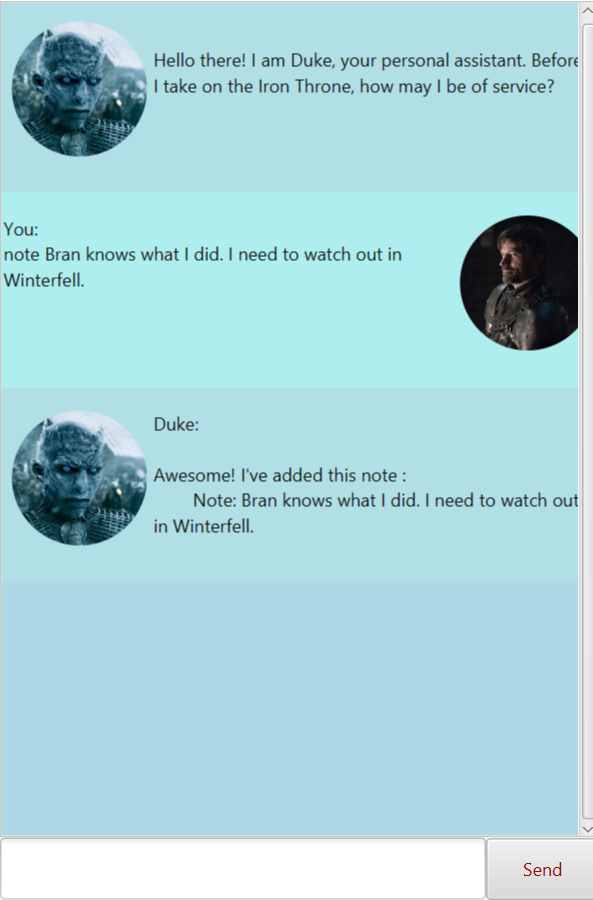

# User Guide

## Introduction

Duke is a Personal Productivity Chatbot that helps a user keep track of various todos, notes, events and deadlines.

> As mentioned above these are the 4 types of Tasks:
1. **Todo**: Tasks without any date attached to them.
2. **Event**: Tasks that occur on a specific date and time.
3. **Deadline**: Tasks that should be done by a particular date and time.
4. **Note**: Tasks that do not need to be completed, but rather are snippets of information meant to be stored.

Duke can perform any of the following commands:
1. **Add** a task.
2. **List** out all of User's tasks stored by Duke.
3. **Mark as complete** for any specific task.
4. **Find** a particular task using a keyword.
5. **Delete** a task.
6. **Whatsup**: find out any event or deadline occurring on a given date.
7. **Exit**: terminate the program.

## Running Duke
1. Locate the jar file in the File Explorer or Finder.
2. Type ‘cmd’ on the search bar and press ‘Enter’ to launch Command Prompt if on Windows or run Terminal if on MacOS.
3. Execute the following command, assuming the jar file is named “duke-0.2-all.jar”
> `java -jar duke-0.2-all.jar`

## Features 

### 1. Add a task
To add a task to your list, use any of the following keywords:
1. todo
2. event
3. deadline
4. note

#### Usage

### `todo ` - Add a new todo task.

Adding a new todo task requires the following format:

`todo [description]`

A description is used to provide details about the new todo.

Example of usage:

`todo Complete Duke UserGuide.`

The above command adds a new todo task with the description "Complete Duke UserGuide."

Expected output:

### `event ` - Add a new event task.

Adding a new event task requires the following format:

`event [description] /at [dd-mm-yyyy hh:mm]`

A description is used to provide details about the new event, 
while a date and time is used to indicate when the event is occurring.

Example of usage:

`event Red Wedding /at 10-12-2020 21:21`

The above command adds a new event task with the description "Red Wedding" and
schedules it on 10th of December 2020 at 9:21pm.

Expected output:

### `deadline ` - Add a new deadline task.

Adding a new deadline task requires the following format:

`deadline [description] /by [dd-mm-yyyy hh:mm]`

A description is used to provide details about the new deadline, 
while a date and time is used to indicate by when the task should be completed.

Example of usage:

`deadline Repay my debts /by 27-05-2020 08:21`

The above command adds a new deadline task with the description "Repay my debts" and
schedules it to be done by 27th of May 2020 at 8:21am.

Expected output:

### `note ` - Add a new note task.

Adding a new note task requires the following format:

`note [description]`

A description is used to provide the snippet of information to be captured inside the note.

Example of usage:

`note Bran knows what I did. I need to watch out in Winterfell.`

The above command adds a new note with the description:
"Bran knows what I did. I need to watch out in Winterfell".

Expected output:

### 2. List

To list out all stored tasks, use the following format:
 
 `list`

Example of usage:

`list`

Expected output:

### 3. **Mark as complete** for any specific task.

Using `list` we know what is the task number of each task.

With that number, we can mark the corresponding task as complete, using the following format:

`done [task number]`

Example Usage:

`done 1`

This marks the 1st item in the list as completed.

Example Output:

### 4. **Find** a particular task using a keyword.

Using `find` keyword, we can search for tasks that have a specific keyword.

Use the following format:

`find [specific keyword or phrase]`

Example usage:

`find Red`

Example output:

### 5. **Delete** a task.

Using the `delete` keyword, we can delete a task if we no longer require it in the list.

Use the following format:

`delete [task number of the task you intend to delete]`

Example usage:
`delete 2`

Example output:

### 6. **Whatsup**: find out any event or deadline occurring on a given date.

Find out all events or deadlines on a specific date by using this format:

`whatsup /on [dd-mm-yyyy]`

Example usage:
`whatsup /on 27-05-2020`

Example output:

### 7. **Exit**: terminate the program.

To close the program, type `bye`.

Do note that even after the program closes, when you launch it again, it will remember your stored tasks.
