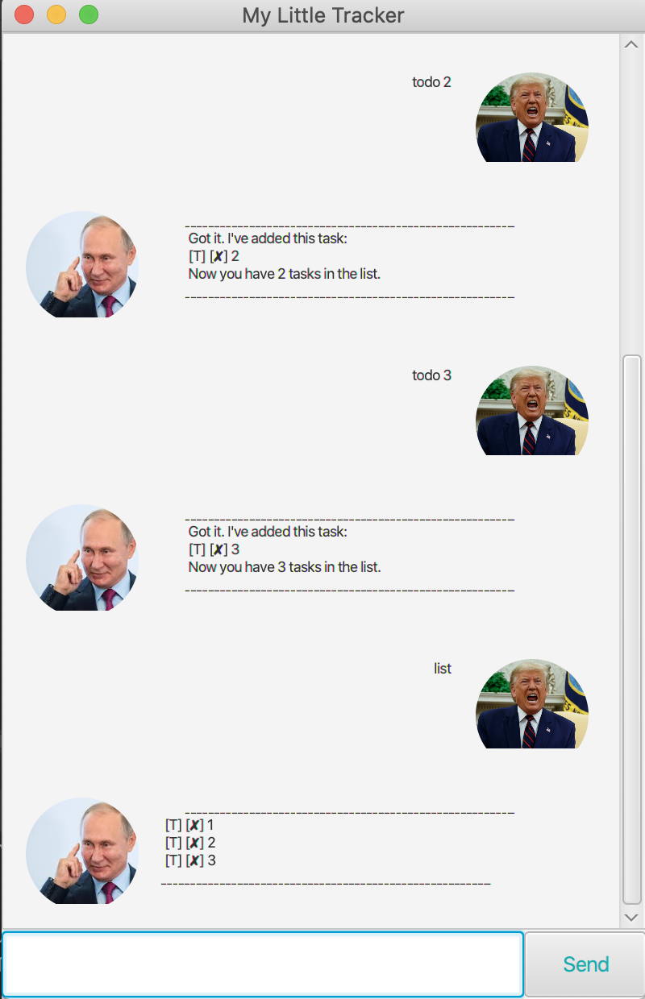
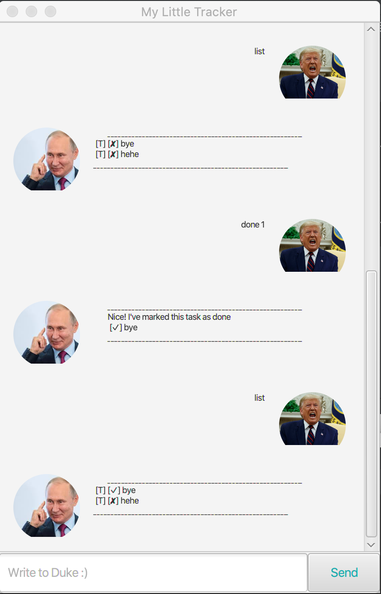

# User Guide

The official guide to using Dude to his full potential!

## Table of Contents
--------------------

1. [Screenshot](#1-screenshot)
2. [Installation](#2-installation)
3. [Quick Start](#3-quick-start)
4. [Command Guide](#4-command-guide)
    1. [Help](#41-help)
    2. [Bye](#42-bye)
    3. [List](#43-list)
    4. [Todo](#44-todo)
    5. [Deadline](#45-deadline)
    6. [Event](#46-event)
    7. [Done](#47-done)
    8. [Delete](#48-delete)
    9. [Find](#49-find)
    10. [Check](#410-check)
    11. [Today](#411-today)
5. [Dates In Dude](#5-dates-in-dude)
6. [Storing your tasks](#6-storing-your-tasks)
7. [Acknowledgements](#7-acknowledgements)


## 1. Screenshot
----------------


## 2. Installation
------------------
Make sure you have [java](https://www.oracle.com/java/technologies/javase-downloads.html) installed on your computer.

Head over to the [releases](https://github.com/CornCobs/duke/releases) page and download the latest version of Dude!

## 3. Quick Start
-----------------
To start Dude, double click the jar file. Alternatively, on the command prompt / terminal, navigate to the directory where the jar file is and run the following:

```
> java -jar dude-0.2.2.jar
```
After Dude has started up, enter "help" to see the available commands, and enter "bye" to exit. That's all you need to get started!

## 4. Command Guide 
-------------------
### **4.1 Help**
Dude lends you a helping hand! The help command can give you more information of how to use Dude, what kinds of input Dude understands and what the various commands do.

If no arguments are given, Dude tells you the format of all of the commands he understands.

If the name of a command is specified, Dude gives more information about that command - the format, and what it does.

If you ask for `help -date`, Dude explains the types of dates he can understand.

**Format**
```
help [command | -date]
```

**Example Usage**


### **4.2 Bye**
Closes Dude. Before closing, Dude makes sure to save all of the tasks you have currently in ./data so when you start him up again, it's as if you never left!

**Format**
```
bye
```

### **4.3 List**
Shows all the tasks you currently have, and their completion status - unless you don't have any, of course!

**Format**
```
list
```

**Example Usage**



### **4.4 Todo**
Adds a todo task to your current list of tasks. Todos only have a description - no time associated with them! If your tasks are time-sensitive, look at [deadlines](#45-deadline).

Make sure your descriptions are not empty, or else Dude will complain!

**Format**
```
todo description
```

**Example Usage**


### **4.5 Deadline**
Adds a deadline to your current list of tasks. Deadlines have a due date. To see what dates Dude understands, look [here](#5-dates-in-dude).

**Format**
```
deadline description /by date
```

**Example Usage**


### **4.6 Event**
Adds an event to your current list of tasks. Events have a start and end date. To see what dates Dude understands, look [here](#5-dates-in-dude).

**Format**
```
event description /from date /to date
```

**Example Usage**


### **4.7 Done**
Marks a task as completed. You need to give the index of the task in Dude's list - you can use the list command to check the indices!

**Format**
```
done index_of_task
```

**Example Usage**



### **4.8 Delete**
Deletes a task from the list. It could be completed, it could be over, or maybe you just can't be bothered to finish it anymore. Dude doesn't pry! Once again you refer to the task by its index.

**Format**
```
delete index_of_task
```

**Example Usage**


### **4.9 Find**
Sometimes you have too many tasks its difficult to find the one you were thinking of with list. Have no fear! Dude allows you to filter the list by giving him some keyword to match the task descriptions against.

**Format**
```
find word
```

**Example Usage**


### **4.10 Check**
What if you need to see what things you have going on on some day? For example your friend just invited you out and you need to check if you have any homework due on that day? Dude allows you to check all the tasks you have that are due or are occurring on any date.

**Format**
```
check date
```

**Example Usage**


### **4.11 Today**
A simple shortcut to check what you have on today. Why make you write "check (today's date)" when you can just say "today"?

**Format**
```
today
```


## 5. Dates In Dude
-------------------
Dude is all about *freedom* - he wants to let you express yourself as much as you like! So he accepts a whole variety of date formats:

1. `yyyy-MM-dd` - the standard ISO format
   - Eg. 2020-12-31
2. `d MMM yyyy` - the kind of date we're more familiar with
   - Eg. 4 Apr 2021
3. `dayOfWeek [+number]` - Dude allows you to say something like "Monday" to refer to the coming Monday, and if you give an extra number at the back, like "Tues +1", Dude knows you mean the next Tuesday!
   - Eg. Wed +2 (Means Wednesday 2 weeks after this)
4. `number [day(s) | week(s) | month(s) | year(s)]` - Dude also allows you to just say how far away this task is going to be from today. If you have something due tomorrow, just say "deadline ... /by 1 day"
   - Eg. 2 weeks (Means 14 days from today)


## 6. Storing your tasks
------------------------
Dude keeps your tasks safe between sessions. What good would a todo list be otherwise? Dude automatically stores your session data in a directory `data` in the directory you run Dude from, and attempts to find this directory when you start him up again. 

If he can't find this folder (or its empty), Dude will start with an empty list of tasks, so don't accidentally delete the `data` folder! 

Or do it if you actually want to delete everything. Please don't delete all the tasks 1 by 1.

## 7. Acknowledgements
----------------------
Dude is a fork from the [duke project](https://github.com/nus-cs2103-AY1920S2/duke) by NUS, used for CS2103 - Software Engineering. 

A large amount of the javafx UI code is taken from the [tutorials](https://github.com/nus-cs2103-AY1920S2/duke/tree/master/tutorials) written by Jeffry Lum
