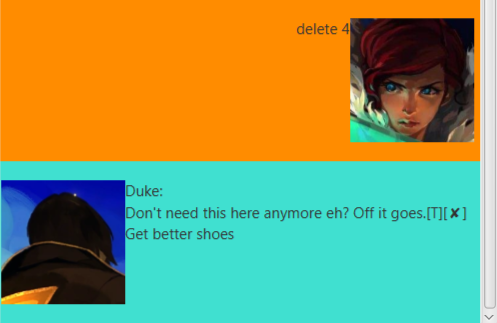

# Duke User Guide

## Description
* Duke is a customised task manager for you, you can easily categorized your 
tasks into deadlines, events and todos and manage them by adding new tasks, deleting tasks,
tagging tasks and etc.

## Features 

### Categorized tasks
* Duke helps you to categorize your regular tasks into the following three types:
    - todo
    - event
    - deadline

### Basic CRUD functions
* You can easily create, read, update and delete your tasks in Duke.

### Interactive GUI
* Duke has a pretty cool and good-looking GUI, you will definitely enjoy using it daily as a Task Manager
and even as a close friend who is always here for you.  
  

### Warm greetings
* When you say hello to Duke, it will greet you with warm welcome.

### Mark task as done
* You are able to update your task as done when you have completed the task.

### Archive your tasks
* You are able to store the data of your tasks into the hard disk for next time use.

### Find tasks
* You can search for related task by giving the keyword you are looking for.

### Tag your tasks
* You can give your tasks multiple tags.

### Exit Duke without clicking
* Finally, you are able to exit Duke using the CLI quickly instead of clicking exit button.

## Usage

### 1. `hey` - Say hello to the Duke bot

* Say hello to the Duke bot and Duke bot will introduce herself to you.

* Example of usage: 

   `hey`

* Expected outcome:

    `Hello, I'm Popuko.` 
    `What can I do for you?`  
    
  
    
### 2. `todo [description]` - Add a todo task to your list

* Ask Duke to add a todo task to your list by given the description of the todo task.

* Example of usage: 

   `todo CS2103T individual project`

* Expected outcome:

    `Got it. I've added this task:` 
    `[T][✘] CS2103T individual project` 
    `Now you have 1 tasks in the list.`  
    
  
    
### 3. `event [description] /at [scheduled date]` - Add an event task to your list

* Ask Duke to add an event task to your list by given the description
and the scheduled date of the event.

* Example of usage: 

   `event CS2103T meeting /at 2020-02-15`

* Expected outcome:

    `Got it. I've added this task:` 
    `[E][✘] CS2103T meeting (at: Feb 15 2020)` 
    `Now you have 2 tasks in the list.`  
    
  
    
   
### 4. `deadline [description] /by [due date]` - Add an deadline task to your list

* Ask Duke to add a deadline task to your list by given the description
and the due date of the deadline task.

* Example of usage: 

   `deadline CS2103T post lecture quiz /by 2020-03-10`

* Expected outcome:

    `Got it. I've added this task:` 
    `[D][✘] CS2103T post lecture quiz (by: Mar 10 2020)` 
    `Now you have 3 tasks in the list.`  
    
  
    
    
### 5. `list` - List all tasks you have added to the task list

* Ask Duke to show all tasks you have asked her to record.

* Example of usage: 

   `list`

* Expected outcome:

    `📜 Here are the tasks in your list:` 
    `[T][✘] CS2103T individual project` 
    `[E][✘] CS2103T meeting (at: Feb 15 2020)` 
    `[D][✘] CS2103T post lecture quiz (by: Mar 10 2020)`  
    
  
    
    
### 6. `done [task index]` - Mark the specific task as done

* Ask Duke to mark a task as done according the the given index of the task.

* Example of usage: 

   `done 2`

* Expected outcome:

    `👠Nice! I've marked this task as done:` 
    `[E][✓] CS2103T meeting (at: Feb 15 2020)`  
    
  
    
    
### 7. `delete [task index]` - Delete the specific task in the list

* Ask Duke to remove a task from the list according the the given index of the task.

* Example of usage: 

   `delete 2`

* Expected outcome:

    `👌 Noted. I've removed this task:` 
    `[E][✓] CS2103T meeting (at: Feb 15 2020)` 
    `Now you have 2 tasks in the list.`  
    
  
    
    
### 8. `find [keyword]` - Find out all tasks which contain the keyword given

* Ask Duke to find all tasks that contain the keyword given.

* Example of usage: 

   `find CS2103T`

* Expected outcome:

    `📜 Here are the matching tasks in your list:` 
    `[T][✘] CS2103T individual project` 
    `[E][✘] CS2103T meeting (at: Feb 15 2020)`  
        
  
    
    
### 9. `tag [task index] [tag name]` - Add tag to a specific task

* Ask Duke to add a tag to a task by the given task index and name of the tag.

* Example of usage: 

   `tag 1 important`

* Expected outcome:

    `🟢 Got it. I've tagged this task as you wish:` 
    `[T][✘] CS2103T individual project #important`  
        
  

### 10. `bye` - Exit Duke application

* Say goodbye to Duke bot to quit the application without clicking any button.

* Example of usage: 

   `bye`

* Expected outcome:

    exit the application immediately.
            
